# Tema 1: Introducción a la programación

??? abstract "Duración y criterios de evaluación"

    Duración estimada: 6 sesiones

    <hr />

    **Resultados de aprendizaje**

    1. Comprende los conceptos fundamentales de la programación, sus paradigmas y fases de desarrollo.
    2. Conoce los distintos tipos de lenguajes de programación y su evolución histórica.
    3. Comprende el proceso de compilación y ejecución de programas en Java.
    4. Utiliza un entorno de desarrollo integrado para elaborar programas básicos.

    **Criterios de evaluación**

    1. Se han identificado las acciones cotidianas que dependen de la programación.
    2. Se han descrito los conceptos de programa, programación y algoritmo.
    3. Se han caracterizado los principales paradigmas de programación y sus diferencias.
    4. Se han descrito las fases del ciclo de vida de un programa con ejemplos prácticos.
    5. Se han diferenciado los tipos de lenguajes de programación y sus ventajas e inconvenientes.
    6. Se ha explicado el funcionamiento de Java y su máquina virtual.
    7. Se han creado programas en Java utilizando un IDE de desarrollo.

## 1.1 Introducción

Vivimos rodeados de tecnología. Muchas de las acciones que realizamos a diario son posibles gracias a **programas informáticos**:

* La alarma del móvil que te despierta.
* El microondas que calienta tu desayuno.
* El ascensor que utilizas para salir de casa.
* Las noticias que consultas en un dispositivo digital.
* Los videojuegos, las aplicaciones de mensajería o incluso los cajeros automáticos.

Detrás de todo ello hay personas que diseñan, programan y mantienen el software. La programación es, por tanto, una habilidad fundamental en la sociedad actual.

!!! tip "Reflexiona"
    Intenta pensar cuántas veces al día interactúas con un programa. Te sorprenderá ver hasta qué punto dependemos de ellos.

## 1.2 Programas y programación

Un **programa** es un conjunto de instrucciones que indican a un ordenador cómo realizar una tarea. La **programación** es el proceso de diseñar y escribir dichos programas.

<figure>
  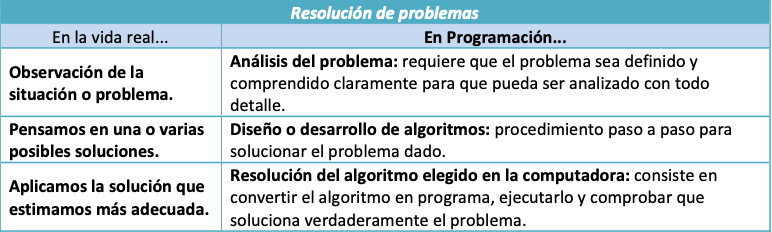
  <figcaption>Resolución de problemas mediante programación</figcaption>
</figure>

### Conceptos clave en la resolución de problemas

* **Abstracción**: centrarse en lo esencial, ignorando los detalles irrelevantes.
* **Divide y vencerás**: dividir un problema complejo en problemas más pequeños y manejables.
* **Encapsulación**: agrupar datos y procedimientos relacionados, de forma que se oculten los detalles internos.
* **Modularidad**: organizar el código en módulos reutilizables y fáciles de mantener.

### Algoritmo y programa

* **Algoritmo**: secuencia ordenada y no ambigua de pasos que llevan a la solución de un problema.
* **Programa**: implementación de un algoritmo en un lenguaje de programación concreto.

!!! example "Características de un buen algoritmo"
    - **Finito**: tras un número limitado de pasos finaliza.
    - **Preciso**: cada paso está descrito sin ambigüedades.
    - **Definido**: si se repite con la misma entrada, produce el mismo resultado.

    Piensa en la receta de cocinar pasta:

    - Poner agua a hervir.
    - Añadir sal y pasta.
    - Esperar 10 minutos.
    - Escurrir y servir.

    Este conjunto de pasos claros y ordenados es un **algoritmo**.

### Representación de algoritmos

Existen distintas técnicas para plasmar un algoritmo antes de programarlo:

* [Diagramas de flujo](https://www.lucidchart.com/pages/es/que-es-un-diagrama-de-flujo): representación gráfica de los pasos mediante figuras (elipses, rectángulos, rombos...).
* [Pseudocódigo](https://es.wikipedia.org/wiki/Pseudoc%C3%B3digo): texto estructurado con instrucciones similares a un lenguaje de programación.
* [Tablas de decisión](https://es.wikipedia.org/wiki/Tabla_de_decisi%C3%B3n): representación tabular de condiciones y acciones.

<figure>
  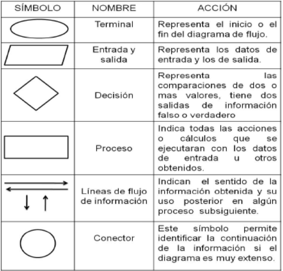
  <figcaption>Elementos básicos de un diagrama de flujo</figcaption>
</figure>

<figure>
  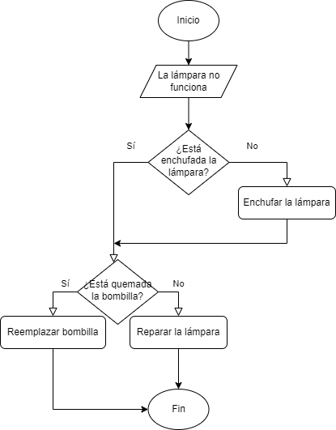
  <figcaption>Ejemplo de construcción de un diagrama de flujo</figcaption>
</figure>

## 1.3 Paradigmas de programación

Los **paradigmas** son formas de clasificar los lenguajes de programación según sus características.

### Clasificación general

* **Programación imperativa**: describe paso a paso cómo resolver un problema (*cómo* hacerlo). Ejemplo: C.
* **Programación declarativa**: describe el resultado que se quiere obtener (*qué* se desea). Ejemplo: SQL.

<figure>
  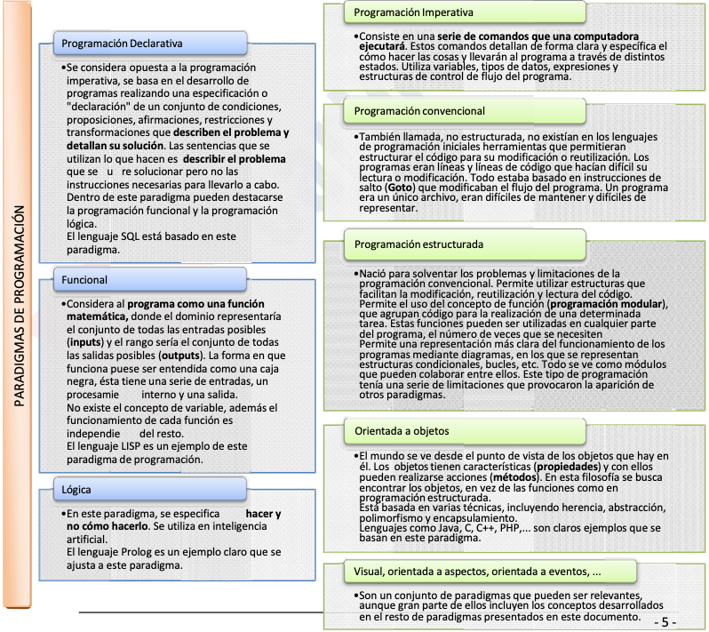
  <figcaption>Paradigmas de programación</figcaption>
</figure>

### Subtipos de paradigmas

- **Imperativo** (cómo se hace, secuencia de instrucciones)  
  - **Convencional (no estructurada)**  
    - Basada en `GOTO`, poco mantenible  
  - **Estructurada**  
    - Uso de funciones, bucles, condicionales, modularidad  
  - **Orientado a Objetos (subtipo imperativo)**  
    - Objetos con atributos y métodos, herencia, polimorfismo  

- **Declarativo** (qué se quiere lograr, sin detallar el cómo)  
  - **Funcional**  
    - Basado en funciones matemáticas, sin estado mutable  
  - **Lógico**  
    - Basado en reglas y deducción lógica (ej. Prolog)  

- **Orientado a Eventos / Visual**  
  - Flujo guiado por eventos externos (clics, señales, GUI)  

- **Orientado a Aspectos (AOP)**  
  - Manejo de elementos transversales (logging, seguridad, etc.)

??? info "Notas sobre paradigmas visual, orientados a eventos y a aspectos"
    Se suele considerar la orientación a eventos más bien un estilo de programación que puede coexistir con POO o estructurada. Se pone aparte en muchas clasificaciones porque cambia la forma mental de diseñar: pasas de pensar en "qué pasos sigue mi programa" a "qué debe hacer mi programa cuando ocurra X".
    
    La programación orientada a aspectos complementa a la POO. Mientras la POO organiza el software en objetos, la AOP organiza el software en objetos + aspectos transversales que se aplican de manera automática allí donde se necesitan.

### Lenguajes multiparadigma

Hoy en día, la mayoría de los lenguajes son multiparadigma. Ejemplo: **Java**, que es estructurado, orientado a objetos y funcional.

## 1.4 Fases de la programación

El desarrollo de un programa no consiste solo en escribir código. Se recorren distintas fases que forman el **ciclo de vida** del software:

```mermaid
flowchart TD
    A[1. Análisis<br/>¿Qué pide el cliente?] --> B[2. Diseño<br/>¿Cómo lo resuelvo?]
    B --> C[3. Codificación<br/>Escribir el código Java]
    C --> D[4. Pruebas y validación<br/>¿Funciona correctamente?]
    D --> E[5. Explotación y mantenimiento<br/>Uso real + mejoras]
    D -.errores.-> B
    E -.> D
```

1. **Resolución del problema**

   * **Análisis**: identificar los requisitos del cliente, elaborando la especificación de requisitos.
   * **Diseño**: definir cómo se resolverá el problema (algoritmos, diagramas, estructura del programa).

2. **Implementación**

   * **Codificación**: escribir el código en un lenguaje.
   * **Pruebas y validación**: comprobar que funciona correctamente y documentar (manuales de instalación, administración, usuario...).

3. **Explotación y mantenimiento**

   * Uso en producción por los usuarios finales.
   * Correcciones y mejoras (proceso de mejora y optimización del software).

### Ejemplo: programa "pares/impares"

**1. Análisis**

Una empresa quiere un programa que pida un número entre 1 y 100 y devuelva si es **par o impar**. Reglas acordadas con el cliente:

* El número deberá estar entre 1 y 100.
* Si el número es 0 → error.
* Si está fuera del rango → error.
* Debe indicar si es par o impar.

**2. Diseño**

* Puede representarse mediante diagrama de flujo o pseudocódigo.

<figure>
  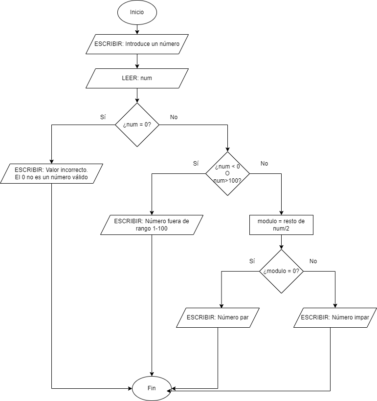
  <figcaption>Ejemplo de diagrama de flujo</figcaption>
</figure>

<figure>
  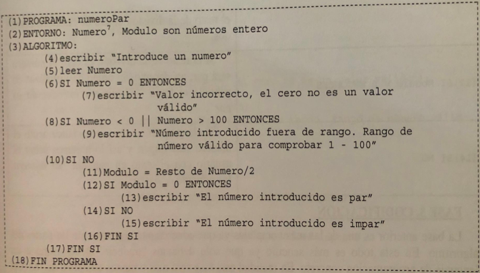
  <figcaption>Ejemplo de pseudocódigo</figcaption>
</figure>

**3. Codificación (Java)**

```java
import java.util.Scanner;

public class Main {
  public static void main(String[] args) {
    int modulo, numero;
    var scanner = new Scanner(System.in);
    System.out.println("Introduce un número");
    numero = Integer.parseInt(scanner.nextLine());

    if (numero == 0) {
      System.out.println("Valor incorrecto. El 0 no es válido");
    } else if (numero < 0 || numero > 100) {
      System.out.println("Número no válido, el rango es 1-100");
    } else {
      modulo = numero % 2;
      if (modulo == 0) {
        System.out.println("El número es par");
      } else {
        System.out.println("El número es impar");
      }
    }
  }
}
```

**4. Pruebas y validación**

* Probar con números válidos (p. ej. 4 → par, 7 → impar) e inválidos (0, 101, -3).
* Documentar cómo usar el programa.

**5. Explotación y mantenimiento**

* Cuando el software se usa en la práctica, se corrigen errores y se actualiza.

## 1.5 Lenguajes de programación

Los lenguajes han evolucionado mucho desde los inicios de la informática. Los agrupamos según su **nivel de abstracción** y su **forma de traducción**.

### 1. Lenguaje máquina

* Es el nivel más bajo.
* Se escribe directamente en **código binario** (0 y 1).
* Válido solo para un tipo de procesador concreto.
* Muy costoso para el programador, pero el único que entiende la CPU directamente.

<figure>
  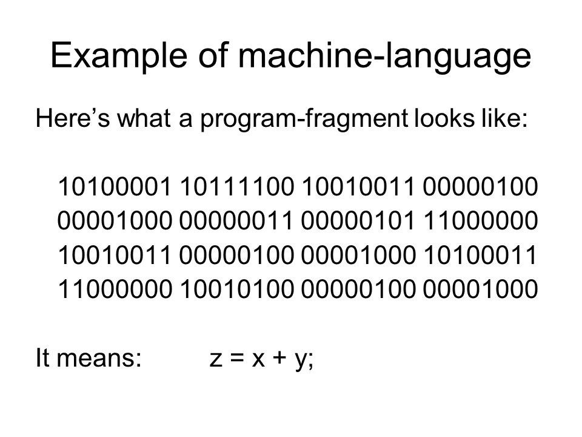
  <figcaption>Ejemplo de código en lenguaje máquina</figcaption>
</figure>

### 2. Lenguaje ensamblador

* Usa instrucciones **simbólicas (mnemónicos)** como `MOV`, `ADD`, `JMP`.
* Depende de la arquitectura del PC.
* Requiere gran conocimiento del hardware y control de los recursos.

!!! info "Ejemplo en vídeo"

    - [Lenguaje ensamblador (YouTube 1)](https://www.youtube.com/embed/GmtenWqfIaI)
    - [Lenguaje ensamblador (YouTube 2)](https://www.youtube.com/embed/wQf0u8cTAcg)

### 3. Lenguajes compilados

* Se usa un **compilador** que traduce todo el código de alto nivel a lenguaje máquina **de una sola vez**.
* Se genera un **ejecutable** independiente del compilador (aunque dependiente del sistema operativo).
* Más rápidos en ejecución.
* Ejemplos: C, C++ (sobre todo C#/Java a media distancia).

<figure>
  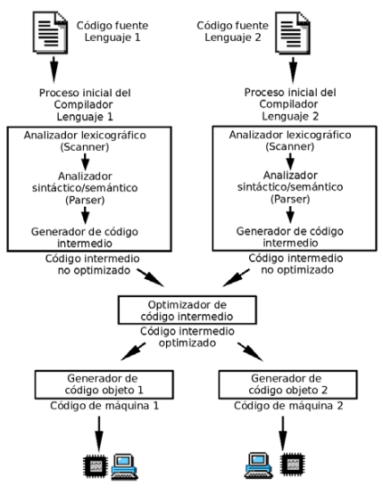
  <figcaption>Esquema del proceso de compilación</figcaption>
</figure>

| Ventajas | Inconvenientes |
|----------|----------------|
| Rápidos y eficientes | El ejecutable depende de la plataforma |
| Se detectan muchos errores en compilación | Hay que recompilar al hacer cambios |
| Generan programas muy optimizados | Menos flexibles para desarrollo rápido |

### 4. Lenguajes interpretados

* Se usa un **intérprete** que analiza, traduce y ejecuta **instrucción a instrucción**.
* Más lentos, pero más flexibles (se ejecutan directamente desde el código fuente).
* Ejemplos: Python, PHP, JavaScript.

```python
numero1 = int(input("Ingresa un número: "))
numero2 = int(input("Ingresa otro número: "))
operacion = input("suma, resta, división, multiplicación: ")

if operacion == "suma":
    print(numero1 + numero2)
elif operacion == "resta":
    print(numero1 - numero2)
elif operacion == "división":
    print(numero1 / numero2)
elif operacion == "multiplicación":
    print(numero1 * numero2)
```

| Ventajas | Inconvenientes |
|----------|----------------|
| Código portable (solo necesita el intérprete) | Más lentos en ejecución |
| Fáciles de depurar y probar | Los errores aparecen en tiempo de ejecución |
| Muy productivos para desarrollo | El cliente necesita el intérprete |

### Caso particular: Java

Java es **pseudo-compilado o pseudo-interpretado**:

* El **compilador (`javac`)** traduce el código fuente a **bytecode** (código intermedio) en lugar de a lenguaje máquina.
* El **intérprete (`java`)** de la **Máquina Virtual de Java (JVM)** ejecuta ese bytecode en cada plataforma.

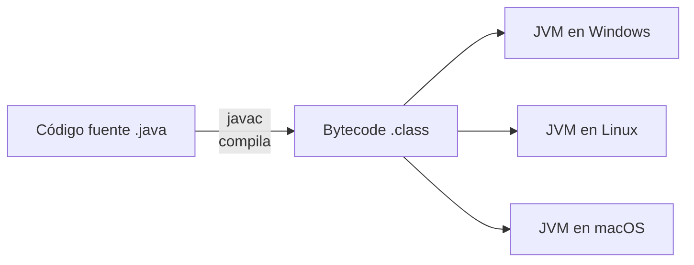

<figure>
  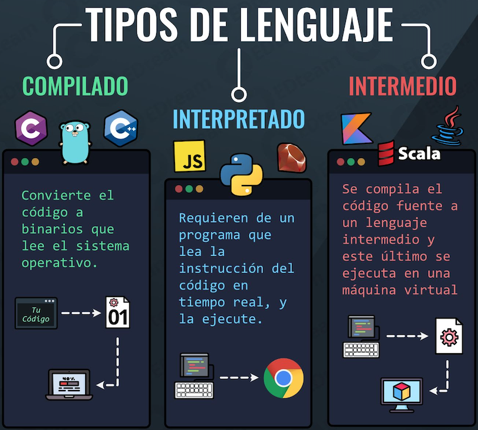
  <figcaption>Arquitectura completa de Java</figcaption>
</figure>

<figure>
  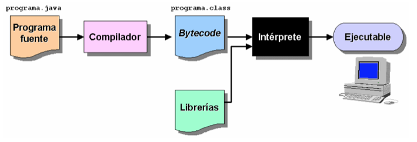
  <figcaption>El compilador (javac) e intérprete (java) en distintas plataformas</figcaption>
</figure>

!!! tip "Las siglas que debes conocer"
    - **JDK** (Java Development Kit): incluye compilador, herramientas y bibliotecas. Lo usas para **desarrollar**.
    - **JRE** (Java Runtime Environment): incluye la JVM y las bibliotecas. Basta para **ejecutar** programas.
    - **JVM** (Java Virtual Machine): la máquina virtual que ejecuta el bytecode.

## 1.6 Programas en Java

Java es uno de los lenguajes más utilizados del mundo. Sus características:

* Código **independiente de la arquitectura** gracias a la JVM.
* **Totalmente orientado a objetos** (y multiparadigma).
* Sintaxis **similar a C/C++**.
* Gran **biblioteca de clases** (la API estándar).
* Preparado para **aplicaciones en red**.
* **Seguro y robusto** (gestión de memoria automática, excepciones...).

### Ediciones y versiones del JDK

* **OpenJDK**: versión abierta y gratuita, desarrollada por la comunidad.
* **Oracle JDK**: versión comercial de Oracle, casi idéntica.

!!! info "Descarga e instalación"
    1. Descarga el **JDK 26** (Oracle JDK o OpenJDK) desde su web oficial.
    2. Establece la variable del sistema **PATH** para poder ejecutar `java` y `javac` desde cualquier terminal.
    3. Comprueba la instalación:

    ```terminal
    java -version
    javac -version
    ```

### Estructura de un programa Java

Todo programa Java tiene esta estructura:

```java
public class ClasePrincipal {
  // Definición de atributos de clase
  // Definición de métodos de clase
  // Método principal main
  public static void main(String[] args) {
    // Instrucciones
  }
}
```

Características:

* **Método principal `main`**: todo programa ejecutable debe tenerlo. Es el punto de entrada.
* **Comentarios**: de línea (`//`) o de bloque (`/* ... */`).
* **Bloques**: código delimitado por llaves `{ }`.

```java
/**
 * La clase HolaMundo implementa una aplicación que
 * simplemente imprime "Hola Mundo!" por la salida estándar.
 */
public class HolaMundo {
  public static void main(String[] args) {
    System.out.println("Hola Mundo!");
  }
}
```

### Tipos de programas en Java

Hoy en día Java se usa para desarrollar multitud de tipos de aplicaciones:

* **Aplicaciones de consola**: programas con interfaz de texto (las que haremos en clase).
* **Aplicaciones de escritorio**: interfaces gráficas con JavaFX o Swing.
* **Aplicaciones web del lado servidor**: Spring Boot, Jakarta EE (Servlets, JSP).
* **Aplicaciones Android**: la mayoría del framework Android está escrito en Java/Kotlin.
* **Microservicios**: servicios ligeros e independientes desplegados en la nube (Spring Boot, Quarkus).
* **Big Data**: distribución y procesamiento masivo de datos (Hadoop, Spark).

## 1.7 IA en el desarrollo de software

La **Inteligencia Artificial (IA)** ya forma parte del trabajo diario de las personas que programan. Se utiliza como **asistente** para escribir, revisar y entender código.

### Herramientas actuales (2026)

* [GitHub Copilot](https://github.com/features/copilot): asistente de código integrado en el IDE.
* Asistentes conversacionales: [ChatGPT](https://chatgpt.com/), [Claude](https://claude.ai/), [Gemini](https://gemini.google.com/).
* [IntelliJ IDEA AI Assistant](https://www.jetbrains.com/ai/): integrado en el IDE que usaremos.
* Editores con IA: [Cursor](https://cursor.com/), [VS Code](https://code.visualstudio.com/) con Copilot.

### ¿Qué pueden hacer por ti?

* Completar el código mientras escribes (autocompletado).
* Generar código a partir de una descripción en lenguaje natural.
* Explicar qué hace un fragmento de código o un error.
* Refactorizar: renombrar, simplificar y reorganizar el código.
* Escribir pruebas unitarias y comentarios.
* Buscar documentación de forma contextual.

### Buenas prácticas y riesgos

* **Verifica siempre** el código generado: la IA puede **alucinar** y producir código falso o incorrecto.
* No **copies sin entender**: si no puedes explicarlo, no lo has aprendido.
* No pegues **código confidencial** ni datos personales en herramientas externas.
* Úsala como un **profesor particular**: pide explicaciones, ejemplos y correcciones.

### La IA no sustituye los fundamentos

Programar con IA = **saber preguntar** + **saber validar**.

Para usar bien la IA necesitas entender:

* Abstracción, algoritmos y lógica: lo que verás en este tema.
* Cómo funciona el lenguaje que usas (Java).
* Leer y depurar código, no solo generarlo.

!!! tip "Recuerda"
    La IA hace el trabajo *mecánico*; el de *pensar* es tuyo.

## 1.8 Git y control de versiones

**Git** es un sistema de **control de versiones**: guarda el historial de cambios de tu código.

* **Repositorio**: el proyecto con todo su historial.
* **Commit**: un cambio concreto guardado con un mensaje descriptivo.
* **Ramas (branches)**: permiten trabajar en paralelo sin romper lo que funciona.
* **GitHub**: plataforma que aloja repositorios en la nube para colaborar y publicar tu código.

### Flujo básico

Comandos más utilizados:

```terminal
git clone https://github.com/usuario/repo.git    # copiar un repositorio
git status                                        # ver qué ha cambiado
git add .                                         # añadir los cambios
git commit -m "Mi primer commit"                  # guardarlos
git push                                          # subirlos a GitHub
git pull                                          # descargar cambios
```

Los IDEs (IntelliJ, VS Code) integran Git con botones y ventanas, sin usar terminal.

## 1.9 Entornos de Desarrollo Integrado (IDE)

Un **IDE** (Integrated Development Environment) integra editor, compilador, depurador y otras herramientas (control de versiones, refactorización, autocompletado...).

Los más conocidos para Java son:

* [IntelliJ IDEA](https://www.jetbrains.com/es-es/idea/): potente y muy usado en entornos profesionales. La edición *Community* es gratuita.
* [NetBeans](https://netbeans.apache.org/): gratuito y versátil, muy utilizado en entornos educativos.
* [VS Code](https://code.visualstudio.com/) con la extensión *Extension Pack for Java*: ligero y moderno.

!!! tip "Consejo"
    Empieza con un IDE sencillo, pero no olvides aprender también a **compilar desde la terminal** (`javac` y `java`). Eso te ayudará a entender mejor cómo funciona Java y a valorar lo que el IDE automatiza por ti.

### Tu primer proyecto: "Hola Mundo"

1. Ejecuta tu IDE y crea un **nuevo proyecto** Java (no uses plantillas de *Maven* todavía).
2. Crea una clase principal llamada `HolaMundo`.
3. Escribe el programa visto en el apartado anterior.
4. Compila (pulsa el botón de ejecutar / `Run`) y observa la salida en la consola del IDE.

!!! warning "Regla de oro"
    El **nombre del archivo** `.java` debe coincidir exactamente con el nombre de la **clase pública** que contiene.

## 1.10 Salidas profesionales

Un ciclo de **Desarrollo de Aplicaciones Web** te prepara para trabajar como programador, una de las profesiones más demandadas.

### Roles más habituales

* **Desarrollador**: backend, frontend, full-stack o móvil.
* **QA / Tester**: garantiza la calidad y escribe pruebas.
* **DevOps**: despliega y mantiene aplicaciones en servidores y en la nube.
* **Analista / científico de datos**: extrae valor de los datos.

### ¿Qué se valora en el sector?

* Dominar los fundamentos: lógica, algoritmos y POO, que verás este curso.
* Trabajar en equipo y usar control de versiones (Git).
* Aprender a aprender: la tecnología cambia muy rápido.
* Usar la IA como herramienta profesional, con criterio.

!!! note "Objetivo del curso"
    **Pensar como programador**.

## 1.11 Buenas prácticas

* **Escribe primero el algoritmo**: diseña con pseudocódigo o diagrama antes de abrir el IDE.
* **Nombres descriptivos**: las clases en `UpperCamelCase` y las variables en `lowerCamelCase`, en español o inglés, pero siempre coherente.
* **Comenta lo importante**: explica el *porqué*, no traduzcas el código línea a línea.
* **Prueba poco y a menudo**: compila y ejecuta al acabar cada pequeña mejora.
* **Un programa, un archivo**: en proyectos reales, cada clase pública va en su propio archivo.

## 1.12 Referencias

* [Documentación oficial de Java (Oracle)](https://docs.oracle.com/en/java/)
* [Descarga del OpenJDK](https://openjdk.org/)
* [IntelliJ IDEA Community](https://www.jetbrains.com/idea/download/)
* [NetBeans](https://netbeans.apache.org/)
* [Tutorial de Java de W3Schools](https://www.w3schools.com/java/)
* [Tutorial de Java de w3schools/JavaPoint](https://www.javatpoint.com/java-tutorial)
* [Documentación oficial de Git](https://git-scm.com/doc)
* [GitHub](https://github.com/)

## 1.13 Actividades

101. Enumera 5 ejemplos de tu vida diaria que dependen de la programación.

102. Explica con tus palabras la diferencia entre un **algoritmo** y un **programa**.

103. Representa en **pseudocódigo** un algoritmo que determine si un número es divisible por 5.

??? info "Solución ejercicio 103"
    ```text
    Escribir "Introduce un número: "
    Leer numero
    Si resto(numero, 5) == 0 Entonces
        Escribir "Es divisible por 5"
    SiNo
        Escribir "No es divisible por 5"
    FinSi
    ```

104. Busca 3 lenguajes de programación **compilados** y 3 **interpretados**. Comenta en qué situaciones se usaría cada uno.

105. Dibuja un **diagrama de flujo** que represente el cálculo del área de un triángulo.

??? info "Pseudocódigo de ayuda para el ejercicio 105"
    ```text
    Escribir "Base: "
    Leer base
    Escribir "Altura: "
    Leer altura
    area = (base * altura) / 2
    Escribir "El área es: ", area
    ```

106. Descarga e instala un IDE de Java. Crea un programa "Hola Mundo" y describe los pasos realizados.

107. Investiga la diferencia entre **OpenJDK** y **Oracle JDK** y explica cuál utilizarías en un proyecto educativo.

108. Busca una oferta de trabajo en programación y analiza: lenguaje solicitado, paradigma, herramientas y nivel de experiencia requerido.

109. Ordena del nivel más bajo al más alto: Java, ensamblador, lenguaje máquina, Python. Justifica tu respuesta.

110. Explica por qué el *bytecode* permite que un programa Java se ejecute en cualquier sistema operativo **sin recompilarlo**.