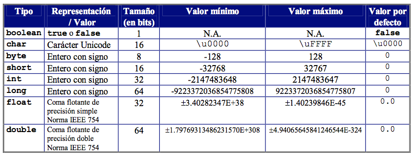
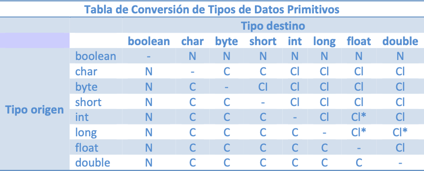

# Tema 2: Fundamentos básicos de la programación

??? abstract "Duración y criterios de evaluación"

    Duración estimada: 10 sesiones

    <hr />

    **Resultados de aprendizaje**

    1. Comprender los conceptos fundamentales del lenguaje Java relacionados con tipos de datos, variables y estructuras de control.
    2. Saber leer y escribir datos por consola y formatear la salida.
    3. Identificar y utilizar operadores y expresiones conociendo su precedencia y efectos.
    4. Aplicar conversiones de tipo (implícitas y explícitas) y prever pérdida de información.
    5. Implementar estructuras selectivas y repetitivas para resolver problemas básicos.
    6. Documentar y depurar programas sencillos en Java.

    **Criterios de evaluación**

    1. El alumno utiliza correctamente las funciones de entrada/salida (`Scanner`, `System.out`) y elige la más adecuada según la tarea.
    2. Se declaran variables con tipado adecuado, incluyendo constantes `final` cuando corresponde.
    3. Se aplican operadores correctamente y se demuestra conocimiento de su precedencia y efectos sobre tipos.
    4. Se implementan estructuras `if`, `switch`, `for`, `while` y `do-while` para solucionar problemas concretos.
    5. Se realizan pruebas que comprueban casos límite, se documentan los supuestos y se corrige con pruebas simples.
    6. Los ejercicios propuestos incluyen comentarios explicativos y manejo básico de errores de entrada.

---

## 2.1 Introducción

En este tema vamos a trabajar las *bases* de la programación imperativa con Java: cómo representar información (tipos y variables), cómo comunicarnos con el usuario (entrada y salida), y cómo controlar el flujo del programa (condicionales y bucles). Estos conceptos son claves porque, una vez dominados, permiten construir cualquier algoritmo y entender mejor paradigmas superiores (POO, concurrencia, etc.).

!!! tip "Lectura previa recomendada"
    Repasa el Tema 1 (Introducción a la programación) para recordar conceptos como algoritmo, pseudocódigo y diagrama de flujo —estos siguen siendo útiles cuando traduzcas la lógica a Java.

---

## 2.2 Salida de datos por pantalla

### Funciones básicas

En Java, la salida por consola se realiza fundamentalmente con la clase `System.out`. Las funciones más habituales son:

- `System.out.print("texto");` → imprime sin salto de línea.
- `System.out.println("texto");` → imprime y añade salto de línea.
- `System.out.printf("formato %args", arg1, arg2);` → imprime con formato (similar a `printf` en C).

Estas funciones pertenecen al *stream* estándar de salida (`stdout`) y son útiles para depuración y programas de consola.

```java
System.out.print("Hola");
System.out.println(" Mundo");
System.out.printf("Número: %d, texto: %s\n", 10, "ejemplo");
```

!!! example "Uso didáctico"
    Usa `println` cuando quieras mostrar líneas completas y `print` para construir la salida de forma progresiva. Emplea `printf` cuando necesites controlar el formato (ancho, decimales, justificación).

### Colorear texto (código ANSI)

En terminales compatibles, se pueden imprimir códigos de escape ANSI para cambiar color y estilo:

```java
public class Colores {
    public static void main(String[] args) {
        System.out.print("\033[33m mandarina");
        System.out.print("\033[32m hierba");
        System.out.print("\033[31m tomate");
        System.out.print("\033[0m\n"); // reset
    }
}
```

> **Nota importante:** No todas las consolas (especialmente emuladores de Windows antiguos) interpretan estos códigos por defecto. En Windows moderno (PowerShell, Windows Terminal) suelen funcionar; en algunos casos necesitarás librerías o configurar la consola.

### Caracteres especiales (Unicode)

Puedes usar secuencias `\uXXXX` para imprimir caracteres Unicode por su código hexadecimal:

```java
public class CaracteresEspeciales {
    public static void main(String[] args) {
        System.out.print("Corchea: \u266A");
        System.out.print(" Doble corchea: \u266B");
    }
}
```

Consulta tablas Unicode para encontrar símbolos útiles (p. ej. `\u266A` = ♪).

### Formatear la salida

`printf` permite máscaras como `%s`, `%d`, `%f` y especificadores de precisión y ancho:

```java
public class SalidaFormateada {
    public static void main(String[] args) {
        System.out.printf("El número %d no tiene decimales.\n", 21);
        System.out.printf("El número %.3f sale con 3 decimales.\n", 21.0);
        System.out.printf("Soy %s y tengo %d años.\n", "Eladio", 39);
    }
}
```

!!! tip "Formato y localización"
    Ten en cuenta que el separador decimal depende del *locale* en algunos métodos. `printf` en Java usa `.` como separador decimal a menos que cambies el `Locale`. Para salidas localizadas usa `String.format(Locale, ...)` o controla el `Locale` de `Formatter`.

<figure>
  
  <figcaption>Salida de datos y ejemplos en consola</figcaption>
</figure>

---

## 2.3 Variables e identificadores

### Identificadores

Un **identificador** es el nombre que damos a variables, métodos, clases o paquetes. Reglas y recomendaciones importantes:

- Java distingue entre mayúsculas y minúsculas: `num` ≠ `Num`.
- Convención de nombres: `lowerCamelCase` para variables y métodos, `UpperCamelCase` para clases.
- El primer carácter debe ser una letra, `$` o `_` (aunque `$` y `_` no se recomiendan).
- Evita palabras reservadas (p. ej. `class`, `int`, `if`...).

En equipos, seguir una guía de estilo (por ejemplo la de Google para Java) mejora la legibilidad.

!!! tip "Nombres descriptivos"
    Prefiere nombres descriptivos: `int numeroAlumnos` es más claro que `int n`.

<figure>
  
  <figcaption>Identificadores: convención lowerCamelCase</figcaption>
</figure>

### Variables

Una **variable** es una zona de memoria con nombre y tipo. Su tipo determina qué valores puede almacenar y qué operaciones admite.

```java
int numero;        // declaración
numero = 5;        // asignación

int contador = 0;  // declaración e inicialización
```

Tipos y ámbitos:

- **Locales**: declaradas dentro de métodos, visibles solo allí.
- **Miembro (field)**: declaradas en la clase, visibles para instancias o `static` para la clase.
- **Parámetros**: variables que reciben métodos al invocarlos.

### Tipos de variables (clasificación conceptual)

- **Primitivas vs Referenciadas**: las primitivas contienen el valor (ej. `int`), las referenciadas contienen una referencia a un objeto (`String`, `Persona`, arrays).
- **Variables vs Constantes**: constantes se declaran con `final`.
- **Miembro vs Local**: ámbito y ciclo de vida diferentes.

#### Ejemplo con variables estáticas y locales

```java
public class TiposVariables {
    // Constante
    final double PI = 3.1415926536;
    // Estática (campo de clase)
    static int x;

    static int obtenerX(int x){
        // Local a la función
        int valorAntiguo = x;
        return valorAntiguo;
    }

    public static void main(String[] args) {
        x = 5;
        System.out.println(obtenerX(x));
    }
}
```

---

## 2.4 Tipos de datos

Los tipos describen qué valores puede contener una variable y qué operaciones son válidas.

### Primitivos y referenciados

- **Primitivos**: `byte`, `short`, `int`, `long`, `float`, `double`, `char`, `boolean`.
- **Referenciados**: clases, interfaces, arrays (ej. `String`, `Persona`, `int[]`).

| Tipo     | Tamaño | Valores típicos / comentario |
|----------|--------|------------------------------|
| `byte`   | 8 bits | -128 a 127                   |
| `short`  | 16    | -32.768 a 32.767             |
| `int`    | 32    | -2^31 ... 2^31-1             |
| `long`   | 64    | números grandes, añade `L`   |
| `float`  | 32    | punto flotante simple, `f`   |
| `double` | 64    | punto flotante doble (por defecto) |
| `char`   | 16    | carácter Unicode             |
| `boolean`| 1 (conceptual) | `true` o `false`    |

<figure>
  
  <figcaption>Tipos de datos primitivos</figcaption>
</figure>

### Rangos y valores por defecto

Los tipos primitivos tienen valores por defecto cuando son campos de clase (no locales):

- `int` → `0`, `double` → `0.0`, `boolean` → `false`, `char` → `'\u0000'` (carácter nulo).

<figure>
  
  <figcaption>Rangos de los tipos primitivos</figcaption>
</figure>

### Declaración e inicialización: ejemplos

```java
boolean abierto = true;
byte repeticiones = 22;
char letra = 'a';
short pantalones = 22;
int asistentes = 22;
long poblacion = 2200000L;
float nota = 9.5f;
double precio = 22.55;
String nombre = "Eladio";
```

### `var` en Java

Desde Java 10 existe `var` para inferencia local de tipos:

```java
var numeroAlumnos = 15;
var radio = 3.14;  // double inferred
```

!!! warning "Uso de `var`"
    `var` mejora la concisión pero reduce la explícitez del código. Para variables con tipos claros y en ejemplos didácticos, recomendamos **declarar explícitamente** el tipo (especialmente en material de aprendizaje).

### `char`: formas de asignación

Un `char` puede asignarse de tres maneras:

- Directamente: `char c = 'A';`
- Por código Unicode: `char c = '\u0040';`
- Por entero (valor ASCII/Unicode): `char c = 63;  // '?'`

```java
char simbolo1 = '&';
char simbolo2 = '\u0040';
char simbolo3 = 63;
```

### `boolean`: expresiones lógicas

`boolean` almacena `true` o `false`. Se suele asignar a partir de comparaciones:

```java
int edad = 12;
boolean adulto = edad >= 18;

if (adulto) {
    System.out.println("Eres mayor de edad");
} else {
    System.out.println("Eres menor de edad");
}
```

---

## 2.5 Depuración y herramientas

Depurar es una habilidad esencial. Aprender a usar el *debugger* del IDE (breakpoints, inspección de variables, paso a paso) ayuda a entender el estado del programa y detectar errores lógicos.

<figure>
  
  <figcaption>Usando el debugger</figcaption>
</figure>

!!! tip "Estrategia de depuración"
    - Añade `System.out.printf` para inspecciones rápidas.  
    - Usa breakpoints para detener la ejecución y examinar variables.  
    - Escribe pruebas con datos límite para descubrir comportamientos inesperados.

---

## 2.6 Tipos referenciados

Los tipos referenciados no almacenan el valor directamente sino una referencia (puntero) a un objeto en memoria:

- Arrays: `int[] vector = new int[10];`
- Clases: `Persona usuario = new Persona();`
- `String` (inmutable): comparte características propias (pool de cadenas).

```java
public class Main {
    public static void main(String[] args) {
        Usuario usuarioActivo;
        int listaNotas[];
    }
}
```

---

## 2.7 Lectura de datos desde teclado

### Clase `Scanner`

`Scanner` es la forma más común de leer desde `System.in` en programas de consola:

```java
import java.util.Scanner;

public class LeerTextoScanner {
    public static void main(String[] args) {
        Scanner s = new Scanner(System.in);
        System.out.print("Dime tu nombre completo: ");
        String nombre = s.nextLine(); // lee hasta ENTER
    }
}
```

### Conversión de datos leídos

`Scanner` devuelve *strings* con `nextLine()` o tokens con `next()`. Para convertir a tipos numéricos se usan funciones como `Integer.parseInt` o `Float.parseFloat`:

```java
// Leer y convertir
String respuesta;
System.out.print("Dime tu edad: ");
respuesta = s.nextLine();
int edad = Integer.parseInt(respuesta);

// Leer float (usar punto decimal)
System.out.print("Dime tu estatura en metros: ");
respuesta = s.nextLine();
float estatura = Float.parseFloat(respuesta);

System.out.printf("Edad: %d años. Estatura: %.2f metros.", edad, estatura);
```

!!! warning "Decimal y configuración regional"
    En algunos sistemas, `nextFloat()` interpreta el separador decimal según el `Locale` (en España la coma). Para evitar confusiones, pide al usuario que use `.` como separador o establece explícitamente el `Locale` de `Scanner`.

### Leer varios datos con métodos específicos

`Scanner` incluye métodos `nextInt()`, `nextFloat()`, `next()` (token), `nextLine()` (línea completa):

```java
System.out.print("Dime tu nombre, edad y estatura separados por espacio: ");
String nombre = s.next();
int edad = s.nextInt();
float estatura = s.nextFloat();
```

### Combinar `nextLine()` con `nextInt()` — cuidado frecuente

Si usas `nextInt()` y después `nextLine()`, la segunda puede leer el salto de línea sobrante. Solución típica: consumir el salto con un `nextLine()` extra.

```java
int edad = s.nextInt();
s.nextLine(); // consume el salto pendiente
String nombre = s.nextLine();
```

!!! example "Patrón seguro"
    Para lecturas mixtas: lee siempre con `nextLine()` y parsea manualmente (`Integer.parseInt(...)`) para evitar efectos secundarios del buffer.

---

## 2.8 Operadores y expresiones

Los operadores manipulan valores primitivos y devuelven otro valor (generalmente primitivo). Entender la diferencia entre **expresión** (por ejemplo `i + 1`) y **sentencia** (`suma = i + 1;`) es clave.

### Aritméticos

`+`, `-`, `*`, `/`, `%` — con reglas de tipo: si ambos operandos son enteros, `/` hace división entera; si uno es float/double, la división es en coma flotante.

```java
short x = 4;
int y = 5;

System.out.println("El resultado de x / y (división entera) es: " + (x / y));
System.out.println("El resto de x / y es: " + (x % y));
```

### Asignación combinada

`+=`, `-=`, `*=`, `/=`, `%=` facilitan operaciones con asignación:

```java
int x = 5, y = 3;
x += y; // x == 8
x -= y; // x == 5 (si se vuelve a aplicar sobre el estado anterior)
```

### Incremento/decremento

Preincremento `++x` incrementa y devuelve el nuevo valor; postincremento `x++` devuelve el valor antiguo y luego incrementa.

```java
int x = 3;
int y = ++x; // x==4, y==4

x = 3;
y = x++; // x==4, y==3
```

### Relacionales

Comparan valores y devuelven `boolean`: `==`, `!=`, `<`, `>`, `<=`, `>=`.

**Importante**: para `String` en Java **no** uses `==` para comparar contenido; usa `equals()` o `equalsIgnoreCase()`.

```java
String nombre = "Manolo";
String input = s.nextLine();
boolean comp = nombre.equals(input);
```

### Lógicos

`&&` (AND), `||` (OR), `!` (NOT). Recuerda evaluación *cortocircuitada*: en `A && B`, si `A` es `false` no se evalúa `B`.

### Operador ternario

Sintaxis compacta: `variable = condición ? valorSiTrue : valorSiFalse;`

```java
String mensaje = (num % 2 == 0) ? "par" : "impar";
```

### Trabajo con cadenas (String)

Algunos métodos útiles:

- `length()` → longitud
- `concat(...)` → concatenar
- `equals(...)`, `equalsIgnoreCase(...)` → comparación
- `substring(i, j)` → subcadena
- `toUpperCase()`, `toLowerCase()` → cambios de caso

```java
String cad1 = "CICLO DAW", cad2 = "ciclo daw";
System.out.println(cad1.length());
System.out.println(cad1.equalsIgnoreCase(cad2));
System.out.println(cad1.substring(6));
```

<figure>
  
  <figcaption>Orden de precedencia de operadores (resumen visual)</figcaption>
</figure>

!!! tip "Precedencia y paréntesis"
    Si una expresión te resulta ambigua o depende del tipo de los operandos, usa paréntesis para dejar claro el orden de evaluación y evitar errores por coerción de tipos.

---

## 2.9 Conversión de tipo (cast)

La conversión entre tipos numéricos puede ser **implícita** (cuando el compilador lo permite sin pérdida aparente) o **explícita** (cuando el programador fuerza la conversión con cast).

### Conversión implícita (promoción)

Asignar de tipo menor a mayor:

```java
int numeroEntero = 10;
long numeroLong = numeroEntero; // implícita
float numeroFloat = numeroEntero; // 10.0f
```

### Conversión explícita (casting)

De mayor a menor (posible pérdida de datos):

```java
long numeroLong = 20L;
int numeroEntero = (int) numeroLong; // explícita

float numeroFloat = 5.9f;
int entero = (int) numeroFloat; // entero == 5 (se trunca)
```

#### Ejemplo clásico: media de enteros

Si sumas enteros y divides por `3` obtendrás división entera. Para obtener decimal, convierte al menos un operando a `float` o `double`:

```java
int nota1 = 4, nota2 = 7, nota3 = 8;
float media = (float)(nota1 + nota2 + nota3) / 3;
System.out.printf("Media: %.2f", media);
```

### Tabla de conversión (resumen)

- CI → conversión implícita posible
- C → casting explícito necesario
- N → no permitido

<figure>
  
  <figcaption>Tabla resumen de conversión entre tipos</figcaption>
</figure>

!!! tip "Evita pérdida silenciosa"
    Antes de castear, cuestiona si la pérdida de información es aceptable. Añade comentarios que justifiquen el cast si es deliberado.

---

## 2.10 Comentarios

Los comentarios facilitan la comprensión del código y la colaboración. Tipos en Java:

- `// comentario de una línea`
- `/* comentario
     de varias líneas */`
- `/** Comentario Javadoc */` → para documentación de clases/métodos (herramientas como `javadoc` lo usan)

```java
// Comentario de una línea
/*
  Comentario multilínea
*/
/**
 * Devuelve la suma de a y b.
 * @param a primer sumando
 * @param b segundo sumando
 * @return suma
 */
public int suma(int a, int b){ return a + b; }
```

!!! tip "Javadoc"
    Documenta parámetros y valores de retorno en métodos públicos. Facilita la generación automática de documentación.

---

## 2.11 Estructuras selectivas

Las estructuras selectivas permiten ejecutar código condicionalmente.

### `if` simple y `if-else`

```java
if (expresionLogica) {
    // sentencias si true
} else {
    // sentencias si false
}
```

Ejemplo: determinar par/impar

```java
public class ParImpar {
    public static void main(String[] args) {
        Scanner s = new Scanner(System.in);
        int num = Integer.parseInt(s.nextLine());

        // Es par si el resto de dividirlo entre 2 es 0
        int resto = num % 2;
        if (resto == 0) {
            System.out.printf("El número %d es par.", num);
        } else {
            System.out.printf("El número %d es impar.", num);
        }
    }
}
```

> Si el bloque contiene solo una sentencia, las llaves pueden omitirse, pero **no** es buena práctica omitirlas en código docente porque facilita errores al modificar el código.

### `switch` clásico y `switch` expression (Java 12+)

**Switch clásico** (compatible con `int`, `String`, etc.):

```java
switch(variable) {
    case valor1:
        sentencias;
        break;
    case valor2:
        sentencias;
        break;
    default:
        sentencias;
}
```

**Switch expression** (más moderno, Java 12/13+), uso de `->` o `yield`:

```java
int numMes = 5;
switch(numMes) {
    case 9, 10, 11, 12 -> System.out.println("1er trimestre");
    case 1, 2, 3 -> System.out.println("2º trimestre");
    case 4, 5, 6 -> {
        System.out.println("Último trimestre! :)");
        System.out.println("3er trimestre");
    }
    default -> System.out.println("No hay clase");
}
```

Ejemplo asignando valores y usando `yield`:

```java
String mes = "may";
int trimestre = switch(mes) {
    case "sep", "oct", "nov", "dic" -> 1;
    case "ene", "feb", "mar" -> 2;
    case "abr", "may", "jun" -> {
        System.out.println("Último trimestre! :)");
        yield 3;
    }
    default -> -1;
};
System.out.println("Trimestre número " + trimestre);
```

!!! example "Ejercicio (switch clásico)"
    Completa el `switch` que devuelve el nombre del mes a partir de su número:
    ```java
    var s = new Scanner(System.in);
    System.out.println("Introduce el número del mes: ");
    int mes = Integer.parseInt(s.nextLine());
    String nombreDelMes = "";
    switch(mes){
        case 1:
            nombreDelMes = "enero";
            break;
        case 2:
            nombreDelMes = "febrero";
            break;
        // COMPLETA EL CÓDIGO QUE FALTA AQUÍ
    }
    System.out.println("Mes " + mes + ": " + nombreDelMes);
    ```

---

## 2.12 Estructuras repetitivas

Las estructuras repetitivas permiten ejecutar una o varias sentencias varias veces hasta que se cumpla una condición.

### `for` clásico

```java
for (inicio; condicion; iteracion){
    sentencias;
}
```

Ejemplo: tabla de multiplicar

```java
System.out.println("Tabla de multiplicar del 5");
for (int i = 0; i <= 10; i++) {
    System.out.println(5 + " * " + i + " = " + 5 * i);
}
```

Contar hacia atrás:

```java
for (int i = 10; i >= 0; i--) {
    System.out.println("i = " + i);
}
```

### `for-each` (enhanced for)

Para recorrer arrays y colecciones de manera segura y sin índices:

```java
String semana[] = {"lunes", "martes", "miércoles", "jueves", "viernes", "sábado", "domingo"};
for (String dia : semana) {
    System.out.println("día = " + dia);
}
```

### `while`

```java
int i = 0;
while (i <= 10) {
    System.out.println(5 + " * " + i + " = " + 5 * i);
    i++; // iteración
}
```

Ejemplo práctico (login con intentos):

```java
boolean bloqueado = false;
boolean logueado = false;
String usuario = "admin", pass = "superPass1234";
int intentos = 3;

Scanner s = new Scanner(System.in);

while (!bloqueado && !logueado && intentos > 0) {
    System.out.print("Bienvenido, introduzca su usuario: ");
    String entradaUsuario = s.nextLine();
    System.out.print("Introduzca su contraseña: ");
    String entradaPass = s.nextLine();

    if (entradaUsuario.equals(usuario) && entradaPass.equals(pass)) {
        logueado = true;
        System.out.println("Acceso correcto");
    } else {
        intentos--;
        System.out.println("Error. Intentos restantes: " + intentos);
    }

    if (intentos == 0) {
        bloqueado = true;
    }
}
```

### `do-while`

Se ejecuta al menos una vez:

```java
int i = 1;
do {
    System.out.println("Valor: " + i);
    i++;
} while (i <= 5);
```

!!! tip "Elegir bucle"
    - Usa `for` cuando conoces el número de iteraciones.  
    - Usa `while` cuando la condición se evalúa antes y puede no ejecutarse ninguna vez.  
    - Usa `do-while` cuando la condición se evalúa después y necesitas asegurar una ejecución inicial.

<figure>
  
  <figcaption>Diagrama y ejemplos de bucles</figcaption>
</figure>

---

## 2.13 Ejercicios propuestos (ampliados)

A continuación encontrarás ejercicios con distintos niveles y sugerencias de mejora o ampliación.

201. **Positivo/negativo**  
    Escribe un programa que lea un número y diga si es positivo, negativo o cero.  
    - Ampliación: valida la entrada y maneja números grandes (`long`).  
    - Casos de prueba: -1, 0, 1, `Long.MAX_VALUE`.

202. **Operaciones básicas**  
    Crea un programa que lea dos números y muestre su suma, resta, multiplicación y división.  
    - Ampliación: gestiona división por cero con control de excepciones.

203. **Par/Impar**  
    Realiza un programa que pida un número e indique si es par o impar.  
    - Solución (colapsada abajo).

204. **Bucle `for` hasta 10**  
    Haz un programa que muestre los números del 1 al 10 usando un `for`.  
    - Ampliación: muestra también la tabla de multiplicar de cada número.

205. **Suma de primeros 100 naturales**  
    Programa que calcule y muestre la suma de los 100 primeros números naturales.  
    - Ampliación: implementa una solución matemática (`n*(n+1)/2`) y otra por bucle; compara tiempos.

206. **Validación completa**  
    Diseña un programa que pida la edad y valide que es un número entre 0 y 120. Si la entrada no es válida, vuelve a pedirla hasta que lo sea (usa `while` y manejo de excepciones).

207. **Menú de áreas (switch)**  
    Implementa el ejemplo del cálculo de áreas (cuadrado, rectángulo, triángulo) con `switch`. Mejora el menú para permitir repetir operaciones hasta que el usuario decida salir.

208. **Login con límites de intentos**  
    Implementa el ejemplo de login con `while` y añade un temporizador simulado tras 3 intentos fallidos (por ejemplo, `Thread.sleep(2000)` para pausar).

209. **Conversión y media**  
    Programa que lea tres notas enteras, calcule la media y muestre con 2 decimales. Prueba con entradas que muestren pérdida por conversión y explica cómo evitarla.

??? info "Solución ejercicio 203"
    ```java
    import java.util.Scanner;
    public class ParImpar {
        public static void main(String[] args) {
            Scanner sc = new Scanner(System.in);
            System.out.print("Introduce un número: ");
            int num = sc.nextInt();
            if (num % 2 == 0) {
                System.out.println("Es par");
            } else {
                System.out.println("Es impar");
            }
        }
    }
    ```

---

## 2.14 Recomendaciones y buenas prácticas (resumen extendido)

- **Documenta** funciones públicas con Javadoc.  
- **Nombres significativos** para variables, métodos y clases.  
- **Evita magia**: no uses números mágicos (constantes sin nombre).  
- **Comprueba entradas**: valida datos del usuario antes de parsear.  
- **Pruebas simples**: prueba con casos límite y nulos.  
- **Formato y estilo**: sigue una guía de estilo y mantén indentación consistente.

---

## Referencias y recursos adicionales

- Guía de estilo Java (Google Java Style Guide).  
- Documentación oficial Oracle/OpenJDK.  
- Tutoriales y recursos sobre `Scanner`, `String`, `Math`, y debugging en tu IDE preferido.

---

## Notas finales

Este documento replica y **amplía** la presentación original: mantiene todos los ejemplos en Java, preserva las rutas a las imágenes para su integración con tu sitio, y añade explicaciones, advertencias y ampliaciones donde procede. Si quieres que genere versiones alternativas (p. ej. con soluciones completas para todos los ejercicios dentro de `??? info "Solución"`), puedo hacerlo en una siguiente iteración.

