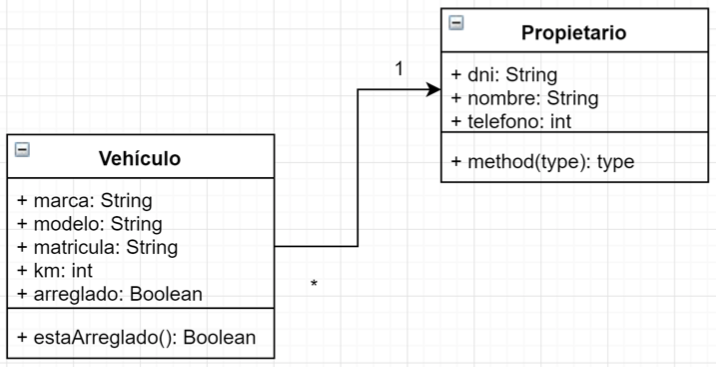
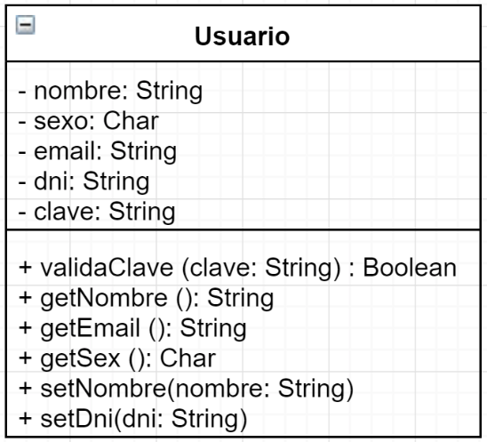
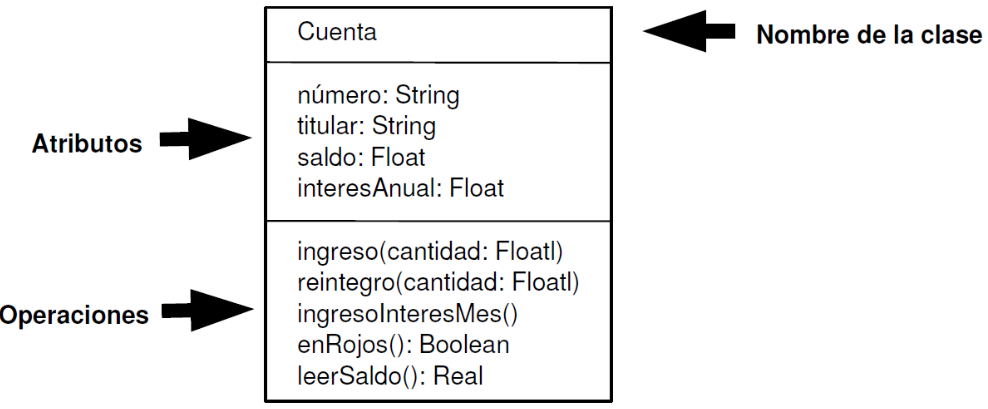
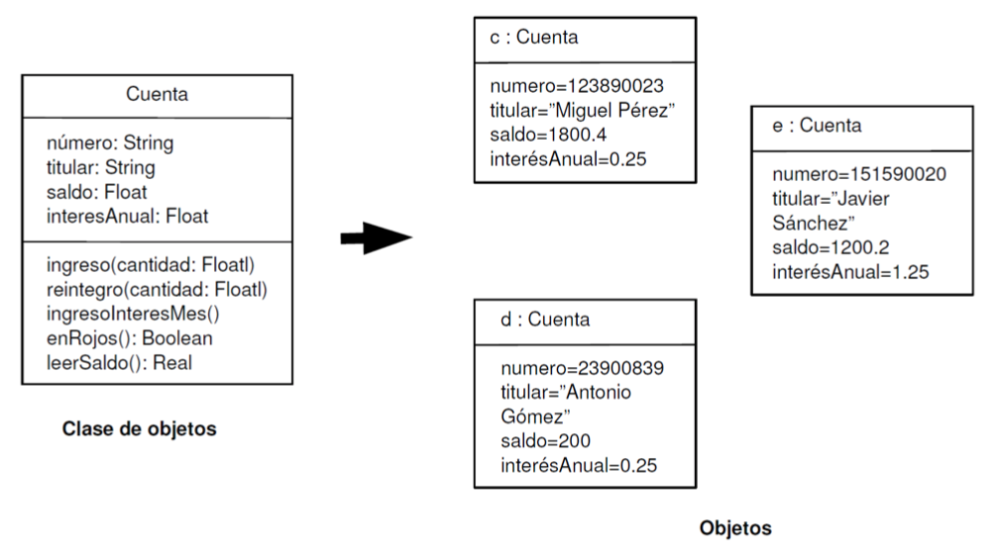

# Tema 3: Aleatorios y funciones

??? abstract "Duración y criterios de evaluación"

    Duración estimada: 12 sesiones

    <hr />

    **Resultados de aprendizaje:**

    1. Comprende la generación y uso de números aleatorios en Java.
    2. Define y utiliza funciones para estructurar el código.
    3. Emplea paso de parámetros y retorno de valores.
    4. Aplica modularidad en la resolución de problemas.
    5. Utiliza correctamente el ámbito de las variables y su ciclo de vida.

    **Criterios de evaluación:**

    1. Se ha utilizado la clase `Random` y el método `Math.random()` de forma adecuada.
    2. Se han diseñado funciones con parámetros y valor de retorno.
    3. Se ha empleado correctamente el ámbito de las variables.
    4. Se han organizado los programas en funciones reutilizables.
    5. Se han documentado y probado las funciones implementadas.

## 3.1 Números aleatorios

En muchos programas es necesario **generar valores aleatorios**, como en juegos, simulaciones o pruebas.  
En Java existen varias formas de hacerlo, siendo las más comunes la clase `Random` y el método estático `Math.random()`.

<figure>
  
  <figcaption>Ejemplo de aplicación que usa números aleatorios.</figcaption>
</figure>

### Uso de la clase `Random`

```java
import java.util.Random;

public class Aleatorios {
    public static void main(String[] args) {
        Random r = new Random();
        int numero = r.nextInt(10); // genera número entre 0 y 9
        System.out.println("Número generado: " + numero);
    }
}
```

!!! info "Métodos principales de Random"
    - `nextInt(n)` → devuelve un número entero entre 0 y *n-1*  
    - `nextDouble()` → devuelve un número decimal entre 0.0 y 1.0  
    - `nextBoolean()` → genera un valor verdadero o falso

### Uso de `Math.random()`

```java
double aleatorio = Math.random(); // valor entre 0.0 y 1.0
int numero = (int) (Math.random() * 10); // valor entre 0 y 9
```

!!! example "Ejemplo práctico"
    ```java
    public class EjemploRandom {
        public static void main(String[] args) {
            for (int i = 0; i < 5; i++) {
                int dado = (int) (Math.random() * 6) + 1;
                System.out.println("Tirada: " + dado);
            }
        }
    }
    ```

## 3.2 Funciones

Una **función** (también llamada *método* cuando se usa POO) es un bloque de código que realiza una tarea específica.  
Permiten dividir un programa en partes más pequeñas y reutilizables.

### Estructura general

```java
modificador tipoRetorno nombreFuncion(parámetros) {
    // cuerpo del método
    return valor;
}
```

Ejemplo básico:

```java
public static int sumar(int a, int b) {
    return a + b;
}
```

!!! tip "Ventajas del uso de funciones"
    - Favorecen la **reutilización** del código.
    - Mejoran la **legibilidad** y **mantenimiento**.
    - Permiten **aislar errores** y depurar más fácilmente.

<figure>
  
  <figcaption>Estructura general de un método en Java.</figcaption>
</figure>

## 3.3 Tipos de funciones

Podemos clasificar las funciones según **reciban o no parámetros** y **devuelvan o no un valor**.

| Tipo | Parámetros | Retorno | Ejemplo |
|------|-------------|----------|----------|
| Sin parámetros ni retorno | No | No | `void saludar()` |
| Con parámetros | Sí | No | `void mostrar(String msg)` |
| Con retorno | No | Sí | `int obtenerNumero()` |
| Con parámetros y retorno | Sí | Sí | `int sumar(int a, int b)` |

### Ejemplo completo

```java
public class EjemploFunciones {
    public static void main(String[] args) {
        saludar();
        mostrar("¡Bienvenido a Java!");
        int resultado = sumar(5, 3);
        System.out.println("Resultado: " + resultado);
    }

    static void saludar() {
        System.out.println("Hola!");
    }

    static void mostrar(String mensaje) {
        System.out.println(mensaje);
    }

    static int sumar(int a, int b) {
        return a + b;
    }
}
```

## 3.4 Parámetros y argumentos

Cuando una función necesita datos externos, en la definición de la función los indicamos mediante **parámetros** y en la llamada mediante **argumentos**.

En Java el paso de parámetros se realiza **por valor**, lo que significa que la función recibe una copia de los datos.

<figure>
  
  <figcaption>Paso de parámetros a funciones en Java.</figcaption>
</figure>

```java
public class PasoPorValor {
    // En la declaración de la función --> parámetro x
    static void duplicar(int x) {
        x = x * 2;
        System.out.println("Dentro de la función: " + x);
    }

    public static void main(String[] args) {
        int num = 5;
        // En la llamada a la función --> argumento num
        duplicar(num);
        System.out.println("Fuera de la función: " + num);
    }
}
```

!!! info "Resultado"
    Dentro de la función: 10  
    Fuera de la función: 5

## 3.5 Ámbito de las variables

Las variables tienen un **ámbito** (scope) que determina desde dónde pueden usarse.  
Una variable declarada dentro de una función es **local**; fuera de ella, **global** (aunque en Java, las variables de clase son atributos).

```java
public class Ambito {
    static int global = 10;

    public static void main(String[] args) {
        int local = 5;
        System.out.println("Variable local: " + local);
        System.out.println("Variable global: " + global);
    }
}
```

!!! tip "Recuerda"
    Las variables locales se crean al entrar en la función y se destruyen al salir.

## 3.6 Recursividad

Una función puede **llamarse a sí misma**, lo que se denomina *recursividad*. Debe tener una **condición de parada** para evitar llamadas infinitas.

### Ejemplo de factorial recursivo

```java
public class Factorial {
    static int factorial(int n) {
        if (n == 0) return 1; // Condición de parada
        else return n * factorial(n - 1);
    }

    public static void main(String[] args) {
        System.out.println("Factorial de 5 = " + factorial(5));
    }
}
```

!!! warning "Precaución"
    Las llamadas recursivas consumen memoria, por lo que deben usarse con cuidado.

## 3.7 Funciones con números aleatorios

Podemos combinar la generación de números aleatorios con funciones para crear programas más estructurados.

```java
import java.util.Random;

public class Lanzamiento {
    static int tirarDado() {
        Random r = new Random();
        return r.nextInt(6) + 1;
    }

    public static void main(String[] args) {
        for (int i = 0; i < 3; i++) {
            System.out.println("Tirada " + (i+1) + ": " + tirarDado());
        }
    }
}
```

<figure>
  
  <figcaption>Ejemplo de función con valores aleatorios.</figcaption>
</figure>

## 3.8 Ejercicios propuestos

301. Crea una función que reciba dos números enteros y devuelva el mayor.  
302. Diseña un método que calcule el cuadrado de un número.  
303. Escribe una función que simule el lanzamiento de un dado de 6 caras.  
304. Implementa una función que reciba un número y devuelva su factorial.  
305. Realiza un programa que genere 10 números aleatorios y calcule su media.  
306. Haz un programa que use una función para comprobar si un número es primo.

??? info "Solución ejercicio 303"
    ```java
    import java.util.Random;
    public class Dado {
        static int lanzar() {
            Random r = new Random();
            return r.nextInt(6) + 1;
        }
        public static void main(String[] args) {
            System.out.println("Resultado: " + lanzar());
        }
    }
    ```

??? info "Solución ejercicio 304"
    ```java
    public class Factorial {
        static int factorial(int n) {
            if (n == 0) return 1;
            else return n * factorial(n - 1);
        }
        public static void main(String[] args) {
            System.out.println("Factorial de 5: " + factorial(5));
        }
    }
    ```

??? info "Solución ejercicio 306"
    ```java
    public class Primo {
        static boolean esPrimo(int n) {
            if (n <= 1) return false;
            for (int i = 2; i <= Math.sqrt(n); i++) {
                if (n % i == 0) return false;
            }
            return true;
        }

        public static void main(String[] args) {
            for (int i = 1; i <= 10; i++) {
                System.out.println(i + " es primo? " + esPrimo(i));
            }
        }
    }
    ```
