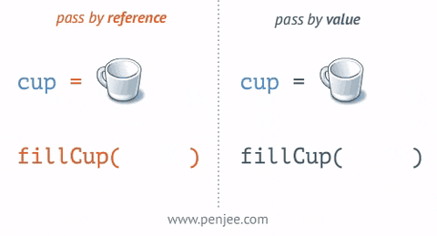
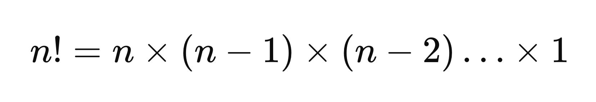
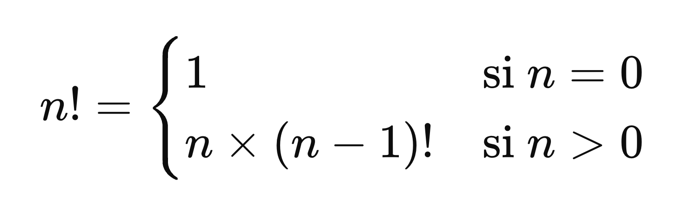
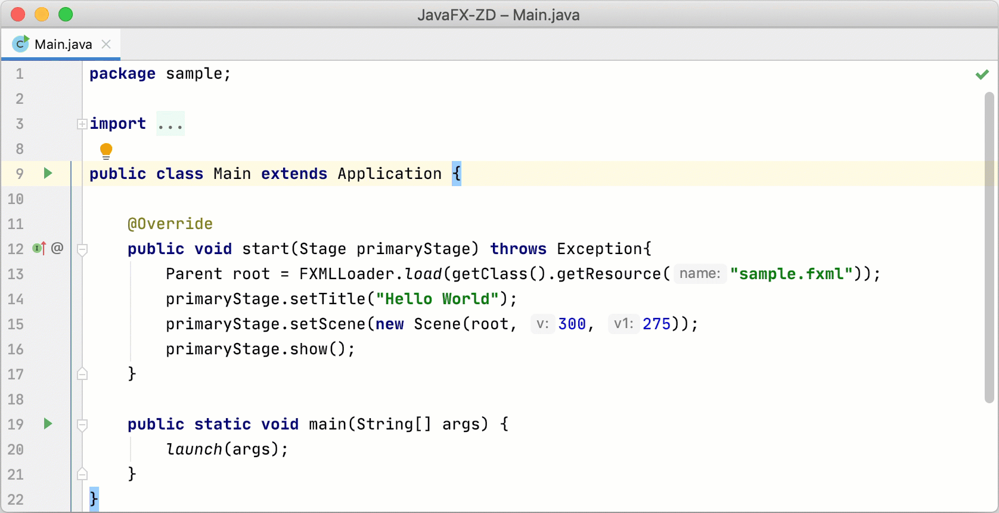
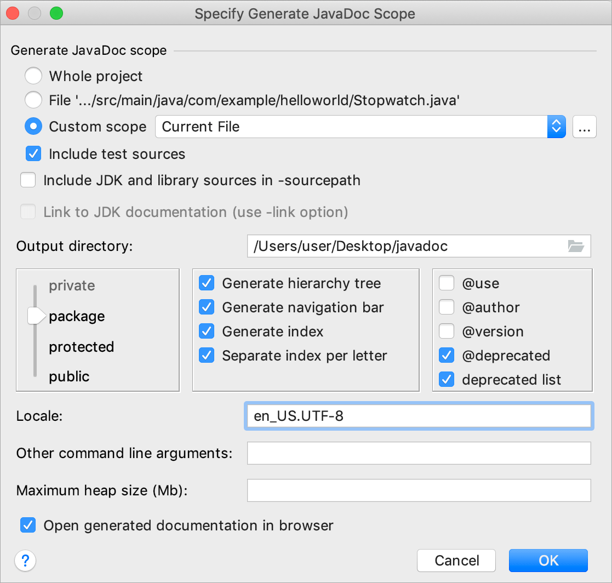
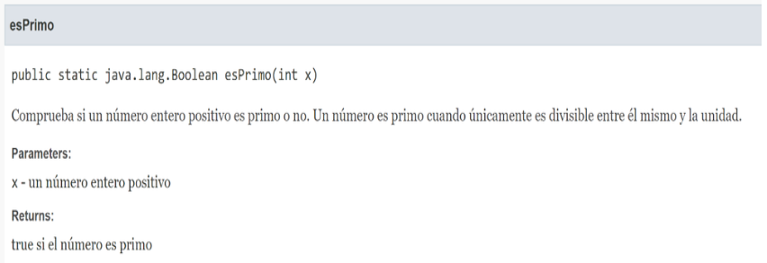

# Tema 3: Aleatorios y funciones

??? abstract "Duración y criterios de evaluación"

    Duración estimada: 12 sesiones

    <hr />

    **Resultados de aprendizaje**

    1. Comprende la generación y uso de números aleatorios en Java.
    2. Define y utiliza funciones para estructurar el código.
    3. Emplea paso de parámetros y retorno de valores.
    4. Aplica modularidad en la resolución de problemas.
    5. Utiliza correctamente el ámbito de las variables y su ciclo de vida.

    **Criterios de evaluación**

    1. Se ha utilizado la clase `Random` y el método `Math.random()` de forma adecuada.
    2. Se han diseñado funciones con parámetros y valor de retorno.
    3. Se ha empleado correctamente el ámbito de las variables.
    4. Se han organizado los programas en funciones reutilizables.
    5. Se han documentado y probado las funciones implementadas.

## 3.1 Números aleatorios

En muchos programas es necesario **generar valores aleatorios**, como en juegos, simulaciones, cifrado o pruebas. En Java existen varias formas de hacerlo, siendo las más comunes la clase `Random` y el método estático `Math.random()`.

### Uso de `Math.random()`

`Math.random()` devuelve un valor de tipo `double` entre *0* y *0.99999999999*. Ese valor lo normalizamos multiplicándolo por el número de elementos que queremos generar, sumándole el valor inicial y convirtiendo el resultado a entero. **Fórmula general**:

> (int) (aleatorio * nº de elementos del rango + valor inicial)

```java
double aleatorio = Math.random(); // valor entre 0.0 y 0.9999999999
int numero = (int) (Math.random() * 10); // valor entre 0 y 9
```

!!! example "Ejemplo práctico: 5 tiradas de un dado"
    ```java
    public class EjemploRandom {
        public static void main(String[] args) {
            for (int i = 0; i < 5; i++) {
                int dado = (int) (Math.random() * 6) + 1;
                System.out.println("Tirada: " + dado);
            }
        }
    }
    ```

### Rangos personalizados

Podemos generar números en **cualquier rango** indicado con su valor inicial (Vi) y su valor final (Vf). El número de elementos del rango es `Vf - Vi + 1`:

```java
int numero = (int) (Math.random() * (Vf - Vi + 1)) + Vi;
```

Por ejemplo, para generar 20 números aleatorios entre 1 y 10:

```java
System.out.println("Veinte números aleatorios entre 1 y 10:\n");
for (int i = 1; i <= 20; i++) {
    int num = (int) (Math.random() * 10) + 1;
    System.out.println(num);
}
```

### Números aleatorios combinados con `switch`

Combinando los números aleatorios con un `switch` podemos generar **palabras aleatorias** (o valores semánticos):

```java
public class PalabrasAleatorias {
    public static void main(String[] args) {
        System.out.println("Genera al azar piedra, papel o tijera:");

        int opcion = (int) (Math.random() * 3);
        String palabra;

        switch (opcion) {
            case 0 -> palabra = "piedra";
            case 1 -> palabra = "papel";
            default -> palabra = "tijera";
        }
        System.out.println(palabra);
    }
}
```

<figure>
  
  <figcaption>Ejercicio: devolver un día de la semana aleatorio</figcaption>
</figure>

### Uso de la clase `Random`

La clase `Random` es más sencilla de utilizar, pues directamente podemos utilizar sus funciones para generar el número aleatorio en el tipo de dato que nos interese.

```java
import java.util.Random;

public class Aleatorios {
    public static void main(String[] args) {
        Random r = new Random();
        int numero = r.nextInt(10); // genera número entre 0 y 9
        System.out.println("Número generado: " + numero);
    }
}
```

!!! info "Métodos principales de Random"
    - `nextInt(n)` → devuelve un número entero entre 0 y *n-1*
    - `nextInt(desde, hasta)` → devuelve un entero entre `desde` (incluido) y `hasta` (excluido)
    - `nextDouble()` → devuelve un número decimal entre 0.0 y 1.0
    - `nextBoolean()` → genera un valor verdadero o falso
    - `nextLong()` → número entero grande aleatorio

!!! tip "¿`Math.random()` o `Random`?"
    - `Math.random()` es un método estático sencillo, suficiente para la mayoría de ejercicios.
    - `Random` permite más control (semilla, rangos directos, otros tipos) y es la opción recomendada para programas reales.

## 3.2 Introducción a las funciones

Una **función** (también llamada *método* cuando se usa POO) es un bloque de código que realiza una tarea específica, opcionalmente recibe parámetros de entrada y devuelve un valor de salida. Permiten dividir un programa en partes más pequeñas y reutilizables.

#### Ejemplo de función que no recibe nada ni devuelve nada

Útil para mostrar menús:

```java
public static void muestraMenu() {
    System.out.println("\n###### Menú ######");
    System.out.println("1. Ingreso");
    System.out.println("2. Reintegro");
    System.out.println("3. Consulta de saldo");
    System.out.println("0. Salir");
}
```

#### Ejemplo de función que no recibe nada y devuelve un entero

Útil para pedir datos al usuario:

```java
public static int leerNumero() {
    Scanner s = new Scanner(System.in);
    System.out.print("Introduce un número: ");
    return Integer.parseInt(s.nextLine());
}
```

#### Ejemplo de función que recibe un entero y no devuelve nada

Útil para procesar datos o hacer cálculos:

```java
public static void ejecutaOpcion(int opc) {
    int num1, num2, resultado;
    num1 = leerNumero();
    num2 = leerNumero();

    if (opc == 1) {
        resultado = num1 + num2;
        System.out.println("Resultado: " + resultado);
    }
}
```

#### Ejemplo de función que recibe 2 enteros y devuelve un entero

```java
public static int suma(int num1, int num2) {
    int resultado = num1 + num2;
    return resultado;
}
```

#### El main como función principal

El `main` es la función principal que tiene que tener todo código que se vaya a ejecutar:

```java
public static void main(String[] args) {
    int opcion;
    do {
        muestraMenu();
        opcion = leerNumero();
        ejecutaOpcion(opcion);
    } while (opcion != 0);
}
```

### Ventajas del uso de funciones

!!! tip "Ventajas del uso de funciones"
    - Favorecen la **reutilización** del código (escribir una vez, usar muchas).
    - Mejoran la **legibilidad** y el **mantenimiento** (cada función hace una cosa).
    - Permiten **aislar errores** y depurar más fácilmente.
    - Facilitan el **trabajo en equipo** (cada miembro desarrolla una parte).

## 3.3 Declaración y llamada

### Declaración

```java
public static boolean esPrimo(int x) {
    for (int i = 2; i < x; i++) {
        if (x % i == 0) {
            return false;
        }
    }
    return true;
}
```

> Importante declararla como `static` para que pueda ser llamada directamente desde el `main` sin crear objetos (se estudia en el tema POO).

### Llamada

```java
public static void main(String[] args) {
    Scanner s = new Scanner(System.in);
    System.out.print("Bienvenido, introduzca un número: ");
    int n = Integer.parseInt(s.nextLine());

    if (esPrimo(n)) {
        System.out.println(n + " es primo");
    } else {
        System.out.println(n + " no es primo");
    }
}
```

### Tipos de funciones

Podemos clasificar las funciones según **reciban o no parámetros** y **devuelvan o no un valor**:

| Tipo | Parámetros | Retorno | Ejemplo |
|------|-------------|----------|----------|
| Sin parámetros ni retorno | No | No | `void saludar()` |
| Con parámetros | Sí | No | `void mostrar(String msg)` |
| Con retorno | No | Sí | `int obtenerNumero()` |
| Con parámetros y retorno | Sí | Sí | `int sumar(int a, int b)` |

!!! info "Las funciones sin retorno se llaman *procedimientos*"
    En Java, una función que no devuelve nada se declara con el tipo de retorno `void`. El resto de funciones deben terminar con `return valor;`.

## 3.4 Siempre con la sintaxis completa

La sintaxis general de la **declaración** de una función es:

```java
modificadores tipoRetorno nombreFuncion(listaParámetros) {
    // cuerpo de la función
    return valor; // obligatorio si tipoRetorno != void
}
```

### Parámetros y argumentos

Cuando una función necesita datos externos, en la definición de la función los indicamos mediante **parámetros** y en la llamada mediante **argumentos**.

Es muy importante **no declarar dentro de la función variables con el mismo nombre que los parámetros**.

## 3.5 Sobrecarga de funciones

Java permite que varias funciones **compartan el mismo identificador** siempre que sus parámetros sean **diferentes en número o tipo**:

```java
public static int suma(int a, int b) {
    return a + b;
}

public static int suma(int a, int b, int c) {   // 3 parámetros
    return a + b + c;
}

public static double suma(double a, double b) { // tipo double
    return a + b;
}

public static void main(String[] args) {
    System.out.println(suma(2, 3));        // 5      -> usa la 1ª
    System.out.println(suma(2, 3, 4));     // 9      -> usa la 2ª
    System.out.println(suma(2.5, 3.5));    // 6.0    -> usa la 3ª
}
```

> El compilador es el encargado de elegir qué versión utilizar **según el número y tipo de los argumentos** de la llamada.

## 3.6 Ámbito de las variables

Las variables tienen un **ámbito** (scope) que determina desde dónde pueden usarse. Una variable **actúa dentro de su ámbito o bloque** donde está definida. Dos variables con el mismo nombre, definidas dentro y fuera de la función, son **independientes entre sí**.

```java
public class Ambito {
    static int global = 10; // variable global de la clase

    public static void main(String[] args) {
        int local = 5;      // variable local al main
        System.out.println("Variable local: " + local);
        System.out.println("Variable global: " + global);
    }
}
```

```java
public static void main(String[] args) {
    Scanner s = new Scanner(System.in);
    System.out.print("Bienvenido, introduzca un número: ");
    int i = Integer.parseInt(s.nextLine()); // 'i' local al main

    if (esPrimo(i)) {
        System.out.println(i + " es primo");
    }
}
```

!!! tip "Recuerda"
    - Las variables locales se crean al entrar en la función y se destruyen al salir de la misma.
    - Hay que **evitar el uso de variables globales** siempre que sea posible (dificultan conocer dónde se modifican).
    - Si una variable se necesita en varias funciones, lo correcto es **pasarla como parámetro**.

## 3.7 Parámetros por valor o por referencia

- **Por valor**: se pasa una **copia** de la variable, solo importa su valor. Cualquier modificación que se haga a la variable dentro de la función **no afecta** al argumento original.
- **Por referencia**: se pasa la **referencia (dirección de memoria)** del objeto. Modificar el objeto dentro de la función **sí afecta** al original.

<figure>
  
  <figcaption>Paso de parámetros a funciones en Java</figcaption>
</figure>

> En muchos lenguajes es el programador quien decide cuándo se pasa un parámetro por valor o por referencia. **En Java no podemos elegir**: los **tipos primitivos** (`int`, `double`, `char`, `boolean`...) siempre se pasan **por valor**, y los **objetos y arrays** siempre por **referencia**.

```java
public class PasoPorValor {
    static void duplicar(int x) {
        x = x * 2;
        System.out.println("Dentro de la función: " + x);
    }

    public static void main(String[] args) {
        int num = 5;
        duplicar(num);        // se pasa una copia
        System.out.println("Fuera de la función: " + num);
    }
}
```

??? info "Resultado del ejemplo"
    Dentro de la función: 10  
    Fuera de la función: 5

!!! example "Diferencia con objetos"
    Si pasamos un array (objeto) a una función, los cambios **sí** afectan al array original:

    ```java
    static void rellena(int[] a) {
        for (int i = 0; i < a.length; i++) {
            a[i] = i + 1;
        }
    }

    public static void main(String[] args) {
        int[] numeros = new int[3]; // {0, 0, 0}
        rellena(numeros);
        System.out.println(java.util.Arrays.toString(numeros)); // [1, 2, 3]
    }
    ```

## 3.8 Bibliotecas de funciones

Las funciones de un determinado tipo se pueden agrupar para crear un **paquete** que luego se importará desde el programa que necesite usarlas. Cada función encapsula una operación que puede ser aprovechada por cualquier programa.

### Declaración de las funciones en una clase dentro de un paquete

```java
package bibliotecaFunciones;

public class Matematicas {
    public static int suma(int a, int b) {
        return a + b;
    }

    public static boolean esPar(int n) {
        return n % 2 == 0;
    }
}
```

### Uso de las funciones

Sin importar:

```java
package funciones;

public class Funciones01 {
    public static void main(String[] args) {
        int resultado = bibliotecaFunciones.Matematicas.suma(2, 3);
        System.out.println("Resultado: " + resultado);
    }
}
```

Con `import` (recomendado):

```java
package funciones;

import static bibliotecaFunciones.Matematicas.suma;
// import static bibliotecaFunciones.Matematicas.*;  // importar todas

public class Funciones02 {
    public static void main(String[] args) {
        int resultado = suma(2, 3);
        System.out.println("Resultado: " + resultado);
    }
}
```

!!! info "`import` estático"
    Desde Java 5 existe el **`import static`**, que permite usar los miembros estáticos de una clase sin anteponer el nombre de la clase.

## 3.9 Recursividad

La **recursividad** es un concepto donde una función **se llama a sí misma** para resolver un problema. Este enfoque resulta especialmente útil para problemas que se pueden descomponer en sub-problemas más pequeños del mismo tipo.

### ¿Cómo funciona la recursividad?

- **Caso base**: condición que **detiene la recursión**. Sin un caso base, la función se llamaría a sí misma infinitamente.
- **Caso recursivo**: la parte de la función que se llama a sí misma con un problema más pequeño.

### Ejemplo práctico: Factorial

El factorial de un número *n* (representado como *n!*) es el producto de todos los números enteros positivos desde 1 hasta *n*. Matemáticamente: `n! = n * (n-1)!`, con `0! = 1`.

<figure>
  
  <figcaption>Explicación matemática del factorial</figcaption>
</figure>

<figure>
  
  <figcaption>Caso base y caso recursivo del factorial</figcaption>
</figure>

```java
public class Recursividad {
    // Método recursivo para calcular el factorial
    public static int factorial(int n) {
        if (n == 0) {                // caso base
            return 1;
        }
        return n * factorial(n - 1); // caso recursivo
    }

    public static void main(String[] args) {
        System.out.println("Factorial de 5 = " + factorial(5));
    }
}
```

### Ejemplo práctico: Sucesión de Fibonacci

La sucesión de Fibonacci define cada término como la suma de los dos anteriores: `F(0)=0`, `F(1)=1`, `F(n)=F(n-1)+F(n-2)`.

```java
public class Fibonacci {
    public static long fibonacci(int n) {
        if (n == 0) return 0; // caso base 1
        if (n == 1) return 1; // caso base 2
        return fibonacci(n - 1) + fibonacci(n - 2); // caso recursivo
    }

    public static void main(String[] args) {
        for (int i = 0; i <= 10; i++) {
            System.out.println("F(" + i + ") = " + fibonacci(i));
        }
    }
}
```

!!! warning "Precaución"
    Las llamadas recursivas **consumen memoria** (cada llamada ocupa espacio en la pila) y, mal planteadas, pueden producir desbordamiento (`StackOverflowError`). Úsalas con cuidado y comprueba siempre el **caso base**.

!!! tip "Recursividad vs. iteración y coste exponencial"
    Todo problema recursivo **puede resolverse también de forma iterativa** (con bucles). En general la versión iterativa es más eficiente en memoria. Además, la Fibonacci recursiva ingenua tiene **coste exponencial** (O(2ⁿ)) porque repetimos muchísimos cálculos; una versión iterativa es O(n).

## 3.10 Javadoc

**Javadoc** es el sistema de documentación de Java: documentación mediante **comentarios especiales** que se generan de forma automática con la herramienta `javadoc` de la JDK.

### Etiquetas principales

| Etiqueta    | Significado                                 |
|-------------|---------------------------------------------|
| `/**`       | Inicio de un comentario Javadoc             |
| `@author`   | Autor de la función/clase                   |
| `@param`    | Parámetros de la función                    |
| `@return`   | Lo que devuelve la función                  |
| `@throws`   | Excepciones que puede lanzar                |
| `@see`      | Referencia a otra documentación             |

### Ejemplo de comentarios Javadoc

```java
/**
 * Comprueba si un número entero positivo es primo o no.
 * Un número es primo cuando únicamente es divisible entre
 * él mismo y la unidad.
 *
 * @param n número entero positivo a comprobar
 * @return true si es primo, false en caso contrario
 * @author Eladio Blanco
 */
public static boolean esPrimo(int n) {
    ...
}
```

<figure>
  
  <figcaption>Comentarios Javadoc automáticos en IntelliJ</figcaption>
</figure>

### Generar la documentación en IntelliJ

Desde el menú **Tools → Generate Javadoc…** se puede generar la página HTML de documentación:

<figure>
  
  <figcaption>Tools → Generate JavaDoc con selección de output directory y visibilidad</figcaption>
</figure>

<figure>
  
  <figcaption>Ejemplo de documentación generada con Javadoc</figcaption>
</figure>

!!! tip "Nivel de visibilidad"
    Al generar el Javadoc podemos elegir la visibilidad de los miembros a documentar: `private`, `package`, `protected` o `public`. Lo habitual en proyectos es documentar lo `public`.

## 3.11 Buenas prácticas

- **Una función para cada tarea**: si una función hace más de una cosa, divídela.
- **Nombres que empiecen por verbo**: `calcularMedia()`, `esPrimo()`, `mostrarMenu()`.
- **Documenta con Javadoc** las funciones públicas (sobre todo las de la biblioteca propia).
- **Evita las variables globales**: pásalas como parámetros.
- **Comprueba siempre el caso base** en las funciones recursivas.
- **Genera los aleatorios con el rango bien definido** para no salirte del intervalo deseado.

## 3.12 Referencias

- [Documentación de la clase Random](https://docs.oracle.com/en/java/javase/21/docs/api/java.base/java/util/Random.html)
- [Documentación de la clase Math](https://docs.oracle.com/en/java/javase/21/docs/api/java.base/java/lang/Math.html)
- [Java Tutorial — Definición de métodos (Oracle)](https://docs.oracle.com/javase/tutorial/java/javaOO/methods.html)
- [Guía Javadoc (Oracle)](https://docs.oracle.com/javase/8/docs/technotes/tools/windows/javadoc.html)
- [Java Tutorial — Recursion (W3Schools)](https://www.w3schools.com/java/java_recursion.asp)
- [Java Tutorial — Java Math (W3Schools)](https://www.w3schools.com/java/java_math.asp)

## 3.13 Actividades

301. Crea una función que reciba dos números enteros y devuelva el mayor.

??? info "Solución ejercicio 301"
    ```java
    public static int mayor(int a, int b) {
        if (a > b) {
            return a;
        } else {
            return b;
        }
    }
    ```

302. Diseña un método que calcule el cuadrado de un número.

??? info "Solución ejercicio 302"
    ```java
    public static double cuadrado(double n) {
        return n * n;
    }
    ```

303. Escribe una función que simule el lanzamiento de un dado de 6 caras.

??? info "Solución ejercicio 303"
    ```java
    import java.util.Random;

    public static int tirarDado() {
        Random r = new Random();
        return r.nextInt(6) + 1; // 1..6
    }
    ```

304. Implementa una función que reciba un número y devuelva su factorial (por recursividad y por iteración).

??? info "Solución ejercicio 304"
    ```java
    // Recursivo
    public static int factorial(int n) {
        if (n == 0) return 1;
        return n * factorial(n - 1);
    }

    // Iterativo
    public static int factorialIterativo(int n) {
        int resultado = 1;
        for (int i = 2; i <= n; i++) {
            resultado *= i;
        }
        return resultado;
    }
    ```

305. Realiza un programa que genere 10 números aleatorios y calcule su media.

??? info "Solución ejercicio 305"
    ```java
    import java.util.Random;

    public class MediaAleatorios {
        public static void main(String[] args) {
            Random r = new Random();
            int suma = 0;
            for (int i = 0; i < 10; i++) {
                int num = r.nextInt(1, 101); // 1..100
                System.out.println("Número: " + num);
                suma += num;
            }
            double media = (double) suma / 10;
            System.out.printf("Media: %.2f%n", media);
        }
    }
    ```

306. Haz un programa que use una función para comprobar si un número es primo.

307. Implementa una función **sobrecargada** `area()` que calcule el área de un cuadrado (1 parámetro) y de un rectángulo (2 parámetros).

??? info "Solución ejercicio 307"
    ```java
    public static double area(double lado) {
        return lado * lado; // cuadrado
    }

    public static double area(double base, double altura) {
        return base * altura; // rectángulo
    }
    ```

308. Crea una pequeña **biblioteca de funciones** matemáticas (al menos: `suma`, `resta`, `multiplica`, `divide`, `esPar`) en un paquete `bibliotecaFunciones` y pruébala desde un programa en otro paquete con `import static`.

309. Escribe un programa que pida un número y genere dados aleatorios hasta obtener ese número (por ejemplo, pedimos "5" y tiramos un dado hasta que salga un 5). Cuenta las tiradas realizadas.

310. Aplica **Javadoc** a una función de tu biblioteca (con `@author`, `@param` y `@return`) y genera la documentación desde IntelliJ (Tools → Generate Javadoc).

311. Implementa la sucesión de Fibonacci de forma **recursiva e iterativa** y compara el tiempo de ejecución para n=40 usando `System.nanoTime()`.

312. Simula el juego de **piedra, papel o tijera** contra el ordenador: el programa genera su jugada aleatoriamente y pide la tuya, mostrando quién gana.