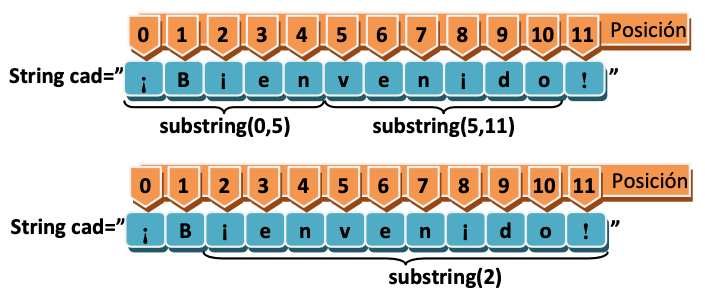
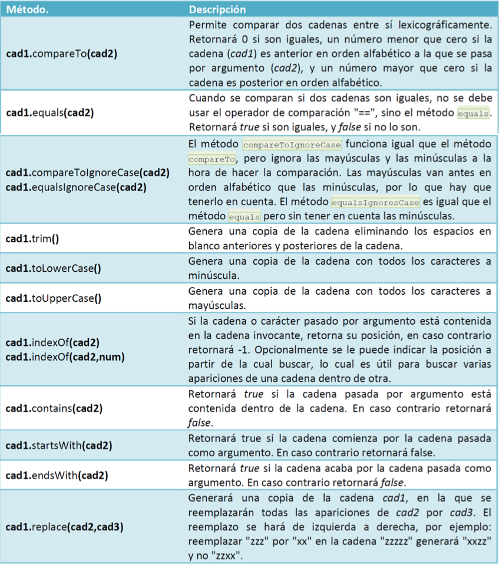
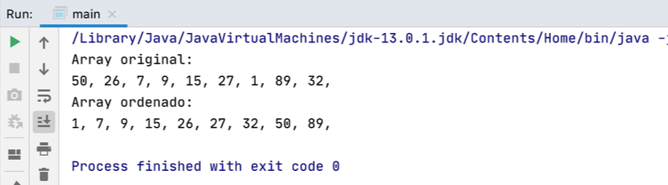
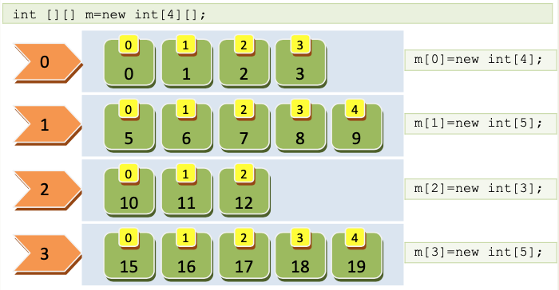

# Tema 4: Cadenas y arrays estáticos

??? abstract "Duración y criterios de evaluación"

    Duración estimada: 12 sesiones

    <hr />

    **Resultados de aprendizaje**

    1. Utilizar correctamente cadenas de caracteres en Java.
    2. Declarar, inicializar y recorrer arrays estáticos.
    3. Manipular texto mediante métodos de la clase `String`.
    4. Aplicar algoritmos básicos sobre arrays.
    5. Comprender el paso de argumentos al programa.

    **Criterios de evaluación**

    1. Uso correcto de métodos de `String`.
    2. Gestión adecuada de índices en arrays.
    3. Implementación correcta de recorridos y ordenaciones.
    4. Claridad y corrección del código Java.
    5. Resolución correcta de ejercicios propuestos.

---

## 4.1 Introducción

Hasta ahora hemos trabajado con variables simples, lo cual resulta insuficiente cuando necesitamos manejar conjuntos de datos relacionados. Para resolver este problema utilizamos **estructuras de almacenamiento**, entre las que destacan las **cadenas de caracteres** y los **arrays estáticos**.

Las cadenas permiten trabajar con texto, mientras que los arrays permiten almacenar múltiples valores del mismo tipo bajo un único identificador.

---

## 4.2 Cadenas de caracteres en Java

En Java, las cadenas se representan mediante la clase **`String`**. Aunque su sintaxis se parece a la de un tipo primitivo, `String` es una **clase**.

```java
String saludo = "Hola";
String despedida = new String("Adiós");
```

!!! info "Inmutabilidad"
    Los objetos `String` son inmutables: cualquier modificación crea un nuevo objeto en memoria.

---

### 4.2.1 Longitud y acceso a caracteres

```java
String texto = "Programación";
int longitud = texto.length();
char primera = texto.charAt(0);
```

<figure>
  
  <figcaption>Uso del método length()</figcaption>
</figure>

---

### 4.2.2 Subcadenas

```java
String palabra = "Programación";
String sub = palabra.substring(0, 7);
```

<figure>
  
  <figcaption>Uso del método substring()</figcaption>
</figure>

---

### 4.2.3 Comparación de cadenas

```java
String a = "Hola";
String b = "hola";

a.equals(b);            // false
a.equalsIgnoreCase(b);  // true
```

!!! warning "Error común"
    No se deben comparar cadenas con `==`, ya que compara referencias y no contenido.

---

### 4.2.4 Conversión de cadenas a números

```java
int x = Integer.parseInt("10");
double y = Double.parseDouble("3.14");
```

Control de errores:

```java
try {
    int n = Integer.parseInt("abc");
} catch (NumberFormatException e) {
    System.out.println("Error de conversión");
}
```

---

### 4.2.5 Formateo de cadenas

```java
float precio = 12.5f;
System.out.printf("Precio: %.2f €", precio);
```

```java
String salida = String.format("Precio: %.2f €", precio);
```

<figure>
  
  <figcaption>Formato de salida</figcaption>
</figure>

---

### 4.2.6 Operaciones avanzadas con String

Algunos métodos habituales:

- `toUpperCase()`, `toLowerCase()`
- `replace()`
- `split()`
- `contains()`
- `startsWith()`, `endsWith()`

```java
String frase = "Hola mundo Java";
String[] palabras = frase.split(" ");
```

<figure>
  
  <figcaption>Métodos habituales de String</figcaption>
</figure>

---

### 4.2.7 Lectura de ficheros en un String

```java
public static String leeFichero(String archivo) throws IOException {
    String texto = "", linea;
    BufferedReader br = new BufferedReader(new FileReader(archivo));

    while ((linea = br.readLine()) != null) {
        texto += linea + "\n";
    }

    br.close();
    return texto;
}
```

---

### 4.2.8 Expresiones regulares

Las expresiones regulares permiten validar y buscar patrones dentro de un texto.

```java
boolean valido = texto.matches("\\d+");
```

---

## 4.3 Arrays estáticos

Un **array** es una estructura que almacena múltiples valores del mismo tipo y con tamaño fijo.

```java
int[] numeros = new int[5];
```

<figure>
  
  <figcaption>Creación de arrays</figcaption>
</figure>

---

### 4.3.1 Inicialización y recorrido

```java
int[] valores = {8, 33, 200, 150, 11};
```

```java
for (int i = 0; i < valores.length; i++) {
    System.out.println(valores[i]);
}
```

```java
for (int v : valores) {
    System.out.println(v);
}
```

---

### 4.3.2 Copia de arrays

```java
int[] a = {1, 2, 3};
int[] b = a;
int[] c = a.clone();
```

!!! info "Importante"
    Asignar un array a otro no duplica su contenido, solo la referencia.

---

### 4.3.3 Ordenación: método de la burbuja

```java
public static void burbuja(int[] array) {
    for (int i = 0; i < array.length - 1; i++) {
        for (int j = 0; j < array.length - i - 1; j++) {
            if (array[j] > array[j + 1]) {
                int aux = array[j];
                array[j] = array[j + 1];
                array[j + 1] = aux;
            }
        }
    }
}
```

<figure>
  
  <figcaption>Ordenación por burbuja</figcaption>
</figure>

---

### 4.3.4 Arrays bidimensionales

```java
int[][] matriz = new int[3][2];
```

```java
for (int f = 0; f < matriz.length; f++) {
    for (int c = 0; c < matriz[f].length; c++) {
        System.out.print(matriz[f][c] + " ");
    }
    System.out.println();
}
```

<figure>
  
  <figcaption>Array bidimensional</figcaption>
</figure>

---

## 4.4 Bonus: argumentos del programa

```java
public static void main(String[] args) {
    for (String arg : args) {
        System.out.println(arg);
    }
}
```

```bash
java Programa uno dos tres
```

<figure>
  
  <figcaption>Paso de argumentos</figcaption>
</figure>

---

## 4.5 Ejercicios propuestos

401. Contar vocales en una cadena.  
402. Separar nombre y apellidos desde una cadena.  
403. Calcular la media de un array.  
404. Ordenar un array con burbuja.  
405. Buscar un valor dentro de un array.  
406. Crear una matriz y mostrarla por pantalla.

---

## 4.6 Para repasar

- https://www.w3schools.com/java/java_strings.asp  
- https://www.w3schools.com/java/java_arrays.asp  


