# Tema 4: Cadenas y arrays estáticos

??? abstract "Duración y criterios de evaluación"

    Duración estimada: 12 sesiones

    <hr />

    **Resultados de aprendizaje**

    1. Comprender y aplicar las operaciones fundamentales y avanzadas sobre cadenas (`String`) en Java.
    2. Declarar, inicializar, recorrer y manipular arrays estáticos unidimensionales y bidimensionales.
    3. Utilizar métodos de la clase `Arrays` para tareas comunes (ordenación, copia, búsqueda, conversión).
    4. Comprender conceptos de rendimiento asociados a cadenas y arrays.
    5. Resolver ejercicios prácticos y documentar soluciones correctas.

    **Criterios de evaluación**

    1. Se han utilizado correctamente los métodos de la clase `String`.
    2. Se han implementado recorridos y manipulaciones de arrays estáticos.
    3. Se han aplicado algoritmos de búsqueda y ordenación.
    4. El código Java es claro, legible y documentado.
    5. Las soluciones propuestas a los ejercicios están justificadas y probadas.

## 4.1 Introducción

Hasta ahora has aprendido variables simples y estructuras básicas de control. Con lo visto hasta ahora podemos hacer programas complejos, pero **limitados por el número de datos**: un número finito de usuarios, de cuentas, de incidencias... Solución: las **estructuras de almacenamiento**. En este tema trabajaremos dos de ellas:

- Las **cadenas de caracteres (`String`)** permiten representar y procesar texto de forma flexible y expresiva.
- Los **arrays estáticos** permiten agrupar múltiples valores del mismo tipo bajo un solo identificador y acceder a ellos mediante índices.

### Clasificación de las estructuras de almacenamiento

- **Según el tipo de datos** que pueden almacenar:
  - Datos **del mismo tipo**: arrays (vectores), arrays multidimensionales (matrices), listas, colecciones...
  - Datos **de distinto tipo**: estructuras, objetos (POO), bases de datos.
- **Según su tamaño**:
  - **Fijo**: su tamaño se especifica al crear la estructura y no cambia. Ejemplo: los **arrays estáticos** de este tema.
  - **Dinámico**: crece y decrece durante la ejecución. Ejemplo: las **colecciones** (ArrayList, HashMap...), que verás en el Tema 7.

## 4.2 Cadenas de caracteres en Java

En Java, las cadenas se representan mediante la clase **`String`**. Aunque su sintaxis puede parecer primitiva, `String` es un objeto que encapsula una secuencia de caracteres y provee métodos para manipular ese texto. Es un tipo de estructura de datos que instanciamos mediante la clase `String`.

Formas equivalentes de declarar e inicializar una cadena:

```java
String saludo = "Hola mundo";
String copia = new String("Hola mundo");
```

Java internamente gestiona un *String Pool*, que permite reutilizar literales idénticos y ahorrar memoria.

!!! info "Inmutabilidad"
    Los objetos de tipo `String` son **inmutables**, lo que significa que una vez creados no pueden modificarse. Cada vez que realizas una operación que "cambia" una cadena, Java crea un nuevo objeto en memoria.

!!! info "Para ampliar"
    - **Codificación de los caracteres**: en qué consiste y cómo se representa el texto en memoria (ASCII, UTF-8, Unicode).
    - **Formato de datos JSON** para intercambio de datos. Ejemplo de API de noticias en JSON (lo usarás en el módulo de desarrollo web).

## 4.3 Operaciones básicas con cadenas

### 4.3.1 Longitud y acceso a caracteres

- `length()` devuelve el número de caracteres de la cadena.
- `charAt(index)` devuelve el carácter en la posición `index` (base 0).

```java
String texto = "Programación";
int longitud = texto.length();   // 12
char primera = texto.charAt(0);  // 'P'
```

<figure>
  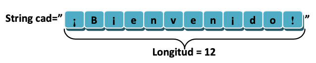
  <figcaption>Uso del método <code>length()</code></figcaption>
</figure>

<figure>
  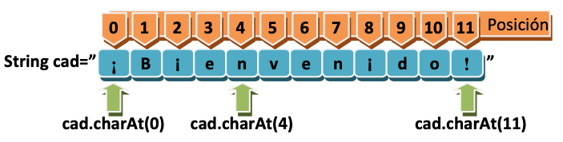
  <figcaption>Uso del método <code>charAt()</code></figcaption>
</figure>

### 4.3.2 Subcadenas y búsqueda

- `substring(inicio, fin)` devuelve parte de la cadena desde `inicio` hasta `fin - 1` (`fin` es opcional).
- `indexOf(...)` devuelve la primera posición de aparición de una subcadena.
- `lastIndexOf(...)` devuelve la última posición de aparición.

```java
String palabra = "Programación";
String sub = palabra.substring(0, 7);     // "Programa"
int pos = palabra.indexOf("ción");         // posición donde empieza "ción"
```

<figure>
  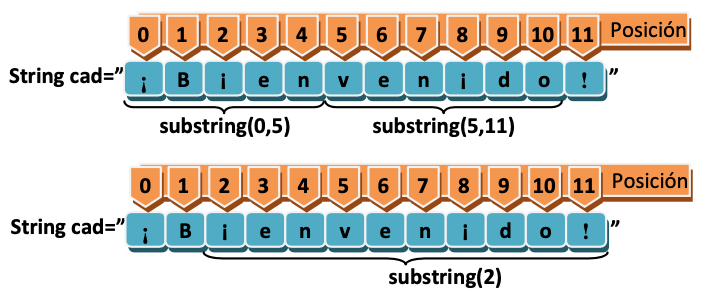
  <figcaption>Uso del método <code>substring()</code></figcaption>
</figure>

!!! example "Ejercicio: separar nombre y apellidos"
    Un programa que pida en una única cadena el nombre y apellidos del usuario (suponiendo que van separados por espacios) y los muestre por separado:

    ```java
    Scanner s = new Scanner(System.in);
    System.out.print("Introduce tu nombre y apellidos: ");
    String frase = s.nextLine();

    String palabra1 = "No hay palabra";
    String palabra2 = "No hay palabra";
    String palabra3 = "No hay palabra";

    int pos1 = frase.indexOf(' ');
    if (pos1 != -1) {
        palabra1 = frase.substring(0, pos1);
        int pos2 = frase.indexOf(' ', pos1 + 1);
        if (pos2 != -1) {
            palabra2 = frase.substring(pos1 + 1, pos2);
            palabra3 = frase.substring(pos2 + 1);
        } else {
            palabra2 = frase.substring(pos1 + 1);
        }
    }

    System.out.println("Nombre: " + palabra1);
    System.out.println("Apellido 1: " + palabra2);
    System.out.println("Apellido 2: " + palabra3);
    ```

    ??? info "Solución más sencilla con `split`"
        ```java
        String[] partes = frase.split(" ");
        System.out.println("Nombre: " + partes[0]);
        System.out.println("Apellido 1: " + partes[1]);
        System.out.println("Apellido 2: " + partes[2]);
        ```

### 4.3.3 Comparación de cadenas

Para comparar el **contenido** de dos cadenas:

```java
if (a.equals(b)) { … }              // sensibilidad a mayúsculas
if (a.equalsIgnoreCase(b)) { … }    // ignora mayúsculas/minúsculas
```

!!! warning "Error común"
    El operador `==` **no** debe usarse para comparar texto en Java, ya que compara **referencias a objetos**, no contenido.

## 4.4 Conversión entre cadenas y tipos numéricos

Para convertir cadenas numéricas a tipos primitivos:

```java
int x = Integer.parseInt("1234");
double y = Double.parseDouble("3.14");
```

Existe además el método **`valueOf(String)`**, disponible en todas las clases descendientes de `Number` (`Integer`, `Float`, `Double`...). La diferencia es que `parseInt()`, `parseFloat()`... devuelven **tipos primitivos** mientras que `valueOf()` devuelve **objetos** de la clase envoltorio:

```java
Integer entero = Integer.valueOf("1234");  // objeto Integer
int primitivo = Integer.parseInt("1234");   // primitivo int
```

??? tip "Comprobación de errores (avanzado)"

    La conversión suele incluirse en un bloque `try-catch` porque puede lanzar la excepción `NumberFormatException`:

    ```java
    try {
        int n = Integer.parseInt("abc");
    } catch (NumberFormatException ex) {
        System.err.println("Formato inválido");
    }
    ```

## 4.5 Formatear la salida y las cadenas

### `printf()` para formatear la salida

Se puede utilizar el método `printf()` de `System.out` en lugar de `print()`/`println()`:

```java
float velocidad = 20.785f;
System.out.printf("Velocidad: %.2f km/h%n", velocidad); // 20.79
```

### `String.format()` para formatear una cadena

Si necesitas **guardar** el texto formateado (por ejemplo, para mostrarlo más tarde o escribirlo en un archivo), usa `String.format()`:

```java
String salida = String.format("Velocidad: %.2f km/h", velocidad);
System.out.println(salida);
```

<figure>
  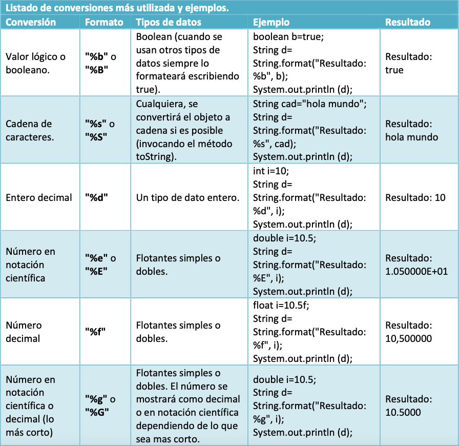
  <figcaption>Listado de conversiones para el formateo de cadenas</figcaption>
</figure>

### Modificadores de conversión

Se pueden aplicar modificadores a las conversiones para ajustar la salida, situándolos entre el carácter de escape `%` y la letra: ancho, precisión, relleno con ceros, alineación...

!!! example "Ejemplo con ancho y precisión"
    ```java
    String descripcion = "Lavadora";
    int unidades = 10;
    float precioUnidad = 302.4f;
    float total = unidades * precioUnidad;

    // %-12s alineación a la izquierda en 12 caracteres
    // %-8d ancho 8, %8.2f ancho 8 con 2 decimales
    System.out.printf("%-12s %-8d %8.2f %12.2f%n",
        descripcion, unidades, precioUnidad, total);
    ```

### Argumentos nombrados por posición

Es posible nombrar los argumentos usando su posición seguida del `$` (empiezan en 1):

```java
int i = 10;
int j = 20;
String salida = String.format("%1$d + %2$d = %3$d", i, j, i + j);
System.out.println(salida); // 10 + 20 = 30
```

## 4.6 Métodos avanzados de `String`

La clase `String` ofrece métodos útiles:

- `toUpperCase()` / `toLowerCase()`
- `replace(old, new)`
- `split(regex)`
- `contains(sub)`
- `startsWith(prefix)`, `endsWith(suffix)`
- `trim()` elimina espacios antes y después del texto

```java
String csv = "manzana,pera,uva";
String[] frutas = csv.split(",");
```

<figure>
  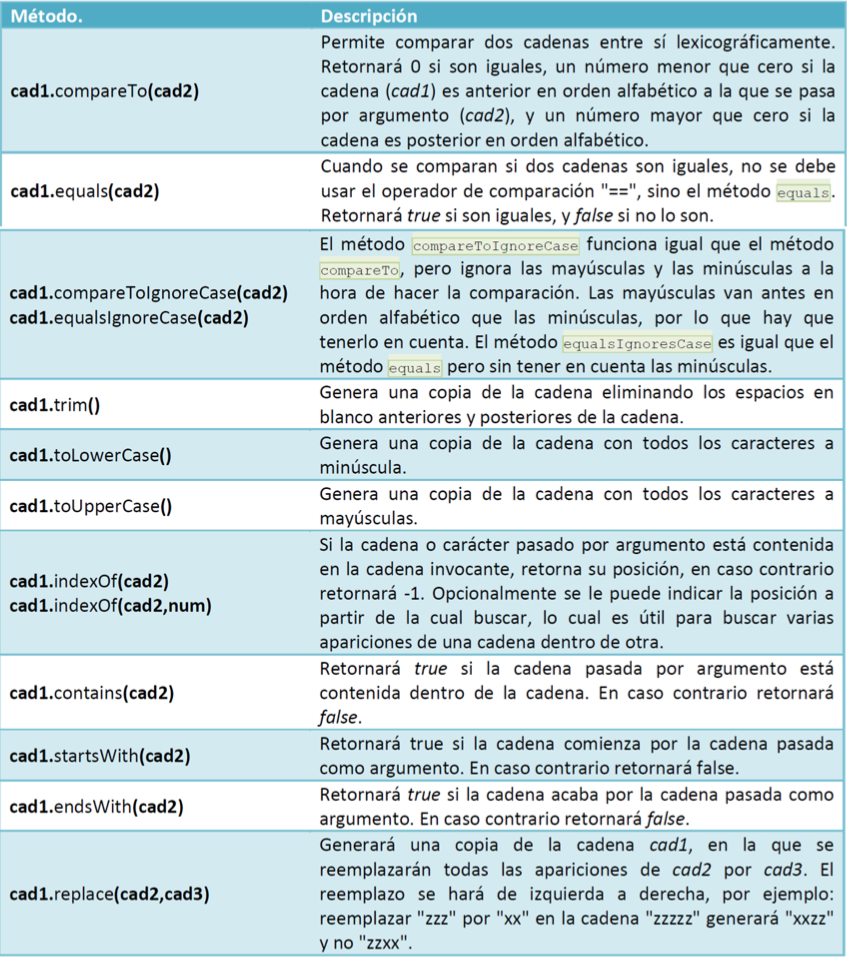
  <figcaption>Métodos habituales de <code>String</code></figcaption>
</figure>

!!! info "Leer un fichero y guardarlo en un String"
    Ya se puede adelantar una utilidad muy práctica: leer un fichero de texto completo y guardarlo en una cadena (los flujos se estudiarán a fondo en el Tema 8):

    ```java
    public static String leeFichero(String archivo) throws IOException {
        String texto = "", cadena = "";
        FileReader f = new FileReader(archivo);
        BufferedReader b = new BufferedReader(f);
        while ((cadena = b.readLine()) != null) {
            texto += cadena + "\n";
        }
        b.close();
        return texto;
    }
    ```

## 4.7 Concatenación y rendimiento

Concatenar muchas cadenas con `+` dentro de bucles genera objetos temporales innecesarios debido a la inmutabilidad de `String`. Para concatenaciones repetidas es mejor usar `StringBuilder`:

```java
StringBuilder sb = new StringBuilder();
for (int i = 0; i < 1000; i++) {
    sb.append(i).append(" ");
}
String resultado = sb.toString();
```

### Comparativa de métodos

| Método         | Uso ideal                                   |
|----------------|---------------------------------------------|
| `+`            | Concatenaciones simples                     |
| `StringBuilder`| Concatenaciones repetidas o en bucles       |
| `StringBuffer` | Igual que StringBuilder pero *thread-safe*   |

## 4.8 Expresiones regulares (regex)

Las expresiones regulares permiten buscar patrones complejos en texto. Java soporta regex con `Pattern` y `Matcher`:

```java
import java.util.regex.*;

Pattern patron = Pattern.compile("\\d{4}-\\d{2}-\\d{2}");
Matcher matcher = patron.matcher("2025-12-15");

if (matcher.matches()) {
    System.out.println("Formato válido de fecha");
}
```

Si además aceptamos que la fecha se pida sin separador, `\\d{8}` cubre `20251215`.

## 4.9 Arrays estáticos

Un **array estático** es una estructura que almacena datos del mismo tipo en posiciones indexadas. Su tamaño se define al crear el array y no cambia durante la ejecución. Al crearlo se especifica su tamaño, el cual **no podrá cambiar después**.

```java
tipo[] nombre;            // Declaración
nombre = new tipo[tamanyo]; // Creación con tamaño fijo
```

### Declaración y creación

```java
int[] edades = new int[20];
String[] nombres = new String[20];
float[] notas = new float[20];
boolean[] aprobados = new boolean[20];
```

```java
int[] numeros;            // Declaración de numeros como array de enteros
numeros = new int[4];     // Asignación de espacio para 4 enteros
numeros[0] = 8;
numeros[1] = 33;
numeros[2] = 200;
numeros[3] = 150;
```

<figure>
  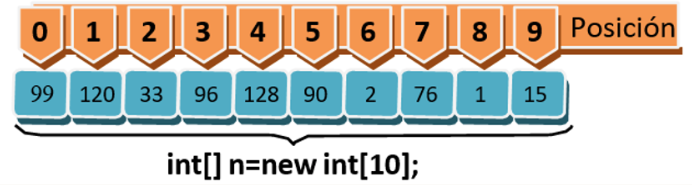
  <figcaption>Creación de arrays</figcaption>
</figure>

### Arrays de una dimensión

Los datos del array **están relacionados con su posición**. Acceso a los datos: `nombre[pos]`.

<figure>
  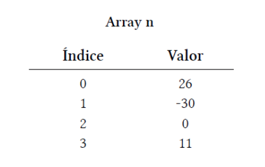
  <figcaption>Relación entre posiciones y datos de un array</figcaption>
</figure>

Inicialización del array con valores a la vez que se crea:

```java
int[] numeros = {8, 33, 200, 150, 11};
```

Su propiedad `.length` devuelve la longitud (número de elementos).

### El uso del índice

```java
Scanner s = new Scanner(System.in);

// Declaración de array y asignación de elementos directa
int[] numeros = new int[3];
numeros[0] = 8;
numeros[1] = 33;
numeros[2] = 200;

// El índice también puede ser una variable o expresión
for (int i = 0; i < numeros.length; i++) {
    System.out.print("Dime el número " + (i + 1) + ": ");
    numeros[i] = Integer.parseInt(s.nextLine());
}
```

!!! example "Ejemplo: notas medias"
    ```java
    Scanner s = new Scanner(System.in);
    double[] notas = new double[4];

    System.out.println("Dime la nota de cada módulo:");
    for (int i = 0; i < notas.length; i++) {
        System.out.print("Nota " + (i + 1) + ": ");
        notas[i] = Double.parseDouble(s.nextLine());
    }

    double suma = 0;
    for (double nota : notas) {
        suma += nota;
    }
    System.out.printf("Media: %.2f%n", suma / notas.length);
    ```

## 4.10 Recorrer arrays

### 4.10.1 Bucle clásico

```java
for (int i = 0; i < numeros.length; i++) {
    System.out.println(numeros[i]);
}
```

### 4.10.2 Bucle mejorado (`foreach`)

Al recorrer arrays con `for` es fácil cometer errores con el iterador, accediendo por ejemplo a una posición fuera de rango. El `foreach` recorre automáticamente los elementos:

```java
int[] numeros = {23, 45, 13, 34, 99};
String[] nombres = {"Jose", "María", "Juan"};

for (int valor : numeros) {
    System.out.println(valor);
}

for (String nombre : nombres) {
    System.out.println(nombre);
}
```

!!! warning "Limitación del `foreach`"
    Con el `foreach` **no tienes acceso al índice**, así que si lo necesitas (por ejemplo, para modificar el elemento o saber su posición), usa el `for` clásico.

## 4.11 Copia de arrays

Asignar un array a otro solo duplica la **referencia** (apuntan al mismo array):

```java
int[] a = {1, 2, 3};
int[] b = a;  // ambos apuntan al mismo array
```

Para duplicar correctamente los **valores**, hay que usar una copia independiente. Podemos usar el método `System.arraycopy`, `clone()` o un bucle:

```java
int[] c = a.clone();       // copia independiente
int[] d = Arrays.copyOf(a, a.length);  // copia con la clase Arrays
```

## 4.12 Utilidades de la clase `Arrays`

La clase `java.util.Arrays` ofrece métodos estáticos útiles:

- `Arrays.sort(array)` → ordena un array
- `Arrays.toString(array)` → representación en texto
- `Arrays.copyOf(array, newSize)` → copia/redimensiona arrays
- `Arrays.equals(a, b)` → compara contenido
- `Arrays.binarySearch(array, valor)` → busca un valor en un array ordenado

```java
import java.util.Arrays;

int[] a = {5, 3, 9};
Arrays.sort(a);
System.out.println(Arrays.toString(a));  // [3, 5, 9]
```

## 4.13 Ordenación: método de la burbuja

Además de `Arrays.sort()`, conviene conocer cómo funciona un **algoritmo de ordenación** sencillo como el de la burbuja: compara elementos adyacentes y los intercambia si están desordenados. Es sencillo pero costoso (O(n²)).

```java
public static void burbuja(int[] a) {
    int i, j, aux;
    for (i = 0; i < a.length - 1; i++) {
        for (j = 0; j < a.length - i - 1; j++) {
            if (a[j] > a[j + 1]) {
                aux = a[j];
                a[j] = a[j + 1];
                a[j + 1] = aux;
            }
        }
    }
}
```

<figure>
  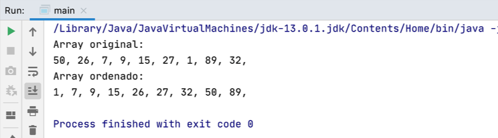
  <figcaption>Ordenación por burbuja</figcaption>
</figure>

!!! example "Para practicar con la burbuja"
    - Modifica la función `burbuja` anterior para que ordene de manera **descendente**.
    - Crea una función que **muestre el array ordenado por pasos** (una línea por cada pasada). Puedes usar `Arrays.toString()` para visualizarlo.

!!! example "Ejercicio Bingo"
    Un clásico para practicar arrays: generar un **cartón de bingo** aleatorio o comprobar un cartón dado.

    <figure>
      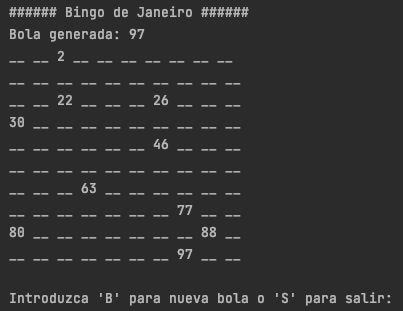
      <figcaption>Ejercicio Bingo</figcaption>
    </figure>

## 4.14 Arrays bidimensionales

Un array bidimensional es una estructura que almacena **arrays dentro del array**. Utiliza **2 índices** para localizar los datos: `nombre[pos1][pos2]`. Ejemplos de uso: tableros de juegos, tablas, matrices...

```java
int FILAS = 3;
int COLS = 2;
int[][] n = new int[FILAS][COLS]; // Array de 3 filas por 2 columnas

n[0][0] = 10;
n[0][1] = 20;
n[1][0] = 30;
n[1][1] = 40;
n[2][0] = 50;
n[2][1] = 60;
```

### Recorrido de un array bidimensional

Un array bidimensional se recorre igual que el de una dimensión, pero con **dos bucles anidados** (uno para filas y otro para columnas):

```java
for (int i = 0; i < n.length; i++) {         // filas
    for (int j = 0; j < n[i].length; j++) {  // columnas
        System.out.print(n[i][j] + " ");
    }
    System.out.println();  // salto de línea al terminar cada fila
}
```

<figure>
  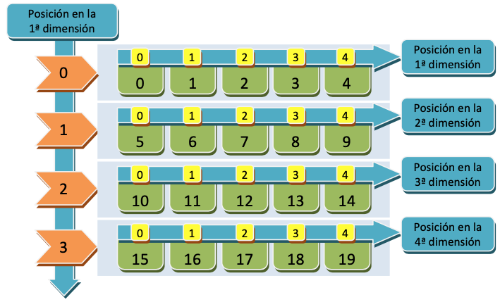
  <figcaption>Recorrido de un array bidimensional</figcaption>
</figure>

<figure>
  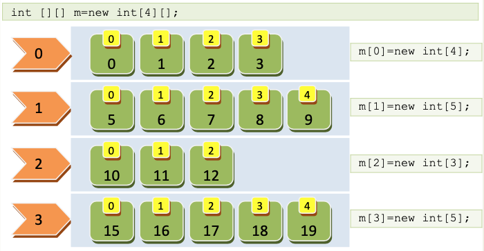
  <figcaption>Array bidimensional</figcaption>
</figure>

### Arrays con segunda dimensión irregular

Los arrays en Java pueden tener la **segunda dimensión irregular** (cada fila con distinta longitud) si creamos cada fila por separado:

```java
int[][] triangular = new int[3][];
triangular[0] = new int[1];
triangular[1] = new int[2];
triangular[2] = new int[3];
```

Sirve, por ejemplo, para representar un **triángulo de Pascal** o una tabla con distinto número de columnas por fila.

### Arrays multidimensionales

Java permite **arrays de más de dos dimensiones** (`int[][][]`...). Son útiles para representar cubos, coordenadas 3D o conjuntos de matrices:

```java
int[][][] cubo = new int[3][3][3];
cubo[0][0][0] = 7; // punto (x=0, y=0, z=0)
```

## 4.15 Bonus: argumentos al programa

En la función `main` se le pasa un array `String[] args` con los **argumentos** que recibe nuestro programa desde fuera:

```java
public class EjemploPasoArgumentos {
    public static void main(String[] args) {
        System.out.println("Número de argumentos: " + args.length);
        for (String arg : args) {
            System.out.println(arg);
        }
    }
}
```

Para probarlo desde consola, se compila y luego se ejecuta con los argumentos que queramos:

```bash
javac EjemploPasoArgumentos.java
java EjemploPasoArgumentos uno dos tres
```

También podemos probarlos directamente desde IntelliJ en **Run → Edit Configurations...**, indicando los *Program arguments*:

!!! tip "posible uso docente: sacar a la pizarra"
    Crea un programa que cualquier profesor sin conocimientos de informática pueda utilizar con sus alumnos para **sacarlos a la pizarra** de forma aleatoria: recibe por argumentos la lista de nombres de la clase.

## 4.16 Buenas prácticas

- **Valida índices** antes de acceder a arrays (evita `ArrayIndexOutOfBoundsException`).
- Usa **`StringBuilder`** para concatenaciones intensivas.
- **Maneja excepciones** en conversiones de tipo (`NumberFormatException`).
- Prefiere utilidades como **`Arrays.sort()`** en producción, y recurre a algoritmos de ordenación propios (burbuja...) solo con fines de aprendizaje.
- Recuerda que las cadenas se comparan con **`equals()`**, nunca con `==`.
- Documenta tus funciones de ordenación y búsqueda con **Javadoc**.

## 4.17 Referencias

- [Documentación de la clase String](https://docs.oracle.com/en/java/javase/21/docs/api/java.base/java/lang/String.html)
- [Documentación de la clase Arrays](https://docs.oracle.com/en/java/javase/21/docs/api/java.base/java/util/Arrays.html)
- [Documentación de la clase StringBuilder](https://docs.oracle.com/en/java/javase/21/docs/api/java.base/java/lang/StringBuilder.html)
- [Java Tutorial — Strings (W3Schools)](https://www.w3schools.com/java/java_strings.asp)
- [Java Tutorial — Arrays (W3Schools)](https://www.w3schools.com/java/java_arrays.asp)
- [Descripción de las conversiones de `String.format` (JavaPoint)](https://www.javatpoint.com/java-string)

## 4.18 Ejercicios propuestos

401. **Contar vocales** en una cadena introducida por teclado.

??? info "Solución ejercicio 401"
    ```java
    import java.util.Scanner;

    public class ContarVocales {
        public static void main(String[] args) {
            Scanner s = new Scanner(System.in);
            System.out.print("Introduce un texto: ");
            String texto = s.nextLine().toLowerCase();

            int vocales = 0;
            for (int i = 0; i < texto.length(); i++) {
                char c = texto.charAt(i);
                if (c == 'a' || c == 'e' || c == 'i' || c == 'o' || c == 'u') {
                    vocales++;
                }
            }
            System.out.println("Número de vocales: " + vocales);
        }
    }
    ```

402. **Separar nombre y apellidos** desde una cadena.

403. **Calcular la media** de un array de números.

??? info "Solución ejercicio 403"
    ```java
    public static double media(double[] notas) {
        double suma = 0;
        for (double nota : notas) {
            suma += nota;
        }
        return notas.length == 0 ? 0 : suma / notas.length;
    }
    ```

404. **Ordenar un array** con burbuja y explicar su coste.

405. **Buscar un valor** en un array y devolver su índice (si no existe, -1).

??? info "Solución ejercicio 405"
    ```java
    public static int buscar(int[] array, int valor) {
        for (int i = 0; i < array.length; i++) {
            if (array[i] == valor) {
                return i;
            }
        }
        return -1;
    }
    ```

406. **Mostrar una matriz** bidimensional por pantalla (filas y columnas alineadas).

407. Crea una función que **invierta una cadena** sin usar métodos de la clase `StringBuilder` (recorriéndola desde el final).

408. Escribe un programa que pida 10 números y los muestre **en orden inverso** al introducido.

??? info "Solución ejercicio 408"
    ```java
    import java.util.Scanner;

    public class Inverso {
        public static void main(String[] args) {
            Scanner s = new Scanner(System.in);
            int[] numeros = new int[10];

            for (int i = 0; i < numeros.length; i++) {
                System.out.print("Número " + (i + 1) + ": ");
                numeros[i] = Integer.parseInt(s.nextLine());
            }

            for (int i = numeros.length - 1; i >= 0; i--) {
                System.out.print(numeros[i] + " ");
            }
        }
    }
    ```

409. Simula el **Bingo**: genera una tabla aleatoria (filas × columnas) con números únicos del 1 al 90 y muéstrala como cartón.

410. Crea una función `traspuesta(int[][] matriz)` que devuelva la **matriz transpuesta** de una dada (intercambia filas por columnas).

411. El truco del **método burbuja descendente**: adapta la función `burbuja` para que ordene de mayor a menor.

412. **Argumentos del programa**: escribe un programa que reciba por argumentos los nombres de los alumnos de la clase y los muestre en orden aleatorio (útil para sacar a la pizarra).