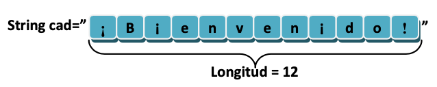
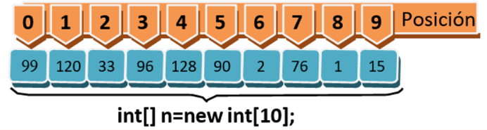

# Tema 4: Cadenas y arrays estáticos

??? abstract "Duración y criterios de evaluación"

    Duración estimada: 12 sesiones

    <hr />

    **Resultados de aprendizaje**

    1. Comprender y aplicar las operaciones fundamentales y avanzadas sobre cadenas (`String`) en Java.  
    2. Declarar, inicializar, recorrer y manipular arrays estáticos unidimensionales y bidimensionales.  
    3. Utilizar métodos de la clase `Arrays` para tareas comunes (ordenación, copia, búsqueda, conversión).  
    4. Comprender conceptos de rendimiento asociados a cadenas y arrays.  
    5. Resolver ejercicios prácticos y documentar soluciones correctas.

    **Criterios de evaluación**

    1. Se han utilizado correctamente los métodos de la clase `String`.  
    2. Se han implementado recorridos y manipulaciones de arrays estáticos.  
    3. Se han aplicado algoritmos de búsqueda y ordenación.  
    4. El código Java es claro, legible y documentado.  
    5. Las soluciones propuestas a los ejercicios están justificadas y probadas.


## 4.1 Introducción

Hasta ahora has aprendido variables simples y estructuras básicas de control. Sin embargo, en muchos programas necesitas trabajar con **textos largos** y con **conjuntos de datos relacionados**. Para ello:

- Las **cadenas de caracteres (`String`)** permiten representar y procesar texto de forma flexible y expresiva.  
- Los **arrays estáticos** permiten agrupar múltiples valores del mismo tipo bajo un solo identificador y acceder a ellos mediante índices.

Estas dos estructuras constituyen la base para casi cualquier programa no trivial.


## 4.2 Cadenas de caracteres en Java

En Java, las cadenas se representan mediante la clase **`String`**. Aunque su sintaxis puede parecer primitiva, `String` es un objeto que encapsula una secuencia de caracteres y provee métodos para manipular ese texto.

```java
String saludo = "Hola mundo";
String copia = new String("Hola mundo");
```

Java internamente gestiona un *String Pool*, que permite reutilizar literales idénticos y ahorrar memoria.

!!! info "Inmutabilidad"
    Los objetos de tipo `String` son **inmutables**, lo que significa que una vez creados no pueden modificarse. Cada vez que realizas una operación que “cambia” una cadena, Java crea un nuevo objeto en memoria.


## 4.3 Operaciones básicas con cadenas

### 4.3.1 Longitud y acceso a caracteres

- `length()` devuelve el número de caracteres de la cadena.  
- `charAt(index)` devuelve el carácter en la posición `index` (base 0).

```java
String texto = "Programación";
int longitud = texto.length();   // 12
char primera = texto.charAt(0);  // 'P'
```

<figure>
  
  <figcaption>Uso del método <code>length()</code></figcaption>
</figure>


### 4.3.2 Subcadenas y búsqueda

- `substring(inicio, fin)` devuelve parte de la cadena desde `inicio` hasta `fin - 1`.  
- `indexOf(...)` devuelve la primera posición de aparición de una subcadena.  
- `lastIndexOf(...)` devuelve la última posición de aparición.

```java
String palabra = "Programación";
String sub = palabra.substring(0, 7);     // "Programa"
int pos = palabra.indexOf("ción");         // posición donde empieza "ción"
```

### 4.3.3 Comparación de cadenas

Para comparar el **contenido** de dos cadenas:

```java
if (a.equals(b)) { … }              // sensibilidad a mayúsculas
if (a.equalsIgnoreCase(b)) { … }    // ignora mayúsculas/minúsculas
```

!!! warning "Error común"
    El operador `==` **no** debe usarse para comparar texto en Java, ya que compara referencias a objetos, no contenido.


## 4.4 Conversión entre cadenas y tipos numéricos

Para convertir cadenas numéricas a tipos primitivos:

```java
int x = Integer.parseInt("1234");
double y = Double.parseDouble("3.14");
```

??? tip "Comprabación de errores (avanzado)"

    Es recomendable capturar posibles errores de conversión mediante excepciones (se estudian en temas posteriores):

    ```java
    try {
        int n = Integer.parseInt("abc");
    } catch (NumberFormatException ex) {
        System.err.println("Formato inválido");
    }
    ```


## 4.5 Concatenación y rendimiento

Concatenar muchas cadenas con `+` dentro de bucles genera objetos temporales innecesarios debido a la inmutabilidad de `String`. Para concatenaciones repetidas es mejor usar `StringBuilder`:

```java
StringBuilder sb = new StringBuilder();
for (int i = 0; i < 1000; i++) {
    sb.append(i).append(" ");
}
String resultado = sb.toString();
```

### Comparativa de métodos

| Método         | Uso ideal                                   |
|----------------|---------------------------------------------|
| `+`            | Concatenaciones simples                     |
| `StringBuilder`| Concatenaciones repetidas o en bucles       |
| `StringBuffer` | Igual que StringBuilder pero *thread-safe*   |


## 4.6 Métodos avanzados de `String`

La clase `String` ofrece métodos útiles:

- `toUpperCase()` / `toLowerCase()`  
- `replace(old, new)`  
- `split(regex)`  
- `contains(sub)`  
- `startsWith(prefix)`, `endsWith(suffix)`  
- `trim()` elimina espacios antes y después del texto

```java
String csv = "manzana,pera,uva";
String[] frutas = csv.split(",");
```

<figure>
  
  <figcaption>Métodos habituales de <code>String</code></figcaption>
</figure>


## 4.7 Expresiones regulares (regex)

Las expresiones regulares permiten buscar patrones complejos en texto. Java soporta regex con `Pattern` y `Matcher`:

```java
import java.util.regex.*;

Pattern patron = Pattern.compile("\\d{4}-\\d{2}-\\d{2}");
Matcher matcher = patron.matcher("2025-12-15");

if (matcher.matches()) {
    System.out.println("Formato válido de fecha");
}
```


## 4.8 Arrays estáticos

Un **array estático** almacena múltiples valores del mismo tipo en posiciones indexadas. Su tamaño se define al crear el array y no cambia durante la ejecución.

```java
int[] numeros = new int[5];
String[] nombres = {"Ana", "Luis", "María"};
```

La propiedad `.length` indica el tamaño.

<figure>
  
  <figcaption>Creación de arrays</figcaption>
</figure>


## 4.9 Recorrer arrays

### 4.9.1 Bucle clásico

```java
for (int i = 0; i < numeros.length; i++) {
    System.out.println(numeros[i]);
}
```

### 4.9.2 Bucle mejorado (`foreach`)

```java
for (int valor : numeros) {
    System.out.println(valor);
}
```


## 4.10 Copia de arrays

Asignar un array a otro solo duplica la referencia:

```java
int[] a = {1, 2, 3};
int[] b = a;  // ambos apuntan al mismo array
```

Para duplicar correctamente los valores:

```java
int[] c = a.clone();
```

## 4.11 Utilidades de la clase `Arrays`

La clase `java.util.Arrays` ofrece métodos estáticos útiles:

- `Arrays.sort(array)` → ordena un array  
- `Arrays.toString(array)` → representación en texto  
- `Arrays.copyOf(array, newSize)` → copia/redimensiona arrays  
- `Arrays.equals(a, b)` → compara contenido

```java
import java.util.Arrays;

int[] a = {5, 3, 9};
Arrays.sort(a);
System.out.println(Arrays.toString(a));  // [3, 5, 9]
```


## 4.12 Ordenación: método de la burbuja

La ordenación por burbuja compara elementos adyacentes y los intercambia si están desordenados. Es sencillo pero costoso (O(n²)):

```java
public static void burbuja(int[] a) {
    for (int i = 0; i < a.length - 1; i++) {
        for (int j = 0; j < a.length - i - 1; j++) {
            if (a[j] > a[j+1]) {
                int tmp = a[j];
                a[j] = a[j+1];
                a[j+1] = tmp;
            }
        }
    }
}
```

<figure>
  
  <figcaption>Ordenación por burbuja</figcaption>
</figure>


## 4.13 Arrays bidimensionales

```java
int[][] matriz = new int[3][2];
```

Recorrer filas y columnas:

```java
for (int i = 0; i < matriz.length; i++) {
    for (int j = 0; j < matriz[i].length; j++) {
        System.out.print(matriz[i][j] + " ");
    }
    System.out.println();
}
```

<figure>
  
  <figcaption>Array bidimensional</figcaption>
</figure>


## 4.14 Bonus: argumentos al programa

El método `main` recibe parámetros en `args`:

```java
public static void main(String[] args) {
    for (String arg : args) {
        System.out.println(arg);
    }
}
```

Ejecución desde la consola:

```bash
java Programa uno dos tres
```

## 4.15 Ejercicios propuestos

401. **Contar vocales** en una cadena.  
402. **Separar nombre y apellidos** desde una cadena.  
403. **Calcular la media** de un array de números.  
404. **Ordenar un array** con burbuja y explicar su coste.  
405. **Buscar un valor** en un array y devolver su índice.  
406. **Mostrar una matriz** bidimensional por pantalla.


## 4.16 Recursos adicionales

- Documentación oficial de `String` y `Arrays` (Oracle).  
- Ejercicios prácticos y retos online (Codingame, LeetCode).  
- Tutoriales de métodos avanzados y patrones de diseño relacionados.

## 4.17 Buenas prácticas

- **Valida índices** antes de acceder a arrays.  
- Usa **StringBuilder** para concatenaciones intensivas.  
- **Maneja excepciones** en conversiones de tipo.  
- Prefiere utilidades como **`Arrays.sort()`** en producción.


