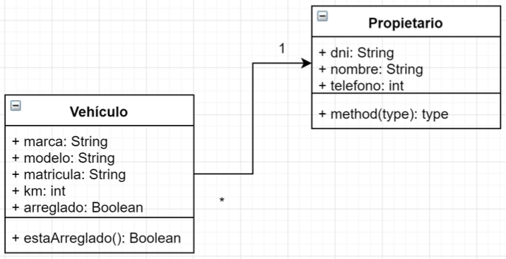
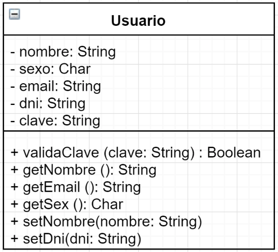
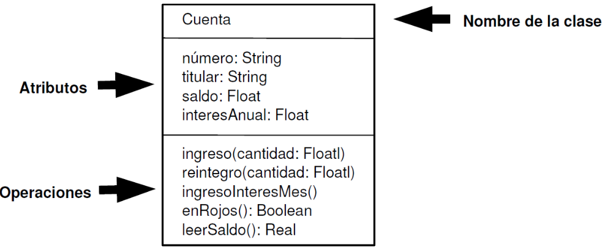
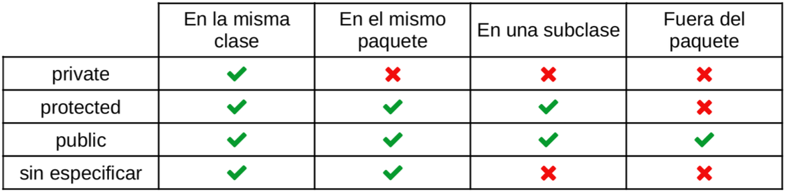
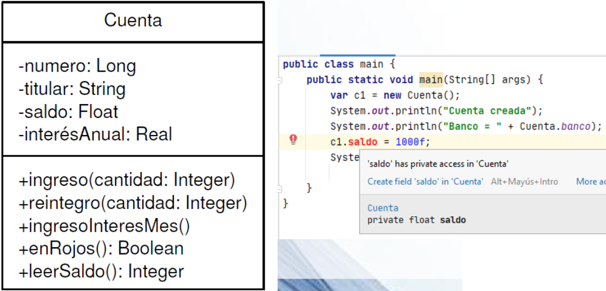
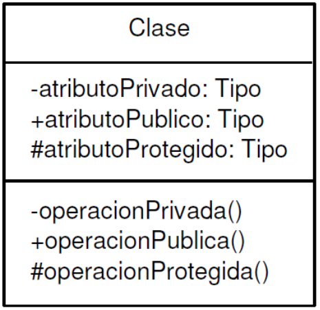
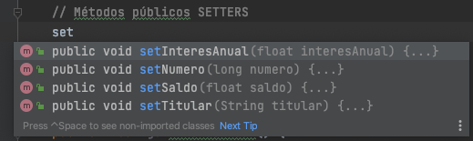
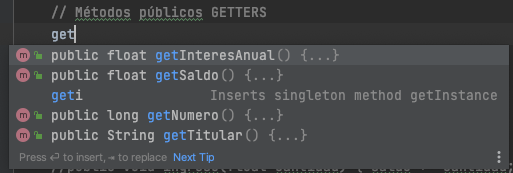

# Tema 5: Introducción a la Programación Orientada a Objetos (POO)

??? abstract "Duración y criterios de evaluación"

    Duración estimada: 10 sesiones

    <hr />

    **Resultados de aprendizaje**

    1. Comprender el paradigma de la Programación Orientada a Objetos y sus fundamentos.
    2. Identificar los elementos de una clase: atributos, métodos y constructores.
    3. Aplicar la encapsulación mediante modificadores de acceso, getters y setters.
    4. Conocer el empaquetado de clases y los arrays de objetos.
    5. Utilizar enumeraciones (`enum`) como tipos especiales.

    **Criterios de evaluación**

    1. Se identifica la estructura general de una clase y los modificadores de acceso y de contenido.
    2. Se definen atributos con el tipo y la visibilidad adecuados.
    3. Se implementan métodos con parámetros, retorno, sobrecarga, `this`, `toString` y `equals`.
    4. Se construyen constructores (por defecto, con parámetros y copia) y se comprende la destrucción de objetos.
    5. Se organizan las clases en paquetes y se usan arrays de objetos.
    6. Se definen y utilizan tipos enumerados con atributos y métodos.

## 5.1 Introducción

Hasta ahora has programado de forma **estructurada**: variables, condicionales, bucles y funciones. Este enfoque funciona bien para programas pequeños, pero **cuando el software crece y es necesario reutilizar código** surgen problemas: código duplicado, dificultad de mantenimiento, funciones interminables...

Para solucionarlo surge la **Programación Orientada a Objetos (POO)**: una técnica para los programas **basándose en objetos** del mundo real. La POO organiza el código en torno a **objetos**, que combinan datos y comportamiento.

!!! tip "Idea clave"
    En lugar de pensar en "pasos a ejecutar", la POO piensa en **qué entidades existen y cómo interactúan**.

## 5.2 Fundamentos de la POO

- La **Programación Estructurada** crea funciones y procedimientos que definen las acciones a realizar, y que posteriormente forman los programas.
- La **Programación Orientada a Objetos** considera los programas en términos de **objetos** y todo gira alrededor de ellos.

<figure>
  
  <figcaption>La POO considera los programas en términos de objetos</figcaption>
</figure>

### Conceptos

- Se descompone la aplicación en **objetos** que son representaciones del mundo real.
- Está más cerca de la **forma humana de pensar** que el modelo imperativo puro.
- Los **datos** y **funciones** que operan sobre ellos quedan **agrupados** en el objeto.

### Beneficios

- **Comprensión**: modelos que reflejan entidades reales.
- **Modularidad**: el programa se organiza en módulos independientes.
- **Mantenimiento**: modificar una clase afecta solo a esa clase.
- **Seguridad**: ocultación de los datos internos.
- **Reusabilidad**: las clases se reutilizan en otros proyectos.

### Características de la POO

| Característica | Descripción |
|----------------|-------------|
| **Abstracción** | Centrarse en las características y operaciones del objeto sin preocuparnos de qué ocurre en el interior. |
| **Modularidad** | El programa se descompone en clases en archivos independientes. Favorece la modificación y reutilización del código. |
| **Encapsulación** | Ocultamiento de la información. El programador decide qué partes (atributos y métodos) pueden accederse desde fuera. |
| **Jerarquía** | Relaciones entre clases. Generalización o especialización (herencia): crear una clase nueva a partir de otra. Relación "es un" (se estudia en el Tema 6). |
| **Polimorfismo** | Capacidad de que varias clases, creadas a partir de una clase ancestra común, realicen una misma acción de forma diferente (se estudia en el Tema 6). |

### Lenguajes POO

| Lenguaje | Año |
|----------|-----|
| Simula    | 1962 |
| SmallTalk | 1972 |
| C++       | 1985 |
| Eiffel    | 1986 |
| Java      | 1995 |
| C#        | 2000 |

!!! info "Ranking de lenguajes"
    Puedes consultar el [índice TIOBE](https://www.tiobe.com/tiobe-index/) para ver cuáles son actualmente los lenguajes más populares y dónde se posiciona Java y otros lenguajes orientados a objetos.

## 5.3 Clases y objetos

- Una **clase** es un **molde o plantilla** que define:
  - **Atributos** (campos o propiedades): qué datos tiene el objeto.
  - **Métodos** (funciones): qué puede hacer el objeto.
- Un **objeto** es una **instancia** de una clase: una materialización concreta con sus propios valores.

~~~java
class Coche {
    String marca;     // atributo
    int velocidad;    // atributo

    void acelerar() { // método
        velocidad += 10;
    }
}
~~~

~~~java
Coche miCoche = new Coche();
miCoche.marca = "Toyota";
miCoche.acelerar();
~~~

Un objeto tiene:

- **Estado** → valores de sus atributos.
- **Comportamiento** → métodos que puede ejecutar.

<figure>
  
  <figcaption>Estructura general de una clase</figcaption>
</figure>

<figure>
  
  <figcaption>La clase como plantilla y los objetos como instancias</figcaption>
</figure>

!!! tip "Clase = definición, Objeto = instancia real"
    Durante la ejecución de la aplicación se **instanciarán (crearán) objetos reales** con sus propios atributos. La clase contiene la definición; los objetos contienen los datos.

## 5.4 Estructura de una clase

Toda clase consta de **cabecera** y **cuerpo**.

### Cabecera de la clase

```java
// Cabecera de la clase
[modificadores] class NombreClase [herencia] [interfaces] {
    // Cuerpo de la clase
    // Declaración de los atributos
    // Declaración de los métodos
}
```

- **Modificadores**: `public`, `abstract`, `final`...
- **Nombre**: primera letra en mayúsculas (`Punto`); si está formada por varias palabras, el inicio de cada una en mayúsculas (`PuntoCartesiano`). Sigue la convención *UpperCamelCase*.
- **Herencia** (opcional): `extends NombreClaseBase`.
- **Interfaces** (opcional): `implements Interface1, Interface2`.

### Cuerpo de la clase

Contiene los **atributos** y los **métodos**:

```java
public class Cuenta {
    // Atributos
    long numero;
    String titular;
    float saldo;

    // Métodos
    void ingreso(float cantidad) {
        saldo += cantidad;
    }

    void reintegro(float cantidad) {
        if (cantidad <= saldo) {
            saldo -= cantidad;
        }
    }

    void saldo() {
        System.out.println("Saldo: " + saldo);
    }
}
```

### Miembros estáticos

Los atributos o métodos **`static`** son elementos de la **clase** y no de cada objeto que instancie de ella. Todos los objetos comparten el mismo valor.

```java
public class Cuenta {
    // Atributos de instancia
    long numero;
    String titular;
    float saldo;

    // Atributo estático (de clase)
    static String banco = "BBVA";

    // Método estático (de clase)
    static float cambioEuroDolar(float euros) {
        return euros * 1.06f;
    }
}
```

Se llaman desde la propia clase y no desde instancias de la misma:

```java
public class Main {
    public static void main(String[] args) {
        System.out.println(Cuenta.banco);
        System.out.println(Cuenta.cambioEuroDolar(100));
    }
}
```

!!! info "El ejemplo clásico: App Banco"
    A lo largo del tema iremos completando la clase `Cuenta` de un pequeño banco. Todo el ejemplo está inspirado en la práctica *Cliente Banco* que se resuelve al final del tema.

## 5.5 Atributos

### Declaración

```java
[modificadores] tipo nombre;
```

- **Modificadores**: de acceso, de contenido y otros. Configuran el comportamiento del atributo.
- **Tipo**: primitivo, otro objeto, array, estructuras de datos...

### Modificadores de acceso

Indican la forma de acceso al atributo desde el código. Permiten implementar la **encapsulación** ocultando los atributos de la clase fuera de ella.

<figure>
  
  <figcaption>Modificadores de acceso en Java</figcaption>
</figure>

| Modificador | Acceso |
|-------------|--------|
| `public`    | Desde cualquier clase |
| `protected` | Desde la propia clase, las subclases y el mismo paquete |
| (sin modificar, *package*) | Solo dentro del mismo paquete |
| `private`   | Solo dentro de la propia clase |

```java
public class Cuenta {
    // Atributos privados
    private long numero;
    private String titular;
    private float saldo;

    // Métodos públicos
    public void ingreso(float cantidad) {
        saldo += cantidad;
    }
}
```

Si intentamos acceder a un atributo `private` desde fuera de la clase, el compilador dará un **error de visibilidad**.

<figure>
  
  <figcaption>Error al acceder a un atributo privado desde fuera</figcaption>
</figure>

<figure>
  
  <figcaption>Representación de la visibilidad en un diagrama UML</figcaption>
</figure>

### Modificadores de contenido

- `static`: atributo de **clase**, no del objeto instanciado (como se vio en *Miembros estáticos*).
- `final`: define el atributo como **constante** (no puede cambiarse después de su inicialización).

```java
public class Cuenta {
    private long numero;
    private String titular;
    private float saldo;
    private static String banco = "BBVA"; // estático
    private static final float COMISION = 0.05f; // constante
    private static int contadorCuentas = 0; // lleva la cuenta total de cuentas creadas
}
```

## 5.6 Métodos

Definen el **comportamiento** de un objeto. Se declaran después de los atributos y constan de **cabecera** (modificadores, nombre, tipo de dato devuelto...) y **cuerpo** (sentencias que implementan el comportamiento).

### Cabecera del método

```java
[private | protected | public] [static] [abstract] [final]
tipo nombreMétodo([lista_parametros]) [throws lista_excepciones]
```

```java
public void ingreso(float cantidad) { // cabecera
    saldo += cantidad;                // cuerpo
}
```

### Cuerpo del método

El cuerpo está encerrado entre llaves. **Si devuelve un tipo de dato, obligatoriamente debe llevar una instrucción `return`**:

```java
public boolean esMorosa() {
    return saldo < 0;
}

public float consultarSaldo() {
    return saldo;
}
```

### Parámetros

Se pueden incluir los que necesitemos **separados por comas** y pueden ser de **cualquier tipo**. Dentro del método **no se pueden declarar variables con el mismo nombre que los parámetros**.

```java
public void ingreso(float cantidad, boolean urgente) {
    // Si es urgente, se le aplica una comisión del 1%
    if (urgente) {
        saldo += (cantidad - (cantidad * 0.01F));
    } else {
        saldo += cantidad;
    }
}
```

### Sobrecarga de métodos

Java permite **definir varios métodos con el mismo nombre** pero **diferentes parámetros** (número o tipo). El compilador distingue la versión a llamar según los argumentos:

```java
public void ingreso(float cantidad) {
    saldo += cantidad;
}

public void ingreso(double cantidad) {
    saldo += (float) cantidad;
}

public void ingreso(float cantidad, boolean urgente) {
    if (urgente) {
        saldo += cantidad - (cantidad * 0.01F);
    } else {
        saldo += cantidad;
    }
}
```

!!! tip "Sobrecarga ≠ sobrescritura"
    La **sobrecarga** es dentro de la misma clase (mismo nombre, distintos parámetros). La **sobrescritura** (con `@Override`) ocurre entre una clase y su subclase (mismo nombre y parámetros) — se verá en el Tema 6.

### La palabra clave `this`

`this` hace referencia al **objeto actual**. Se puede utilizar para hacer referencia a atributos mediante `this.atributo`. Se usa principalmente para **distinguir** el atributo de un parámetro con el mismo nombre:

```java
public void setTitular(String titular) {
    this.titular = titular; // this.titular = atributo; titular = parámetro
}
```

### El método `toString`

Redefiniendo el método `toString` —que viene **heredado de `Object`**— podemos personalizar cómo queremos que se muestre el objeto en un contexto donde se espere una cadena:

```java
@Override
public String toString() {
    return "Nº cuenta: " + numero + ", Titular: " + titular + ", Saldo: " + saldo;
}
```

De esta forma, ya es posible hacer un `sout` directamente de un objeto sin obtener la típica referencia como `Cuenta@23fc625e`:

```java
System.out.println(cuenta); // Nº cuenta: 123456789, Titular: Eladio Blanco, Saldo: 100.0
```

### El método `equals`

Es útil redefinir el método `equals`, que cualquier clase hereda de `Object`, para determinar si **dos objetos de la misma clase son iguales**:

```java
@Override
public boolean equals(Object obj) {
    if (this == obj) {
        return true;
    }
    if (obj == null || getClass() != obj.getClass()) {
        return false;
    }
    Cuenta otra = (Cuenta) obj;
    return numero == otra.numero; // dos cuentas iguales si mismo número
}
```

Para comparar objetos (igual que con las cadenas) se utiliza el método `equals` y **no** el operador `==`, que solo compara las **referencias**:

```java
Cuenta c1 = new Cuenta(123456789, "Eladio", 1000f);
Cuenta c2 = new Cuenta(123456789, "Eladio", 1000f);

System.out.println(c1 == c2);        // false (referencias distintas)
System.out.println(c1.equals(c2));   // true (mismo número de cuenta)
```

Aparte del uso de `equals` de forma explícita, es usado de forma implícita por otros métodos como `contains`, `indexOf`, `remove`... de las colecciones (se verá en el Tema 7).

## 5.7 Encapsulación y visibilidad

La **encapsulación** es una característica muy importante en POO. Consiste en **no tener los atributos públicos** (modificador `public`). Para **leer** su valor se utilizan los **getters** y para **modificarlo** los **setters**.

```java
public class Cuenta {
    // Atributos privados
    private long numero;
    private String titular;
    private float saldo;
    private float interesAnual;
    private static String banco = "BBVA";

    public Cuenta() {
        this.numero = 0;
        this.titular = "";
        this.saldo = 0;
        this.interesAnual = 1;
    }

    // SETTERS
    public void setNumero(long numero) {
        this.numero = numero;
    }

    public void setTitular(String titular) {
        this.titular = titular;
    }

    public void setSaldo(float saldo) {
        this.saldo = saldo;
    }

    // GETTERS
    public long getNumero() {
        return numero;
    }

    public String getTitular() {
        return titular;
    }

    public float getSaldo() {
        return saldo;
    }

    public float getInteresAnual() {
        return interesAnual;
    }

    public static String getBanco() {
        return banco;
    }
}
```

```java
public class Main {
    public static void main(String[] args) {
        Cuenta c1 = new Cuenta();
        System.out.println("Cuenta creada");
        System.out.println("Nº cuenta: " + c1.getNumero());
        System.out.println("Titular: " + c1.getTitular());
        System.out.println("Saldo: " + c1.getSaldo());
        System.out.println("Banco: " + Cuenta.getBanco());
    }
}
```

<figure>
  
  <figcaption>IntelliJ crea automáticamente los setters y getters</figcaption>
</figure>

<figure>
  
  <figcaption>Generación de setters y getters desde Code → Generate</figcaption>
</figure>

!!! example "Generación automática en IntelliJ"
    IntelliJ crea automáticamente los setters y getters al comenzar a escribirlos o directamente desde el menú **Code → Generate** (o `Alt + Insert`). ¡Nunca los escribas a mano!

### Métodos auxiliares privados

Hay métodos que **solo se utilizan dentro de la propia clase** para operaciones internas. En esos casos es recomendable **ocultarlos** marcándolos como `private`:

```java
public class Cuenta {
    // Método privado: solo lo usa la propia clase
    private boolean saldoSuficiente(float cantidad) {
        return saldo >= cantidad;
    }

    public void reintegro(float cantidad) {
        if (saldoSuficiente(cantidad)) {
            saldo -= cantidad;
        } else {
            System.out.println("Saldo insuficiente");
        }
    }
}
```

!!! example "Actividad (ejercicio del DNI)"
    Utiliza la encapsulación para implementar una clase que calcule la **letra del NIF** a partir del número de DNI (se publicará en PDF de la relación de ejercicios):
    - Atributo `int numero` privado.
    - Método público que devuelva la letra.
    - Método privado con la tabla de letras como array de `String` o `char`.

## 5.8 Constructores

Los **constructores** son métodos con el **mismo nombre que su clase** encargados de **inicializar los atributos del objeto**.

- Al crear un objeto con el operador `new` hemos utilizado el **constructor por defecto**.
- A partir de ahora crearemos nuestros **propios constructores**.

Para crear constructores hay que indicar:

1. El **tipo de acceso** (también pueden ser `private`).
2. El **nombre del constructor** (igual que la clase).
3. La **lista de parámetros** (opcional).

```java
public class Cuenta {
    private long numero;
    private String titular;
    private float saldo;
    private float interesAnual;
    private static int contadorCuentas = 0;

    // Constructor por defecto (inicializa valores)
    public Cuenta() {
        numero = 0;
        titular = "";
        saldo = 0;
        interesAnual = 1;
        contadorCuentas++;
    }

    // Constructor con datos básicos
    public Cuenta(long numero, String titular, float interesAnual) {
        this.numero = numero;
        this.titular = titular;
        this.saldo = 0;
        this.interesAnual = interesAnual;
        contadorCuentas++;
    }
}
```

!!! warning "Si defines un constructor propio, el por defecto desaparece"
    Si creamos un constructor con parámetros y queremos poder usar también `new Cuenta()` (sin parámetros), **debemos definir explícitamente el constructor por defecto**.

### Constructor copia

Son constructores a los que se les pasa un **objeto de la misma clase** y crean uno **nuevo a partir de sus atributos**. Útil para **clonar objetos**:

```java
// Constructor copia
public Cuenta(Cuenta c) {
    this.interesAnual = c.getInteresAnual();
    this.saldo = c.getSaldo();
    this.titular = c.getTitular();
    this.numero = c.getNumero();
}
```

```java
Cuenta c1 = new Cuenta(123456789, "Eladio Blanco", 1.5f);
Cuenta c2 = new Cuenta(c1); // copia de c1
System.out.println(c1);     // Nº cuenta: 123456789, Titular: Eladio Blanco, Saldo: 0.0
System.out.println(c2);     // Nº cuenta: 123456789, Titular: Eladio Blanco, Saldo: 0.0
```

!!! tip "Salida del constructor copia"
    Al hacer `System.out.println` de un objeto se imprime la salida de su **`toString`**. Si la clase no redefine `toString`, se imprime la dirección de memoria.

### Destrucción de objetos

Cuando los objetos no son necesarios, hay que **destruirlos para liberar memoria**. El **recolector de basura** de Java los destruye automáticamente cuando ya no hay referencias a ellos.

Podemos declarar nuestro **propio método `finalize`** para realizar operaciones antes de la destrucción:

```java
@Override
protected void finalize() throws Throwable {
    // operaciones de cierre (guardado, cierre de recursos...)
    super.finalize();
}
```

!!! warning "No sabemos cuándo se ejecuta exactamente"
    El **problema**: no sabemos cuándo se va a ejecutar el recolector de basura. La recomendación es implementar las **"operaciones finales" en métodos a los que podamos llamar nosotros manualmente** (por ejemplo `salvar()`), en lugar de depender de `finalize()` (que además está deprecado en versiones modernas y se eliminará).

En el ejemplo del Banco vamos a crear un método `salvar()` para **guardar el estado** de las cuentas:

```java
public void salvar() {
    // Simula guardar el estado de la cuenta en disco
    System.out.println("Guardando cuenta " + numero + " en disco...");
}

public void cargar() {
    System.out.println("Recuperando cuenta " + numero + " de disco...");
}
```

```java
// Guardar cuenta a disco
try {
    c1.salvar();
} catch (Exception e) {
    System.out.println("Error al guardar la cuenta en disco");
}
// Recuperar cuenta de disco
c1.cargar();
```

!!! example "Completa la clase Cuenta"
    Completa la clase `Cuenta` de este tema (atributos, constructores, getters, setters, `toString`, `equals`) y **genera el Javadoc** (menú Tools → Generate Javadoc...). Ten en cuenta que `banco` y `contadorCuentas` son **atributos estáticos**, al igual que el método `cambioEuroDolar`.

## 5.9 Empaquetado de clases

La encapsulación dentro de las clases nos permite realizar el proceso de ocultación. Cuando las aplicaciones crecen, es necesario utilizar un **nivel superior de organización**: los **paquetes** (`package`).

### Jerarquía de paquetes

Los paquetes se organizan **jerárquicamente como el sistema de archivos**:

- **Clases** son los archivos.
- **Paquete** es la **carpeta** que aloja otras clases y otros paquetes (subpaquetes).

```text
es/
└── educativo/
    └── daw/
        ├── Main.java
        └── modelo/
            ├── Cuenta.java
            └── Cliente.java
```

### Uso de paquetes

Cada vez que usemos una clase tendríamos que utilizar **toda su trayectoria** (nombre cualificado completo). La sentencia **`import`** simplifica su uso:

```java
import es.educativo.daw.modelo.Cuenta; // importa una clase concreta
import es.educativo.daw.modelo.*;      // importa todo el paquete
```

Al inicio de nuestro archivo `.java` se indica mediante **`package`** a qué paquete pertenece la clase. **Si no se especifica**, formará parte del paquete por defecto:

```java
package es.educativo.daw.modelo;

public class Cuenta {
    ...
}
```

!!! tip "Convención de nombres de paquete"
    Los paquetes se nombran en minúsculas y suelen invertir el dominio de la organización: `com.tuempresa.app` o `es.centro.daw`.

## 5.10 Arrays estáticos de objetos

Un array también puede **almacenar objetos**, igual que hace con tipos primitivos. Va a permitir **alojar grandes cantidades de objetos y recorrerlos** fácilmente.

Ejemplo de **array de objetos en la App Banco**:

```java
String espera;
Scanner s = new Scanner(System.in);

// Crear array de 3 clientes. Ahora mismo todos apuntan a null
Cliente[] clientes = new Cliente[3];

// Creamos cada cliente y lo guardamos en su posición
for (int i = 0; i < clientes.length; i++) {
    System.out.println("Cliente " + (i + 1));
    System.out.print("Nombre: ");
    String nombre = s.nextLine();
    System.out.print("Apellidos: ");
    String apellidos = s.nextLine();
    clientes[i] = new Cliente(nombre, apellidos); // new obligatorio
    System.out.println();
}

// Recorrer el array e imprimir cada cliente
for (Cliente c : clientes) {
    System.out.println(c);
}
```

!!! warning "Array de objetos = array de referencias"
    Al crear `new Cliente[3]` **no se crean 3 clientes**: se crea un array de 3 referencias `null`. Cada objeto hay que crearlo con `new` antes de usarlo; si recorremos el array y hay un `null`, obtendremos `NullPointerException`.

<figure>
  
  <figcaption>Ejercicio: App Colección de discos con arrays de objetos</figcaption>
</figure>

## 5.11 Tipos enumerados (`enum`)

Los tipos enumerados (`enum`) en Java son una característica que permite definir un **conjunto fijo de constantes** con nombres significativos. Se utilizan cuando una variable puede tomar **un número limitado de valores conocidos**.

### Definición

Se define usando la palabra clave `enum`, seguida del **nombre** y los **valores constantes**:

```java
public enum DiaSemana {
    LUNES, MARTES, MIERCOLES, JUEVES, VIERNES, SABADO, DOMINGO
}
```

### Uso básico

Los `enum` pueden usarse de manera **similar a los tipos primitivos**:

```java
public class TestDiaSemana {
    public static void main(String[] args) {
        DiaSemana dia = DiaSemana.MIERCOLES;
        System.out.println(dia); // MIERCOLES
    }
}
```

### Uso en un `switch`

```java
DiaSemana dia = DiaSemana.MIERCOLES;

switch (dia) {
    case LUNES:
        System.out.println("Inicio de la semana");
        break;
    case VIERNES:
        System.out.println("Hoy es viernes");
        break;
    case SABADO, DOMINGO:
        System.out.println("Fin de semana");
        break;
    default:
        System.out.println("Día laborable");
}
```

### Uso en una clase

```java
public class Persona {
    private String nombre;
    private DiaSemana diaLibre;

    public Persona(String nombre, DiaSemana diaLibre) {
        this.nombre = nombre;
        this.diaLibre = diaLibre;
    }

    public DiaSemana getDiaLibre() {
        return diaLibre;
    }
}
```

### Métodos útiles

- **`values()`**: devuelve un **array** con todas las constantes de la enumeración.
- **`valueOf(String)`**: devuelve la constante de la enumeración que **coincide con el nombre** indicado.

```java
for (DiaSemana d : DiaSemana.values()) {
    System.out.println(d); // LUNES, MARTES, ...
}

DiaSemana d = DiaSemana.valueOf("VIERNES"); // si no existe -> IllegalArgumentException
```

### Atributos y métodos en un `enum`

Las enumeraciones **pueden contener atributos y métodos**, igual que las clases:

```java
public enum Nivel {
    BAJO(100), MEDIO(2000), ALTO(5000);

    private int limite; // atributo

    Nivel(int limite) { // constructor
        this.limite = limite;
    }

    public int getLimite() { // método getter
        return limite;
    }
}
```

```java
Nivel nivel = Nivel.ALTO;
System.out.println(nivel.getLimite()); // 5000
System.out.println(Nivel.BAJO.getLimite()); // 100
```

!!! example "Ejercicio: Mes (con atributo días)"
    1. Crea un `enum` **`Mes`** para representar los 12 meses del año. Cada uno tendrá un valor que serán los **días del propio mes** (sin tener en cuenta años bisiestos).
    2. Pruébalo en una clase `TestMes` haciendo lo siguiente:
       - Mostrar **todos los valores** del enum junto a sus días (usando `values()`).
       - Preguntar al usuario por un mes y devolver los días que tiene (usando `valueOf(String)`), comprobando que existe.

### Conclusión

Los tipos enumerados en Java (y en cualquier lenguaje) son una **herramienta poderosa** para definir valores constantes con significado, evitar valores inválidos y hacer el código más legible y seguro.

## 5.12 Buenas prácticas

- **Atributos privados** siempre: accede mediante getters/setters (encapsulación).
- **Nombres de clase** en `UpperCamelCase` y **nombres de método** en `lowerCamelCase`.
- **Un constructor correcto** que inicialice todos los atributos, y constructor copia cuando se necesite clonar.
- Redefine **`toString`** para ver el contenido del objeto al imprimirlo.
- Usa **`enum`** cuando una variable pueda tomar un número limitado de valores conocidos.
- **Genera Javadoc** en las clases y métodos públicos.
- Evita depender de `finalize()`: cierra recursos en métodos explícitos.

## 5.13 Referencias

- [Documentación de la clase Object (Oracle)](https://docs.oracle.com/en/java/javase/21/docs/api/java.base/java/lang/Object.html)
- [Java Tutorial — Classes and Objects (Oracle)](https://docs.oracle.com/javase/tutorial/java/javaOO/index.html)
- [Clases y objetos (W3Schools)](https://www.w3schools.com/java/java_classes.asp)
- [Enumeraciones en Java (Oracle Docs)](https://docs.oracle.com/javase/tutorial/java/javaOO/enum.html)
- [Índice TIOBE](https://www.tiobe.com/tiobe-index/)
- [Apuntes de POO de Java.Es](https://java.es/)

## 5.14 Actividades

501. Crea una clase `Persona` con atributos (nombre, apellidos, edad) y que sobreescriba `toString` para mostrar esos datos. Prueba a crear un par de instancias en un `main`.

??? info "Solución ejercicio 501"
    ```java
    public class Persona {
        private String nombre;
        private String apellidos;
        private int edad;

        public Persona(String nombre, String apellidos, int edad) {
            this.nombre = nombre;
            this.apellidos = apellidos;
            this.edad = edad;
        }

        @Override
        public String toString() {
            return nombre + " " + apellidos + " (" + edad + " años)";
        }
    }

    public class TestPersona {
        public static void main(String[] args) {
            Persona p1 = new Persona("Luisa", "García", 20);
            Persona p2 = new Persona("Manuel", "Fernández", 21);
            System.out.println(p1);
            System.out.println(p2);
        }
    }
    ```

502. Aplica **encapsulación** con getters/setters y un constructor: crea una clase `Cuenta` como la del banco y valida en el setter de saldo que nunca sea negativo.

503. Crea una jerarquía simple con **herencia** (`Animal` → `Perro`, `Gato`) con un método común y sobrescrituras.

??? info "Solución ejercicio 503"
    ```java
    public class Animal {
        protected String nombre;

        public void sonido() {
            System.out.println("Sonido genérico");
        }
    }

    public class Gato extends Animal {
        @Override
        public void sonido() {
            System.out.println("Miau");
        }
    }

    public class Perro extends Animal {
        @Override
        public void sonido() {
            System.out.println("Guau");
        }
    }
    ```

504. Implementa **polimorfismo** con un método sobrescrito: crea un array de `Animal` con un `Gato` y un `Perro` y recórrelo llamando a `sonido()`.

505. Crea y usa un `enum`, por ejemplo `DiaSemana`, con su uso en `switch` y recorriendo `values()`.

??? info "Solución ejercicio 505"
    ```java
    public enum DiaSemana {
        LUNES, MARTES, MIERCOLES, JUEVES, VIERNES, SABADO, DOMINGO
    }

    public class TestDia {
        public static void main(String[] args) {
            for (DiaSemana d : DiaSemana.values()) {
                System.out.println(d + " -> " + esLaborable(d));
            }
        }

        static boolean esLaborable(DiaSemana d) {
            return d != DiaSemana.SABADO && d != DiaSemana.DOMINGO;
        }
    }
    ```

506. Implementa los constructores (por defecto, con datos y **copia**) de la clase `Cuenta` y muestra cómo un constructor copia clona el objeto (verificando que se imprimen ambos y que son instancias distintas).

507. Redefine `equals` en la clase `Persona` para que dos personas sean iguales si tienen el mismo nombre y apellidos. Compara con `==` y con `equals`. (La jerarquía `Animal/Perro/Gato` y los `enum` se ampliarán en los temas 6 y 7.)

508. Reto: **app Colección de discos** con arrays de objetos: clase `Disco` (título, grupo, año, etc.) y menú con `switch` para añadir, listar, modificar y borrar discos de un array. Reutiliza la estructura del menú del Tema 2.

509. Reto: implementa el **`enum Mes`** del banco del tema (días por mes), con `values()` y `valueOf(String)`.