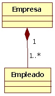
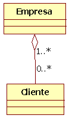
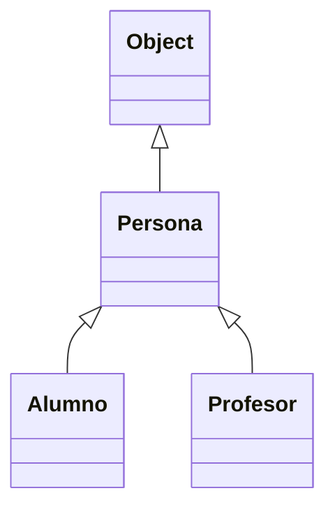
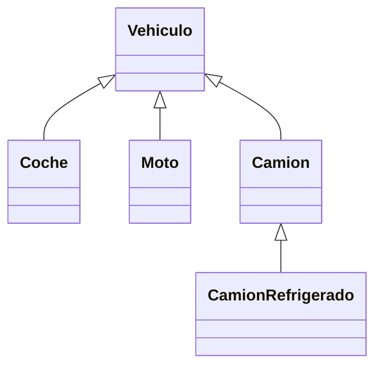

# Tema 6: POO Avanzada. Herencia, polimorfismo e interfaces

??? abstract "Duración y criterios de evaluación"

    Duración estimada: 14 sesiones

    <hr />

    **Resultados de aprendizaje**

    1. Distinguir los tipos de relaciones que pueden existir entre clases.
    2. Aplicar la herencia para crear jerarquías de clases reutilizando código.
    3. Utilizar clases abstractas e interfaces para diseñar la estructura del programa.
    4. Comprender y aplicar el polimorfismo y la ligadura dinámica.
    5. Conocer las novedades modernas de Java (records, sealed classes, pattern matching) y saber cuándo usarlas.

    **Criterios de evaluación**

    1. Se identifica la relación adecuada entre clases mediante "tiene un" (composición/agregación) o "es un" (herencia).
    2. Se crean jerarquías de clases con `extends`, `super` y se sobrescriben métodos con `@Override`.
    3. Se diseñan clases abstractas e interfaces, y se distinguen sus diferencias y cuándo utilizar cada una.
    4. Se construyen estructuras de datos polimórficas y se usan la ligadura dinámica, `instanceof` y el casting correctamente.
    5. Se emplean mecanismos defensivos (copias de objetos) al exponer o recibir referencias.
    6. Se utilizan las características modernas de Java cuando aportan claridad al código.

## 6.1 Introducción

En el tema anterior aprendiste los fundamentos de la **Programación Orientada a Objetos**: clases, objetos, atributos, métodos y los cuatro pilares del paradigma (abstracción, encapsulación, herencia y polimorfismo).

En este tema vamos a **profundizar** en esos conceptos para poder construir programas de verdad:

- Cómo se **relacionan** las clases entre sí (composición, herencia...).
- Cómo se diseña una jerarquía de clases con **herencia**.
- Para qué sirven las **clases abstractas** y las **interfaces**.
- Qué es el **polimorfismo** y por qué es tan potente en Java.
- Qué ha incorporado Java en sus versiones modernas (records, sealed classes, pattern matching).

Al terminar este tema serás capaz de diseñar la estructura de una aplicación pequeña como *App Banco* (con cliente, cuenta, movimientos...) de forma coherente y mantenible.

!!! tip "Recuerda el vocabulario"
    - **Clase**: molde o plantilla que define atributos y métodos.
    - **Objeto**: instancia de una clase (tiene estado y comportamiento).
    - **Encapsulación**: ocultar el estado y exponerlo a través de métodos.

## 6.2 Relaciones entre clases

En un programa real, las clases **raramente viven aisladas**: se comunican, se usan unas a otras o se organizan en jerarquías. Estos son los tipos de relación más habituales:

### 6.2.1 Relaciones de uso

| Relación | Qué significa | Ejemplo |
|----------|---------------|---------|
| **Clientela** | Una clase **utiliza** objetos de otra clase (los crea o recibe como parámetro). | El `main` usa `Scanner`, `LocalDate`... |
| **Composición** | Un **atributo** de una clase es un **objeto** de otra clase. | `Cuenta` tiene un atributo `titular` de tipo `Cliente`. |
| **Anidamiento** | Se declaran **clases internas** dentro de otras clases (menos habitual). | Clase `Movimiento` dentro de `Cuenta`. |
| **Herencia** | Una clase base comparte características con otras que **añaden** funcionalidad. | `CuentaAhorro` y `CuentaCorriente` heredan de `Cuenta`. |

### 6.2.2 Especialización y generalización

Dentro del diseño de clases se habla de dos perspectivas sobre la misma relación de herencia:

- **Especialización**: partimos de algo general y **añadimos características**. Ejemplo: a partir de `Vehiculo` creamos `Camion` (especializamos).
- **Generalización**: partimos de algo concreto y **extraemos lo común**. Ejemplo: a partir de `Camion`, `Coche` y `Moto` sacamos la clase común `Vehiculo` (generalizamos).

Son dos formas de *mirar* la misma jerarquía: de arriba abajo (generalización) o de abajo arriba (especialización).

### 6.2.3 Reglas mnemotécnicas: "tiene un" y "es un"

Para decidir la relación, pregunta en voz alta:

- Si un objeto **es un** objeto de otra clase → **Herencia**. *(Un `Alumno` es una `Persona`)*.
- Si un objeto **tiene un** objeto de otra clase → **Composición**. *(Un `Coche` tiene un `Motor`)*.

!!! example "Ejemplo ¿`es un` o `tiene un`?"
    - ¿Un coche es un vehículo? **Sí** → herencia (`Coche extends Vehiculo`).
    - ¿Un coche tiene ruedas? **Sí** → composición (atributo `Rueda[]`).
    - ¿Un empleado es una persona? **Sí** → herencia.
    - ¿Una cuenta tiene un titular? **Sí** → composición.

## 6.3 Composición y Agregación

### 6.3.1 Composición

Ya la has usado casi sin darte cuenta: es simplemente **declarar como atributo de una clase un objeto de otra clase**.

```java
public class Cuenta {
    private long numero;
    private Cliente titular;   // Composición: un atributo es un objeto de la clase Cliente
    private double saldo;
    private float interes;
}
```

<figure>
  
  <figcaption>Representación de la composición en UML (rombo relleno)</figcaption>
</figure>

!!! warning "Ojo con los getters que devuelven objetos"
    Cuando el tipo devuelto es un **primitivo** (`int`, `double`...), el getter devuelve una **copia del valor**, así que desde fuera no se puede modificar el original:

    ```java
    public int getNumero() {
        return numero; // Se devuelve el valor. Quien lo recibe no puede tocar la Cuenta.
    }
    ```

    Pero cuando el tipo es un **objeto**, el getter devuelve una **referencia** (puntero) al objeto. Quien lo reciba **sí podría modificar** el objeto original:

    ```java
    public Cliente getTitular() {
        return titular; // Devuelve la referencia: podrían cambiar los datos del titular desde fuera
    }
    ```

Aunque los atributos sean `private`, devolver la referencia del objeto **rompe la encapsulación**. ¿Cómo lo evitamos?

### 6.3.2 Técnica defensiva: devolver una copia

En lugar de devolver la referencia, se devuelve un **objeto nuevo** con los mismos valores:

```java
public Cliente getTitular() {
    // Se crea una copia y se devuelve. El original no se puede tocar desde fuera.
    Cliente aux = new Cliente(this.titular.getNombre(), this.titular.getApellidos());
    return aux;
}
```

!!! tip "Àmbito educativo"
    En los ejercicios básicos no siempre aplicaremos copias defensivas, pero debes saber que existen y por qué. Son muy habituales en aplicaciones profesionales.

### 6.3.3 Ojo en los constructores

Si en el constructor guardamos directamente la referencia que nos pasan, y **fuera** se modifica el objeto, **también cambiará** el de la cuenta:

```java
// Constructor "peligroso"
public Cuenta(long numero, Cliente titular, float interes) {
    this.numero = numero;
    this.titular = titular;   // OJO: guarda la MISMA referencia que llega de fuera
    this.saldo = 0;
    this.interes = interes;
}

// Constructor copia
public Cuenta(Cuenta c) {
    this.numero = c.getNumero();
    this.titular = c.getTitular(); // OJO: comparte el titular con la cuenta original
    this.saldo = c.getSaldo();
}
```

La **solución defensiva** (composición fuerte) es guardar una copia:

```java
public Cuenta(long numero, Cliente titular, float interes) {
    this.numero = numero;
    this.titular = new Cliente(titular); // Copia defensiva: constructor copia de Cliente
    this.saldo = 0;
    this.interes = interes;
}
```

### 6.3.4 Agregación: composición "débil"

La **agregación** es un tipo de **composición débil**: una clase es parte de otra, pero:

- Las partes **no se destruyen** al destruir la clase principal.
- Las partes pueden ser **compartidas** por varios objetos complejos.

Ejemplo: un coche "tiene" unas ruedas, pero las ruedas existen independientemente y podrían montarse en otro coche. El mismo objeto `Ruedas` puede estar compartido.

```java
public class Coche {
    private String marca;
    private String modelo;
    private int caballos;
    private Ruedas ruedas;

    // Agregación: guardamos la referencia que nos pasan (las ruedas se comparten)
    public Coche(String marca, String modelo, int caballos, Ruedas ruedas) {
        this.marca = marca;
        this.modelo = modelo;
        this.caballos = caballos;
        this.ruedas = ruedas;
    }
}
```

Si queremos **composición fuerte** (la clase es dueña absoluta de la parte), creamos una copia:

```java
public Coche(String marca, String modelo, int caballos, Ruedas ruedas) {
    this.marca = marca;
    this.modelo = modelo;
    this.caballos = caballos;
    this.ruedas = new Ruedas(ruedas); // Composición fuerte: copia independiente
}
```

<figure>
  
  <figcaption>Representación de la agregación en UML (rombo vacío)</figcaption>
</figure>

!!! info "Diferencia visual en UML"
    - **Agregación** → rombo **vacío** (▷): la parte se comparte y vive independiente.
    - **Composición** → rombo **relleno** (◆): la parte no existe sin el todo.

!!! example "Ejercicio rápido: catálogo de coches (solución)"
    Prueba y corrige este código creando las clases necesarias:

    ```java
    public static void main(String[] args) {
        System.out.println("Bienvenido al catálogo de coches");
        Ruedas michelin = new Ruedas("Michelin", "Primacy", 225, 'V');
        Ruedas dunlop  = new Ruedas("Dunlop", "Sport", 225, 'V');

        Coche bmw = new Coche("BMW", "320d", 177, michelin);

        System.out.println(michelin);
        System.out.println(dunlop);
        System.out.println(bmw);
    }
    ```

    ??? info "Solución"
        Crea la clase `Ruedas` con marca, modelo, ancho y código de velocidad (y su constructor). Luego crea `Coche` con su constructor. La clave del ejercicio es decidir si el atributo `ruedas` de `Coche` debe guardar la **referencia** (agregación) o una **copia** (composición fuerte).

        ```java
        public class Ruedas {
            private String marca;
            private String modelo;
            private int ancho;
            private char indiceVelocidad;

            public Ruedas(String marca, String modelo, int ancho, char indiceVelocidad) {
                this.marca = marca;
                this.modelo = modelo;
                this.ancho = ancho;
                this.indiceVelocidad = indiceVelocidad;
            }

            // Constructor copia (para composición fuerte)
            public Ruedas(Ruedas r) {
                this(r.marca, r.modelo, r.ancho, r.indiceVelocidad);
            }

            @Override
            public String toString() {
                return "Ruedas: " + marca + " " + modelo + " " + ancho + "/" + indiceVelocidad;
            }
        }
        ```

        ```java
        public class Coche {
            private String marca;
            private String modelo;
            private int caballos;
            private Ruedas ruedas;

            public Coche(String marca, String modelo, int caballos, Ruedas ruedas) {
                this.marca = marca;
                this.modelo = modelo;
                this.caballos = caballos;
                // this.ruedas = ruedas;         // Agregación (composición débil)
                this.ruedas = new Ruedas(ruedas); // Composición fuerte
            }

            @Override
            public String toString() {
                return "Coche: " + marca + " " + modelo + " (" + caballos + " cv), " + ruedas;
            }
        }
        ```

## 6.4 Herencia

La **herencia** es el mecanismo para **crear clases a partir de otras existentes**. En Java se usa la palabra clave `extends`:

```java
public class Alumno extends Persona {
    // Alumno hereda atributos y métodos de Persona
}
```

### 6.4.1 La jerarquía de clases en Java

Todas las clases de Java (incluida la `Persona` que tú definas) descienden, en última instancia, de la clase `Object`, definida en `java.lang`. De ella heredan métodos muy útiles como `toString()`, `equals()`, `hashCode()`, `getClass()`...



### 6.4.2 Qué se hereda y qué no

- **Se heredan**: los métodos públicos (`public`) y protegidos (`protected`), y los atributos con esos modificadores.
- **No se hereda**: el **constructor** (aunque se puede invocar el del padre con `super`).
- Los atributos **privados** del padre **no son accesibles directamente** en la hija, pero sí a través de sus **getters/setters** públicos o protegidos.

### 6.4.3 Visibilidad de los elementos de una clase

| Modificador | Misma clase | Mismo paquete | Subclase (otro paquete) | Mundo |
|-------------|:-----------:|:-------------:|:-----------------------:|:-----:|
| `private`   | ✅          | ❌            | ❌                      | ❌    |
| *(sin modificador, package)* | ✅ | ✅ | ❌ | ❌ |
| `protected` | ✅          | ✅            | ✅                      | ❌    |
| `public`    | ✅          | ✅            | ✅                      | ✅    |

!!! tip "Recomendación"
    Si una clase puede ser heredada y quieres que sus atributos sean accesibles desde las subclases, decláralos como `protected`. Si quieres control total, `private` + getters/setters.

### 6.4.4 Ejemplo completo: Persona, Alumno y Profesor

```java
package ejemplos.ejemplo02Personas;

import java.time.LocalDate;

public class Persona {
    // Atributos accesibles desde el mismo paquete y desde subclases
    protected String nombre;
    protected String apellidos;
    protected LocalDate fechaNacim;

    // Constructor
    public Persona(String nombre, String apellidos, LocalDate fechaNacim) {
        this.nombre = nombre;
        this.apellidos = apellidos;
        this.fechaNacim = fechaNacim;
    }

    public String getNombre() { return nombre; }
    public String getApellidos() { return apellidos; }
    public LocalDate getFechaNacim() { return fechaNacim; }

    public void mostrar() {
        System.out.println(nombre + " " + apellidos);
    }
}
```

```java
package ejemplos.ejemplo02Personas;

import java.time.LocalDate;

public class Alumno extends Persona {
    // Atributos propios de Alumno
    private String grupo;
    private double notaMedia;

    // Constructor: primero se llama al constructor del padre
    public Alumno(String nombre, String apellidos, LocalDate fechaNacim,
                  String grupo, double notaMedia) {
        super(nombre, apellidos, fechaNacim); // Llamada al constructor de Persona
        this.grupo = grupo;
        this.notaMedia = notaMedia;
    }

    // Métodos propios
    public String getGrupo() { return grupo; }
    public double getNotaMedia() { return notaMedia; }
}
```

```java
package ejemplos.ejemplo02Personas;

import java.time.LocalDate;

public class Profesor extends Persona {
    private String especialidad;
    private double salario;

    public Profesor(String nombre, String apellidos, LocalDate fechaNacim,
                    String especialidad, double salario) {
        super(nombre, apellidos, fechaNacim);
        this.especialidad = especialidad;
        this.salario = salario;
    }

    public String getEspecialidad() { return especialidad; }
    public double getSalario() { return salario; }
}
```

Y un `Main` que lo pruebe todo:

```java
package ejemplos.ejemplo02Personas;

import java.time.LocalDate;

public class Main {
    public static void main(String[] args) {
        LocalDate fecha1 = LocalDate.of(2001, 11, 2);
        Alumno alumno = new Alumno("Fran", "López", fecha1, "1DAW", 9.3);

        LocalDate fecha2 = LocalDate.of(1975, 5, 20);
        Profesor profesor = new Profesor("Ana", "Pérez", fecha2, "Programación", 2800.0);

        // Métodos heredados de Persona
        System.out.println("Alumno: " + alumno.getNombre() + " " + alumno.getApellidos());
        System.out.println("Grupo: " + alumno.getGrupo());

        // Métodos propios de cada subclase
        System.out.println("Especialidad del profesor: " + profesor.getEspecialidad());
    }
}
```

### 6.4.5 `super` y la sobrescritura de métodos

- `super(...)`: dentro del constructor de la hija, **llama al constructor del padre**. Debe ser la primera instrucción.
- `super.metodo()`: dentro de la hija, llama a la **versión del padre** de un método sobrescrito. Sirve para **ampliar** la funcionalidad.
- Una hija puede **sobrescribir** (override) un método del padre, y al hacerlo puede *abrir* su accesibilidad (por ejemplo, `protected` en el padre → `public` en la hija).

```java
public class Alumno extends Persona {
    // ...
    @Override
    public void mostrar() {
        super.mostrar();            // Se ejecuta la versión del padre
        System.out.println("Grupo: " + grupo); // Y se amplía
    }
}
```

!!! warning "La anotación @Override"
    Aunque es opcional, **siempre** añade `@Override` al sobrescribir un método. El compilador te avisará si el método no existe en el padre (típico error de escribir mal el nombre).

## 6.5 Clases abstractas

Una **clase abstracta** es una clase de la que **no se pueden instanciar objetos** directamente, pero que sirve de **base** para que otras clases hereden.

- Se declara con la palabra clave `abstract`.
- Puede tener **métodos concretos** (con cuerpo), **atributos** y **constructores** normales.
- Puede tener **métodos abstractos**: se declaran **sin cuerpo** y sus **subclases están obligadas a implementarlos**.

```java
public abstract class Persona {
    protected String nombre;
    protected String apellidos;
    protected LocalDate fechaNacim;

    // Método abstracto: no tiene cuerpo, las subclases deben definirlo
    protected abstract void mostrar();
}
```

Las clases derivadas (concretas) implementan el método abstracto:

```java
public class Alumno extends Persona {
    private String grupo;
    private double notaMedia;

    @Override
    public void mostrar() {
        System.out.println(getNombre());
        System.out.println("Nota media: " + notaMedia);
    }
}

public class Profesor extends Persona {
    private String especialidad;

    @Override
    public void mostrar() {
        System.out.println(getNombre());
        System.out.println("Especialidad: " + especialidad);
    }
}
```

Y en el `Main` (el array es de `Persona`, la clase padre):

```java
Persona[] personal = new Persona[2];
personal[0] = new Alumno("Fran", "López", fecha1, "1DAW", 9.3);
personal[1] = new Profesor("Ana", "Pérez", fecha2, "Programación", 2800.0);

alumno.mostrar();
profesor.mostrar();
```

!!! tip "¿Cuándo usar una clase abstracta?"
    Cuando tienes una clase de la que **nunca vas a crear objetos** ("una Persona" sin más no existe, siempre es un Alumno, un Profesor...) pero quieres **compartir código** (atributos, constructores, métodos) entre sus subclases.

### 6.5.1 Clases y métodos `final`

El modificador `final` (el mismo que se usa para constantes) sirve también para:

- **Clases `final`**: no pueden ser heredadas (nadie puede hacer `extends`). Ejemplo: `String`.
- **Métodos `final`**: no pueden ser sobrescritos por las subclases.

```java
public abstract class Persona {
    // ...
    // Método final: ninguna subclase podrá redefinirlo
    protected final String getNombre() {
        return nombre;
    }
}
```

## 6.6 Interfaces

Una **interfaz** es una clase especial que **solo declara** métodos (abstractos) **sin cuerpo** y que las clases que la implementen **deberán definir obligatoriamente**.

- Se declara con `interface`.
- Se implementa con la palabra clave `implements`.
- Una clase puede implementar **varias** interfaces (separadas por comas), pero solo **heredar de una** clase.

!!! info "Frase clave"
    Una interfaz indica **qué hay que hacer** (el contrato); la **implementación** indica **cómo se hace**.

### 6.6.1 Definición

```java
public interface Mascota {
    String getCodigo();
    void hazRuido();
    void come(String comida);
    void peleaCon(Animal contrincante);
}
```

Los métodos son implícitamente `public abstract`: **no hace falta escribir los modificadores**.

!!! tip "Nombres de interfaces"
    Suelen terminar en `-able`, `-or`, `-ente` para reflejar acciones: `Serializable`, `Comparable`, `Clonable`, `Servidor`, `Buscador`... Esto comunica que la interfaz expresa una **capacidad**.

### 6.6.2 Implementación

Una clase implementa una interfaz y **define todos sus métodos**:

```java
public class Gato extends Animal implements Mascota {
    private String codigo;

    public Gato(String sexo, String codigo) {
        super(sexo);
        this.codigo = codigo;
    }

    @Override
    public String getCodigo() { return codigo; }

    @Override
    public void hazRuido() {
        System.out.println("¡Miau!");
    }

    @Override
    public void come(String comida) {
        System.out.println("Hmmmm, gracias por el " + comida);
    }

    @Override
    public void peleaCon(Animal contrincante) {
        System.out.println("¡Mmmiaaaauuu! Saqué las uñas");
    }
}
```

```java
public class Perro extends Animal implements Mascota {
    private String codigo;

    public Perro(String sexo, String codigo) {
        super(sexo);
        this.codigo = codigo;
    }

    @Override
    public String getCodigo() { return codigo; }

    @Override
    public void hazRuido() {
        System.out.println("¡Guau, guau!");
    }

    @Override
    public void come(String comida) {
        System.out.println("¡Ñam, ñam! Qué rico el " + comida);
    }

    @Override
    public void peleaCon(Animal contrincante) {
        System.out.println("¡Grrrr! Le enseñé los dientes");
    }
}
```

Y en el `Main` se pueden usar sin problema:

```java
public class Main {
    public static void main(String[] args) {
        Gato garfield = new Gato("macho", "34569G");
        Perro kuki = new Perro("hembra", "234678P");

        garfield.come("pescado");   // Hmmmm, gracias por el pescado
        kuki.hazRuido();            // ¡Guau, guau!
    }
}
```

!!! example "Ejercicio: Depredador y presa"
    Implementa el siguiente esquema y pruébalo en el `Main`:

    - Una interfaz `Depredador` con métodos como `cazar(Presa presa)`.
    - Una interfaz `Presa` con métodos como `huir(Depredador depredador)`.
    - Un animal abstracto base y dos concretos, uno que sea depredador y otro presa (o ambos).

### 6.6.3 Diferencias entre clase abstracta e interfaz

| | Clase abstracta | Interfaz |
|---|---|---|
| Herencia | Una sola clase | **Varias** interfaces |
| Métodos con cuerpo | Sí | Sí (default/static desde Java 8) |
| Métodos abstractos | Sí | Sí (todos son abstractos por defecto) |
| Atributos | Normales | Constantes (`public static final`) |
| Constructores | Sí | No |
| Uso típico | Compartir código entre clases parecidas | Definir un **contrato** de comportamiento |

!!! tip "Regla práctica"
    - Necesito **compartir código** entre clases *parecidas* → **clase abstracta**.
    - Necesito que clases **no relacionadas** cumplan un **contrato** común → **interfaz**.
    - Un coche y una bici son `Vehículo` (herencia), pero solo el coche necesita `Arrancable` (interfaz).

### 6.6.4 Métodos `default` en interfaces (Java 8+)

Desde Java 8, una interfaz puede incluir métodos **con cuerpo** marcados como `default`. Así, las clases que la implementan **no están obligadas** a definirlos, y pueden usarlo o sobrescribirlo.

```java
public interface Arrancable {
    void arrancarMotor();

    default void comprobarAceite() {
        System.out.println("Comprobando nivel de aceite...");
    }
}
```

## 6.7 Polimorfismo y ligadura dinámica

### 6.7.1 ¿Qué es el polimorfismo?

El **polimorfismo** es la capacidad de **manipular objetos de diferentes clases como si fueran de la misma** (la de su superclase). Se consigue mediante la **herencia**, redefiniendo los métodos en las clases hijas.

```java
Persona persona;                     // Variable de la superclase
persona = new Alumno(...);           // Guarda un objeto de una subclase
persona = new Profesor(...);         // Y también otro
```

### 6.7.2 Ligadura estática vs dinámica

La **ligadura** es la vinculación entre la **llamada a un método** y la **clase a la que pertenece**:

- **Ligadura estática**: se resuelve en **tiempo de compilación** (p. ej. métodos `static` o los de clases no heredadas).
- **Ligadura dinámica**: se resuelve en **tiempo de ejecución** en función del **objeto real** almacenado (p. ej. un método sobrescrito llamado sobre una variable de la superclase).

### 6.7.3 Ejemplo: array polimórfico

Guardamos distintos objetos en un array de la superclase y, al recorrerlo, **se ejecuta el método correcto** según el tipo real de cada posición:

```java
public static void main(String[] args) {
    Scanner s = new Scanner(System.in);

    Persona[] personal = new Persona[3];
    personal[0] = new Alumno("Jose", "López", LocalDate.of(2004, 6, 6), "1DAW", 7.5);
    personal[1] = new Profesor("Ana", "Pérez", LocalDate.of(1980, 3, 1), "Programación", 2500);
    personal[2] = new Alumno("Luis", "García", LocalDate.of(2005, 1, 15), "1DAW", 6.0);

    for (Persona p : personal) {
        p.mostrar();  // Ligadura dinámica: llama a mostrar() de Alumno o Profesor según el caso
        System.out.println("---");
    }
}
```

!!! example "Ejercicio: Gestión Personal"
    Continuando con `Persona`, `Alumno` y `Profesor`:

    1. Implementa una clase `GestionPersonas` que contenga un **array de `Persona`** y un método `imprimirPersonal()` que recorra el array llamando a `mostrar()`.
    2. Prueba en el `Main` a crear varios alumnos y profesores y llama a `imprimirPersonal()` para comprobar que la ligadura dinámica funciona.
    3. **Ampliación (menú)**: añade un menú para insertar alumnos/profesores, mostrarlos, y **seleccionar** una persona del array para realizar funciones específicas según sea alumno (suspender, aprobar, cambiar de grupo...) o profesor (subir sueldo, cambiar asignatura...).

### 6.7.4 `instanceof` y casting a la subclase

La ligadura dinámica resuelve métodos **comunes**. Pero, ¿y si queremos llamar a un método **propio de la subclase**? Entonces hay que **castear** la variable a la subclase... pero antes hay que **comprobar el tipo real** con `instanceof`:

```java
Persona persona;
int num = Integer.parseInt(s.nextLine());

// En tiempo de compilación NO sabemos si será Alumno o Profesor
if (num % 2 == 0) {
    persona = new Alumno("David", "Galán", LocalDate.of(2005, 5, 10), "DAW", 7.2);
} else {
    persona = new Profesor("Marta", "Ruiz", LocalDate.of(1985, 9, 1), "Lenguajes", 2600);
}

// Forma recomendada: instanceof directamente en el if
if (persona instanceof Alumno alumno) {   // Patrón de tipo (Java 16+): declara y castea
    alumno.suspender();                    // Método específico de Alumno
}

// Formas clásicas (también válidas, pero menos elegantes):
if (persona.getClass() == Alumno.class) {
    Alumno alumno = (Alumno) persona;      // Casting explícito
    alumno.suspender();
}
```

!!! tip "Novedad Java 16+: pattern matching para instanceof"
    Tradicionalmente necesitabas dos pasos: comprobar con `instanceof` y luego castear:

    ```java
    if (persona instanceof Alumno) {
        Alumno a = (Alumno) persona;   // Casteo manual
        a.suspender();
    }
    ```

    Desde Java 16 puedes declarar la variable directamente en el `if`:

    ```java
    if (persona instanceof Alumno a) {
        a.suspender();   // La variable "a" ya es de tipo Alumno
    }
    ```

!!! warning "Castear sin comprobar = error en ejecución"
    Si haces `(Alumno) persona` y `persona` NO es un `Alumno`, se lanza una `ClassCastException` y el programa se cuelga. Por eso siempre se comprueba antes el tipo con `instanceof`.

## 6.8 Novedades de Java en POO

Todas estas características forman parte del Java moderno (versiones 16, 17 y 21) y son muy útiles a partir de ahora.

### 6.8.1 Records (Java 16+)

Los **records** sirven para crear **clases de datos** (solo contienen datos) de forma muy breve. El compilador genera automáticamente el constructor, los getters (llamados como el atributo, sin `get`), `equals()`, `hashCode()` y `toString()`.

```java
// Antes: tenías que escribir mucho código a mano
public class Punto {
    private final int x;
    private final int y;

    public Punto(int x, int y) { this.x = x; this.y = y; }
    public int getX() { return x; }
    public int getY() { return y; }
    // equals, hashCode, toString...
}
```

```java
// Ahora: con un record, en una sola línea
public record Punto(int x, int y) { }
```

Uso:

```java
Punto p = new Punto(3, 4);
System.out.println(p.x());    // Los accessors se llaman igual que los campos
System.out.println(p);        // Punto[x=3, y=4]
```

!!! tip "Cuándo usarlos"
    Para clases que **solo transportan datos** (modelos, POJOs). Si necesitas lógica o comportamiento complejo, usa una clase normal.

### 6.8.2 Sealed classes (Java 17+)

Las **sealed classes** (clases selladas) permiten **limitar quién puede heredar** de una clase o implementar una interfaz, enumerando explícitamente a las subclases permitidas con `permits`.

```java
public sealed class Vehiculo permits Coche, Moto, Camion {
}
```

Cada subclase permitida debe declararse como `final`, `sealed` o `non-sealed`:

```java
public final class Coche extends Vehiculo { }     // No se puede heredar más
public final class Moto extends Vehiculo { }
public non-sealed class Camion extends Vehiculo { } // Sigue libre para ser heredado
```



Ventajas: el modelo de dominios queda más preciso y, combinado con `switch` + pattern matching, el compilador puede comprobar que cubres **todas** las subclases.

!!! info "Combina con pattern matching de switch (Java 21+)"
    ```java
    sealed interface Figura permits Circulo, Cuadrado {}

    double area(Figura f) {
        return switch (f) {
            case Circulo c  -> Math.PI * c.radio() * c.radio();
            case Cuadrado q -> q.lado() * q.lado();
        };
    }
    ```

### 6.8.3 Resumen de versiones clave

| Característica | Versión | ¿Para qué sirve? |
|---|---|---|
| Lambdas y Streams | Java 8 | Programación funcional |
| `var` | Java 10 | Inferencia local de tipos |
| Switch expressions | Java 14 | `switch` como expresión con `->` e `yield` |
| Records | Java 16 | Clases de datos en una línea |
| Pattern matching `instanceof` | Java 16 | Evitar el patrón *instanceof + cast* |
| Sealed classes | Java 17 | Restringir la herencia |
| Pattern matching `switch` | Java 21 | `switch` sobre tipos y sin `default` si es exhaustivo |

## 6.9 Buenas prácticas

- Usa **"es un" → herencia**, **"tiene un" → composición**. No heredes para "reutilizar métodos" solo.
- **Prefiere la composición** sobre la herencia cuando se pueda: es más flexible.
- Los **atributos `private`**; usa `protected` solo si las subclases van a acceder directamente.
- **Copia defensiva** al devolver o recibir objetos mutables por referencia.
- Siempre `@Override` al sobrescribir.
- Usa **clases abstractas** para código común y **interfaces** para contratos.
- Antes de castear a una subclase, comprueba con `instanceof`.
- Aplica **records** para clases de datos y **sealed** cuando quieras cerrar una jerarquía.

## 6.10 Referencias

- [Documentación de Java: herencia (Oracle)](https://docs.oracle.com/javase/tutorial/java/IandI/index.html)
- [Clases abstractas e interfaces (w3schools)](https://www.w3schools.com/java/java_abstract.asp)
- [Oracle: Sealed Classes](https://docs.oracle.com/en/java/javase/17/language/sealed-classes-and-interfaces.html)
- [JEP 409: Sealed Classes](https://openjdk.org/jeps/409)
- [JEP 394: Pattern Matching for instanceof](https://openjdk.org/jeps/394)
- [JEP 395: Records](https://openjdk.org/jeps/395)
- [JEP 441: Pattern Matching for switch](https://openjdk.org/jeps/441)

## 6.11 Actividades

601. Crea las clases `Ruedas` y `Coche` del ejercicio del catálogo (con composición fuerte) y comprueba en un `Main` que modificar la variable `michelin` original **no** cambia las ruedas del coche.

602. Diseña una clase abstracta `Figura` con un método abstracto `area()`. Crea `Circulo`, `Cuadrado` y `Triangulo` que la implementen. Guarda varias en un array de `Figura` y muestra el área de todas (polimorfismo).

603. Define la interfaz `Mascota` del tema y haz que `Gato` y `Perro` (que heredan de `Animal`) la implementen. Crea un array de `Mascota` y recórrelo llamando a `hazRuido()`.

604. Continuando con el ejercicio de la App Banco: modela `Cuenta`, `Cliente` y `Movimiento`. Haz que `CuentaAhorro` y `CuentaCorriente` hereden de `Cuenta` añadiendo condiciones propias (p. ej. comisión de mantenimiento).

605. Explica con tus palabras la diferencia entre composición, agregación y herencia, y pon un ejemplo real de cada una.

606. Implementa el ejercicio **Gestion Personal** completo (array polimórfico + menú) con opciones específicas para Alumno y Profesor usando `instanceof`.

607. Convierte la clase `Estudiante` (nombre y edad) en un **record** y comprueba qué métodos se generan automáticamente.

608. Convierte la jerarquía `Figura` del ejercicio 602 en una **sealed class** con subclases `final` y comprueba que el compilador te obliga a cubrir todos los casos en un `switch`.