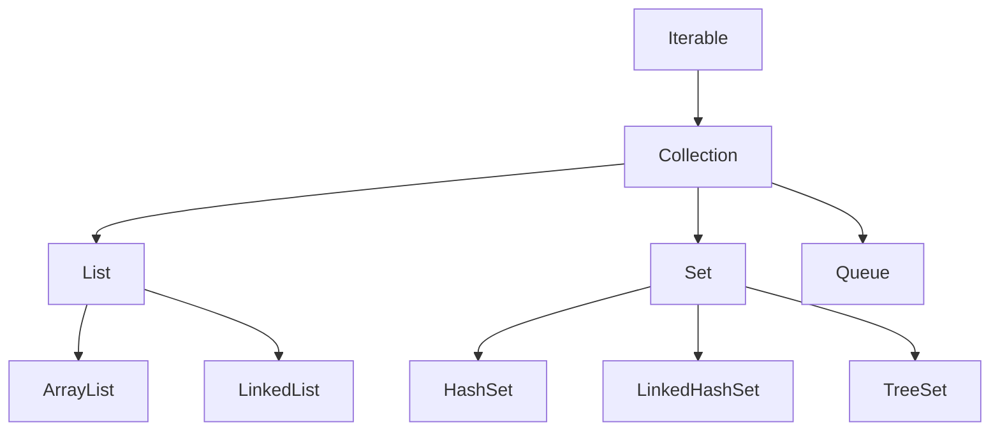
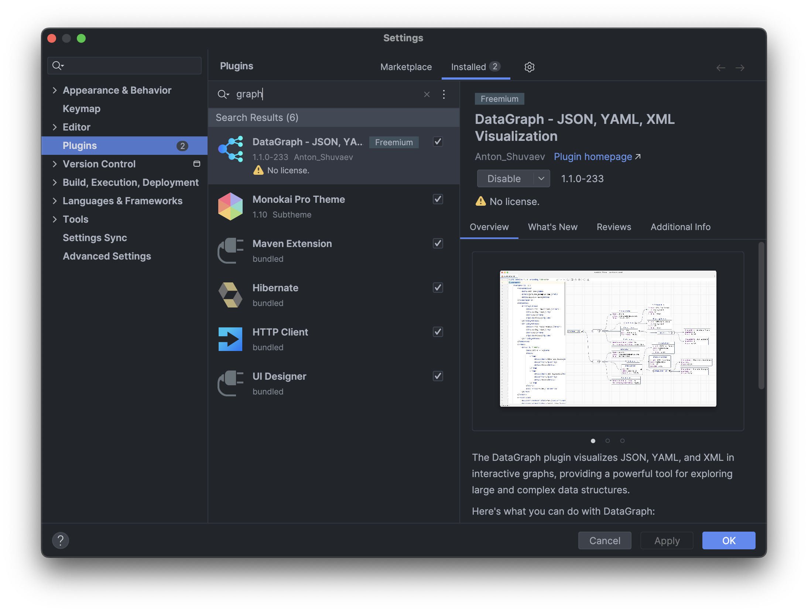
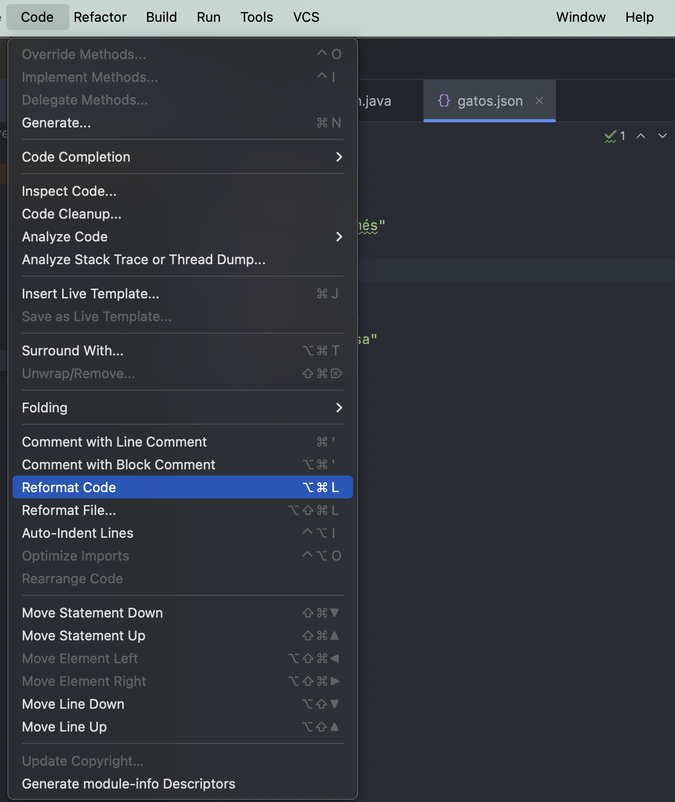

# Tema 7: Colecciones

??? abstract "Duración y criterios de evaluación"

    Duración estimada: 14 sesiones

    <hr />

    **Resultados de aprendizaje**

    1. Comprender la necesidad de las estructuras de datos dinámicas frente a los arrays estáticos.
    2. Conocer la arquitectura del framework de colecciones de Java (Collection, List, Set, Map).
    3. Utilizar conjuntos, listas y diccionarios para resolver problemas reales.
    4. Aplicar criterios de ordenación propios con `Comparable` y `Comparator`.
    5. Conocer las operaciones funcionales de la API Stream.
    6. Manejar XML y JSON como formatos de intercambio de información.

    **Criterios de evaluación**

    1. Se elige la estructura de datos adecuada (lista, conjunto o diccionario) según la necesidad.
    2. Se realizan las operaciones CRUD sobre colecciones con los tipos genéricos correctos.
    3. Se ordenan objetos propios mediante `Comparable`, `Comparator` o lambdas.
    4. Se aplican filtros, transformaciones y reducciones con la API Stream.
    5. Se serializa y deserializa información con JSON (Gson) y se interpreta XML.
    6. Se comprenden las novedades de colecciones de Java 9 y Java 21 (`List.of`, `SequencedCollection`).

## 7.1 Introducción

Con lo aprendido hasta ahora puedes escribir programas correctos, pero **limitados por el número de datos**: un número finito de usuarios, de cuentas, de incidencias...

¿Qué pasaría si tu *App Banco* debe gestionar **millones de cuentas**? No puedes declarar `Cuenta c1, c2, c3...`. Necesitas estructuras que:

- Almacenen **muchos elementos** (simple o compuestos).
- Tengan un tamaño **fijo o dinámico**.
- Se puedan **recorrer**.
- Permitan realizar operaciones **CRUD** (Create, Read, Update, Delete).

Esto existe: son las **colecciones**.

### Clasificación de las estructuras de almacenamiento

Según lo que almacenan:

- **Datos del mismo tipo**: arrays, matrices, **listas, colecciones, conjuntos**...
- **Datos de distinto tipo**: **clases** (vistas en POO).

Según su tamaño:

- **Fijo**: el tamaño se especifica al crearla y no cambia (arrays, matrices).
- **Dinámico**: el tamaño cambia en tiempo de ejecución (listas, colecciones...).

!!! tip "De los arrays a las colecciones"
    Un array es la estructura "básica": tamaño fijo y acceso por índice. Las colecciones añaden flexibilidad: crecen solas, se borran elementos, se buscan, se ordenan...

## 7.2 ¿Qué es una colección?

Una **colección** es un grupo de elementos almacenados de forma conjunta en la misma estructura. Además de los datos, la colección **incluye las funciones** para interactuar con ellos (`add`, `remove`, `size`...).

En Java, el framework de colecciones tiene esta arquitectura:



- Los **conjuntos** y **listas** implementan la interfaz `java.util.Collection`, que define las operaciones comunes (añadir, borrar, saber el tamaño, recorrer...).
- Los **diccionarios** implementan `java.util.Map`, que define las operaciones de pares **clave/valor**.

=== "Interfaz `Collection`"
    ```java
    import java.util.*;

    Collection<String> c = new ArrayList<>();
    c.add("hola");
    c.size();          // 1
    c.remove("hola");  // true
    c.isEmpty();       // true
    ```

=== "Interfaz `Map`"
    ```java
    import java.util.*;

    Map<String, Integer> m = new HashMap<>();
    m.put("Ana", 20);
    m.get("Ana");      // 20
    m.containsKey("Ana"); // true
    ```

!!! warning "Las colecciones usan tipos genéricos"
    Declara siempre el **tipo** de los elementos que almacena la colección (`ArrayList<String>`, `Map<String, Integer>`...). Los *tipos crudos* (`ArrayList` a secas) son código antiguo: compilan, pero pierden la seguridad de tipos y obligan a castear.

## 7.3 Conjuntos (Set)

Un **conjunto** es un tipo de colección que **no admite elementos duplicados**, derivado del concepto matemático de conjunto.

La interfaz `java.util.Set` define cómo deben ser los conjuntos y **extiende `Collection`**, aunque no añade operaciones nuevas: la gracia está en su **comportamiento** (sin repetidos).

### Clases más utilizadas

| Clase | Cómo almacena | Características |
|-------|---------------|-----------------|
| `java.util.HashSet` | Tablas hash | Muy rápido. **Sin orden** garantizado. |
| `java.util.LinkedHashSet` | Tablas hash + lista enlazada | Orden de **inserción**. Acceso rápido. |
| `java.util.TreeSet` | Árbol rojo-negro | Más lento, pero **ordenado** (natural o con `Comparator`). |

```java
import java.util.*;

public class EjemploSet {
    public static void main(String[] args) {
        Set<String> nombres = new HashSet<>();
        nombres.add("Ana");
        nombres.add("Luis");
        nombres.add("Ana"); // Duplicado: NO se añade

        System.out.println(nombres); // [Luis, Ana] (orden no garantizado)
        System.out.println(nombres.size()); // 2
    }
}
```

!!! tip "¿Cuándo usar un Set?"
    Cuando necesites **eliminar duplicados** o comprobar **si un elemento existe** de forma rápida. Ejemplo: lista de alumnos que se apuntan a una actividad (no puede repetirse el DNI).

## 7.4 Listas (List)

Las **listas** son el avance natural sobre los arrays. Añaden:

- Almacenamiento de **elementos repetidos**.
- **Acceso por posición** (índice).
- **Búsqueda** de elementos (obtiene su posición).
- Extracción de **sublistas**.

Todas implementan la interfaz `java.util.List`.

### Clases más utilizadas

| Clase | Cómo funciona | Ideal para |
|-------|---------------|------------|
| `java.util.ArrayList` | Array que se **redimensiona** solo | **Acceso rápido** por índice y lecturas |
| `java.util.LinkedList` | Lista **doblemente enlazada** (nodos) | Muchas **inserciones/borrados** en los extremos |

### 7.4.1 Declaración e inserción

```java
import java.util.ArrayList;

public class EjemploArrayList {
    public static void main(String[] args) {
        ArrayList<String> colores = new ArrayList<>();

        colores.add("violeta");
        colores.add("blanco");
        colores.add("negro");
        colores.add("verde");
        System.out.println(colores); // [violeta, blanco, negro, verde]
    }
}
```

### 7.4.2 Recorridos

```java
// Recorrido clásico con índice
for (int i = 0; i < colores.size(); i++) {
    System.out.println(colores.get(i));
}

// Recorrido mejorado (for-each)
for (String color : colores) {
    System.out.println(color);
}

// Con un Consumer (forEach, Java 8+)
colores.forEach(color -> System.out.println(color));
```

### 7.4.3 El resto de operaciones CRUD

```java
colores.get(1);                    // Elemento en posición 1
colores.set(1, "rojo");            // Reemplaza la posición 1
colores.add(2, "amarillo");        // Inserta en la posición 2
colores.remove(3);                 // Borra por posición
colores.remove("verde");           // Borra por valor (si existe)
colores.indexOf("negro");          // Posición del elemento (o -1)
colores.contains("negro");         // ¿Existe?
colores.size();                    // Número de elementos
colores.isEmpty();                 // ¿Está vacía?
```

### 7.4.4 Borrado condicional con `removeIf` (Java 8+)

```java
ArrayList<String> colores = new ArrayList<>();
colores.add("violeta");
colores.add("blanco");
colores.add("negro");
colores.add("verde");

// Elimina los elementos que cumplan la condición (empiezan por "v")
colores.removeIf(c -> c.startsWith("v"));
System.out.println(colores); // [blanco, negro]
```

### 7.4.5 Almacenar objetos propios

Las listas pueden guardar cualquier objeto:

```java
ArrayList<Gato> gatos = new ArrayList<>();
gatos.add(new Gato("Garfield", "naranja", "común", 10));
gatos.add(new Gato("Mishi", "naranja", "común", 5));
```

!!! tip "Novedad Java 21: `SequencedCollection`"
    Desde Java 21, todas las colecciones ordenadas (listas, `ArrayDeque`, `TreeSet`...) implementan la interfaz `SequencedCollection`, que aporta operaciones uniformes para los **extremos** y la **vista inversa**:

    ```java
    var lista = new ArrayList<>(List.of("a", "b", "c"));
    lista.getFirst();          // "a"  (antes: lista.get(0))
    lista.getLast();           // "c"  (antes: lista.get(lista.size()-1))
    lista.reversed();          // vista inversa [c, b, a]
    ```

## 7.5 Ordenación de listas

### 7.5.1 Ordenar colecciones de tipos básicos

`Collections.sort(lista)` ordena una lista de tipos que ya implementan orden natural (`String`, `Integer`...):

```java
ArrayList<Integer> notas = new ArrayList<>(List.of(8, 3, 9, 5));
Collections.sort(notas);       // [3, 5, 8, 9]
Collections.reverse(notas);    // [9, 8, 5, 3]
```

### 7.5.2 Ordenar objetos propios. Método 1: `Comparable`

Si queremos ordenar objetos propios (por ejemplo, `Gato`), la clase debe implementar la interfaz `Comparable` y definir **`compareTo`** con el criterio de ordenación.

`compareTo` debe devolver: **negativo**, **0** o **positivo** según el objeto actual sea menor, igual o mayor que el argumento.

```java
// 1. Implementar la interfaz Comparable y sobrescribir compareTo
public class Gato implements Comparable<Gato> {

    private String nombre;
    private String color;
    private String raza;
    private int peso;

    // constructor, getters y setters...

    // Criterio: ordenar por peso de menor a mayor
    @Override
    public int compareTo(Gato gato) {
        return this.peso - gato.peso;
    }
}
```

```java
// 2. Utilizar Collections.sort(lista)
import java.util.*;

public class Main {
    public static void main(String[] args) {
        Gato gato1 = new Gato("Garfield", "naranja", "común", 10);
        Gato gato2 = new Gato("Mishi", "naranja", "común", 5);
        Gato gato3 = new Gato("Hello Kitty", "blanco", "japo", 7);

        ArrayList<Gato> gatos = new ArrayList<>();
        gatos.add(gato1);
        gatos.add(gato2);
        gatos.add(gato3);

        Collections.sort(gatos); // Ordena por el criterio de compareTo
        System.out.println(gatos);
    }
}
```

!!! example "Ejercicio"
    Aplica diferentes ordenaciones con `Comparable`: por **nombre**, por **raza** y por **peso**, tanto ascendente como descendentemente. Pista: para ordenar descendente puedes usar `Collections.reverse(lista)` o invertir el orden de `compareTo`.

### 7.5.3 Método 2: `Comparator`

El `Comparator` permite definir **varios criterios de ordenación** sin tocar la clase `Gato`. Se crea una clase que implemente `Comparator` y defina `compare`.

```java
// 1. Crear la clase con el método compare
public class PesoMenosMas implements Comparator<Gato> {
    @Override
    public int compare(Gato o1, Gato o2) {
        return o1.getPeso() - o2.getPeso(); // De menos a más peso
    }
}
```

```java
// 2. Llamar al método sort de la propia lista pasándole una instancia
gatos.sort(new PesoMenosMas());
```

**Variante con clase anónima** (ahorramos crear la clase):

```java
gatos.sort(new Comparator<Gato>() {
    @Override
    public int compare(Gato o1, Gato o2) {
        return o1.getPeso() - o2.getPeso();
    }
});
```

!!! example "Ejercicio"
    Crea las clases necesarias (`PesoMenosMas`, `NombreAZ`, `RazaAZ`, y sus inversas) para ordenar los gatos por nombre, raza y peso, ascendente y descendentemente.

### 7.5.4 Método 3: `Comparator` con lambdas (Java 8+)

La forma más moderna y breve: pasar una **función lambda** directamente a `sort`.

```java
// Los tipos de los argumentos se infieren de la lista
gatos.sort((o1, o2) -> {
    return o1.getPeso() - o2.getPeso();
});

// Si la función tiene una sola línea, se pueden quitar llaves y return. Mejor así:
gatos.sort((o1, o2) -> o1.getPeso() - o2.getPeso());

// Con métodos de ayuda (Comparator.comparing...) todavía más legible:
gatos.sort(Comparator.comparing(Gato::getNombre));
gatos.sort(Comparator.comparing(Gato::getNombre).reversed());
gatos.sort(Comparator.comparing(Gato::getPeso).thenComparing(Gato::getNombre));
```

## 7.6 Consideraciones importantes: referencias

Las listas pueden almacenar objetos **inmutables** (`String`, `Integer`, `Long`...) y **mutables** (clases propias).

Dos errores clásicos:

!!! danger "1. Modificar el objeto "fuera" cambia lo que hay en la lista"
    ```java
    Test p1 = new Test(11);
    LinkedList<Test> lista = new LinkedList<>();
    lista.add(p1);        // Se guarda la REFERENCIA, no una copia

    p1.setNum(99);        // Cambiamos el objeto desde fuera
    // La lista ahora contiene un objeto con num=99
    System.out.println(lista.get(0).getNum()); // 99
    ```

!!! danger "2. Iterar y borrar a la vez"
    Borrar elementos mientras se recorre una lista con `for` tradicional puede saltarte elementos. Mejor usa `removeIf` (visto antes) o recorre hacia atrás con `Iterator`.

```java
// Con gatos:
Gato gato1 = new Gato("Garfield", "naranja", "común", 10);
ArrayList<Gato> gatos = new ArrayList<>();
gatos.add(gato1);

gato1.setColor("verde"); // Cambia el color "dentro" de la lista
System.out.println(gatos.get(0).getColor()); // verde
```

!!! tip "Copia antes, si no quieres compartir"
    Si no quieres que el objeto de la lista se vea afectado por cambios externos, añade una **copia** (como hicimos con la composición en el tema anterior).

## 7.7 Bonus: programación funcional con la API Stream

La **API Stream** (Java 8) permite trabajar con una colección **como si fuese un flujo de información**, encadenando operaciones de filtrado, transformación, ordenación y presentación.

```java
import java.util.*;
import java.util.stream.Collectors;

public class ProgramacionFuncional {

    public static int multiplica10(int num) {
        return num * 10;
    }

    public static void main(String[] args) {
        // Crear una colección de enteros sin añadirlos uno a uno
        ArrayList<Integer> lista = new ArrayList<>(Arrays.asList(12, 5, 8, 3, 21));
        System.out.println("Original: " + lista);

        // filter: quedarnos con los pares
        List<Integer> pares = lista.stream()
                .filter(num -> num % 2 == 0)
                .collect(Collectors.toList());

        // map: transformar cada elemento (num * 10)
        List<Integer> por10 = lista.stream()
                .map(ProgramacionFuncional::multiplica10) // referencia a método
                .collect(Collectors.toList());

        // sorted: ordenar
        List<Integer> ordenados = lista.stream()
                .sorted()
                .collect(Collectors.toList());

        // reduce: sumar todos los elementos
        int suma = lista.stream()
                .reduce(0, (acumulado, num) -> acumulado + num);

        System.out.println("Pares: " + pares);
        System.out.println("Por 10: " + por10);
        System.out.println("Ordenados: " + ordenados);
        System.out.println("Suma: " + suma);
    }
}
```

!!! info "Operaciones más usadas"
    - `filter(condición)` → deja pasar los elementos que cumplen la condición.
    - `map(transformación)` → transforma cada elemento.
    - `sorted()` → ordena (con o sin `Comparator`).
    - `reduce(inicial, función)` → reduce todos a un único valor (suma, máximo...).
    - `forEach(acción)` → aplica una acción a cada elemento.
    - `collect(...)` → convierte el stream en colección/list/map.

!!! example "Ejercicio (baraja española)"
    Partiendo de un programa que elige aleatoriamente **10 cartas** de la baraja española, usando programación funcional:

    1. Muestra todas las cartas en orden normal e inverso.
    2. Muéstralas ordenadas por palo y valor.
    3. Muestra las cartas del palo `espadas` (`filter`).
    4. Muestra el valor numérico de las cartas (`map`): el as vale 1, la sota 10, el caballo 11 y el rey 12.
    5. Muestra las cartas que valen más de 7.
    6. Muestra la **suma** de todos los valores de las cartas (`reduce`).

## 7.8 Diccionarios (Map)

Los **diccionarios** almacenan **pares clave/valor**. Todos implementan la interfaz `java.util.Map`.

### Clases más utilizadas

| Clase | Comportamiento |
|-------|----------------|
| `java.util.HashMap` | **Sin orden** garantizado. Rápido acceso por clave. |
| `java.util.LinkedHashMap` | Mantiene el **orden de inserción**. |
| `java.util.TreeMap` | Mantiene las claves **ordenadas** (natural o `Comparator`). |

### 7.8.1 HashMap en detalle

- Colección **no ordenada** de elementos.
- Se implementa en una **tabla hash**.
- Se aplica una **función hash** a la clave que determina dónde se almacena.
- Si hay **colisión**, el nuevo par clave/valor se enlaza al anterior.
- Acceso a través de la **clave** o del **valor**.
- Permite **valores nulos**, pero **solo una clave nula**.

### 7.8.2 Operaciones

```java
import java.util.HashMap;

public class EjemploMap {
    public static void main(String[] args) {
        HashMap<String, Integer> edades = new HashMap<>();

        // Inserción
        edades.put("Ana", 20);
        edades.put("Luis", 22);
        edades.put("María", 19);

        // Lectura de un valor con get
        System.out.println(edades.get("Ana")); // 20

        // Lectura de todas las entradas con entrySet y for-each
        for (var entrada : edades.entrySet()) {
            // getKey y getValue
            System.out.println(entrada.getKey() + " -> " + entrada.getValue());
        }

        // Búsqueda de clave
        if (edades.containsKey("Luis")) {
            System.out.println("Luis está en el mapa");
        }

        // Otras operaciones
        System.out.println(edades.size());
        System.out.println(edades.keySet());   // Conjunto de claves
        System.out.println(edades.values());   // Colección de valores
        edades.remove("Luis");
    }
}
```

### 7.8.3 Ejemplo de aplicación: BBDD de Bizum

En la *App Banco* se puede usar un `HashMap` para identificar rápidamente qué cuentas tienen asociado un teléfono para hacer Bizum:

```java
HashMap<String, String> telefonoCuenta = new HashMap<>();
telefonoCuenta.put("600111222", "ES123456789");
telefonoCuenta.put("600333444", "ES987654321");

String cuentaAsociada = telefonoCuenta.get("600111222"); // Búsqueda instantánea
```

!!! info "Novedad Java 9: `Map.of`"
    Para mapas **inmutables** pequeños, existen los métodos de fábrica estáticos:

    ```java
    Map<String, Integer> edades = Map.of(
            "Ana", 20,
            "Luis", 21
    );
    List<String> nombres = List.of("Ana", "Luis", "María");
    ```

    Ojo: son **inmutables** (no se puede `put`/`add`).

## 7.9 Otras estructuras: XML y JSON

### 7.9.1 XML

**XML** (*eXtensible Markup Language*) es un lenguaje de etiquetado para **estructurar, almacenar e intercambiar información**.

- La información en XML está pensada para ser **leída por una máquina**.
- Es **legible y editable** con un editor de texto plano.
- Formado por **nodos**: se delimitan por etiqueta de apertura y cierre (como en HTML). Los nodos pueden tener **atributos** en su etiqueta de apertura.

```xml
<clientes>
    <cliente id="1">
        <nombre>Rafael López</nombre>
        <telefono>1234</telefono>
    </cliente>
    <cliente id="2">
        <nombre>María Nadal</nombre>
        <telefono>1238</telefono>
    </cliente>
</clientes>
```

### 7.9.2 JSON

**JSON** (*JavaScript Object Notation*) es un formato de texto para **representar objetos**. Muy útil para transmitir datos por la red.

- Permite almacenar los mismos tipos de datos que Java: cadenas, números, arrays, objetos...
- Para acceder a sus datos desde Java hay que **convertirlo a objetos nativos** mediante librerías como **Gson** (de Google).

```json
{
  "clientes": [
    { "id": 1, "nombre": "Rafael López", "telefono": 1234 },
    { "id": 2, "nombre": "María Nadal", "telefono": 1238 }
  ]
}
```

#### Serializar (stringify) con Gson

Convierte un objeto Java en una cadena de texto JSON → `gson.toJson(objeto)`.

```java
import com.google.gson.*;

public class EjemploToJson {
    public static void main(String[] args) {
        Gson gson = new Gson();

        ArrayList<Cuenta> cuentas = new ArrayList<>();
        cuentas.add(new Cuenta(1, new Cliente("Rafael López"), 100.0));

        String json = gson.toJson(cuentas);
        System.out.println(json);
        // Guardar a fichero... (se hace con FileWriter, tema siguiente)
    }
}
```

#### Deserializar (parse) con Gson

Convierte un texto JSON en un objeto Java → `gson.fromJson(buffer, ClasePrincipal.class)`.

```java
import com.google.gson.*;
import java.io.*;

public class EjemploFromJson {
    public static void main(String[] args) throws Exception {
        Gson gson = new Gson();

        // El buffer se lee normalmente desde un fichero
        BufferedReader buffer = new BufferedReader(new FileReader("cuentas.json"));
        GestionCuentas gc = gson.fromJson(buffer, GestionCuentas.class);
        buffer.close();

        // Si queremos mapear un JSON a una estructura sin clase propia (ArrayList):
        ArrayList<Cuenta> cuentas = gson.fromJson(
                new FileReader("cuentas.json"),
                new TypeToken<ArrayList<Cuenta>>() { }.getType()
        );
    }
}
```

#### Escritura del JSON a fichero

```java
public static void escribeJSONEnFichero(String json) {
    try {
        FileWriter fichero = new FileWriter("cuentas.json");
        PrintWriter pw = new PrintWriter(fichero);
        pw.println(json);
        fichero.close();
    } catch (Exception e) {
        e.printStackTrace();
    }
}
```

<figure>
  
  <figcaption>Plugin DataGraph de IntelliJ IDEA para visualizar archivos JSON</figcaption>
</figure>

<figure>
  
  <figcaption>Reformatear un JSON en IntelliJ IDEA (Code → Reformat Code)</figcaption>
</figure>

!!! tip "Trabajar con APIs (flujo completo)"
    Para consumir un JSON descargado desde una API:

    1. Localizar una **API** pública.
    2. Probar la API en **Postman** (ver la estructura del JSON).
    3. Generar el **esquema de clases** a partir del JSON con [jsonschema2pojo](https://www.jsonschema2pojo.org/).
    4. Comprender la información del JSON y del esquema generado.
    5. Parsear con `gson.fromJson(buffer, ClasePrincipal.class)`.

## 7.10 Novedades de Java en colecciones

| Novedad | Versión | Qué aporta |
|---|---|---|
| API Stream, lambdas | Java 8 | Programación funcional sobre colecciones (`filter`, `map`, `reduce`...) |
| `List.of`, `Set.of`, `Map.of` | Java 9 | Colecciones inmutables en una línea |
| `removeIf`, `forEach` | Java 8 | Operaciones cómodas sobre `Collection` |
| `getOrDefault`, `putIfAbsent`, `computeIfAbsent` | Java 8 | Métodos cómodos de `Map` |
| `SequencedCollection`, `SequencedSet`, `SequencedMap` | Java 21 | `getFirst()`, `getLast()`, `reversed()` en todas las colecciones ordenadas |
| Records | Java 16 | Modelar los objetos guardados en colecciones de forma breve |

```java
// Ejemplo del mundo real: combinar novedades
List<Gato> gatos = List.of(
        new Gato("Garfield", "naranja", "común", 10),
        new Gato("Mishi", "naranja", "común", 5)
);

// Gatos que pesan más de 6, ordenados por peso
List<Gato> pesados = gatos.stream()
        .filter(g -> g.getPeso() > 6)
        .sorted(Comparator.comparing(Gato::getPeso))
        .toList(); // Java 16+: toList() sin colector
```

## 7.11 Buenas prácticas

- Declara siempre el **tipo genérico** (`ArrayList<String>`), nunca tipos crudos.
- **Elige bien la estructura**: ¿admite repetidos? → lista. ¿No? → set. ¿Búsqueda por clave? → map.
- Nombra con tipos de la **interfaz** (`List<String> l = new ArrayList<>();`) para poder cambiar la implementación después.
- En producción, ordena con `Collections.sort` o `list.sort`; no reinventes la burbuja.
- Para concatenar mucho texto usa `StringBuilder` (ya lo vimos en el tema 4).
- Usa `Stream` para operaciones de filtrado/transformación que serían *ruidosas* con bucles.
- Ten cuidado con las **referencias**: añadir un objeto a una lista no lo copia.
- Prefiere **`List.of`/`Map.of`** cuando la colección no vaya a cambiar.

## 7.12 Referencias

- [Java Tutorial: The List interface (Oracle)](https://docs.oracle.com/javase/tutorial/collections/interfaces/list.html)
- [Java Tutorial: The Set interface](https://docs.oracle.com/javase/tutorial/collections/interfaces/set.html)
- [Java Tutorial: The Map interface](https://docs.oracle.com/javase/tutorial/collections/interfaces/map.html)
- [JEP 431: Sequenced Collections](https://openjdk.org/jeps/431)
- [Gson: guía de usuario](https://github.com/google/gson/blob/main/UserGuide.md)
- [Javarevisited: 5 librerías JSON para Java](https://javarevisited.blogspot.com/)

## 7.13 Actividades

701. Crea un `HashSet<Integer>` e intenta añadir tres veces el mismo número. Comprueba con `size()` que solo se almacena una vez.

702. Escribe un programa que lea nombres por teclado y los guarde en un `ArrayList<String>` hasta que el usuario escriba "fin". Después muestra el listado ordenado alfabéticamente y sin repetidos (pista: usa un `TreeSet` o `LinkedHashSet`).

703. Crea la clase `Gato` con `Comparable` (peso) y la clase `PesoMenosMas` (Comparator). Ordena una lista de 3 o 4 gatos de las tres formas: `Comparable`, `Comparator` y **lambda**, y comprueba que salen igual.

704. Dado un `ArrayList<Integer>` con los números del 1 al 20, usa **Stream** para mostrar: los pares, los múltiplos de 3, el mayor, el menor, y la suma de todos.

705. Implementa una mini agenda con `HashMap<String, String>` (teléfono → nombre). Ofrece un menú: añadir contacto, buscar contacto, listar todos, eliminar, salir.

706. Crea un programa que serialize un objeto `Library` (con libros) a JSON con Gson y lo guarde en `biblioteca.json`. Después, en otro programa, léelo y muéstralo.

707. Convierte la lista de la App Banco (cuentas) para que se gestione con `ArrayList<Cuenta>` (fuera ya los arrays estáticos). Añade y elimina cuentas, ordénalas por número e imprime el detalle de cada una.

708. Investiga la diferencia entre `ArrayList` y `LinkedList`: qué operaciones son rápidas y cuáles lentas en cada una. Pon un ejemplo donde `LinkedList` gane claramente (insertar/borrar al principio).