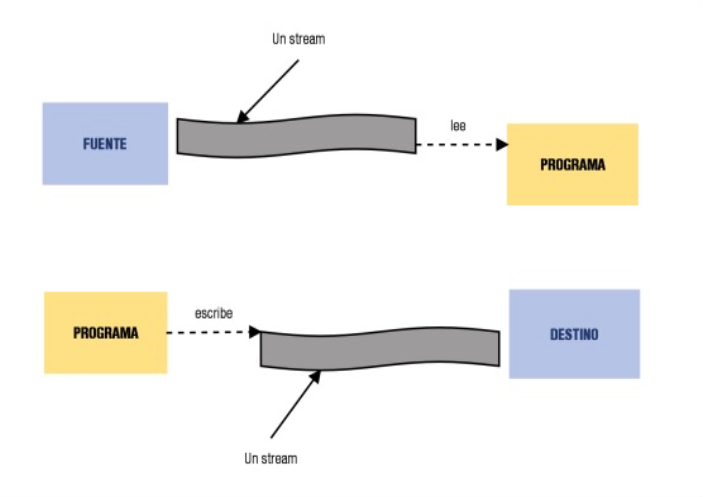
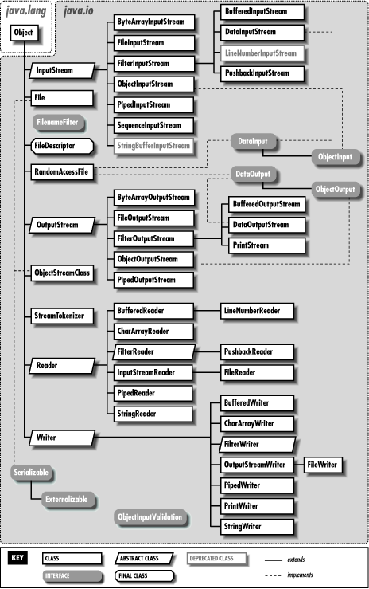
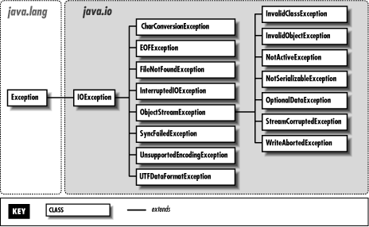
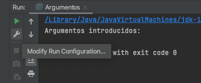
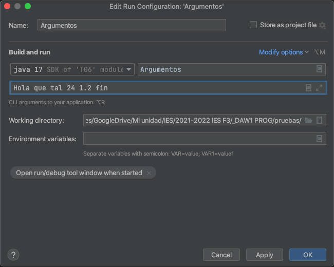
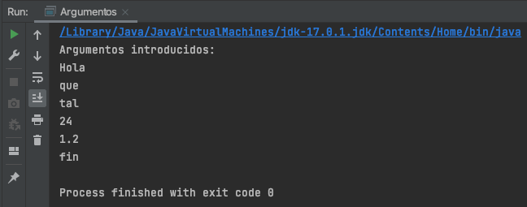
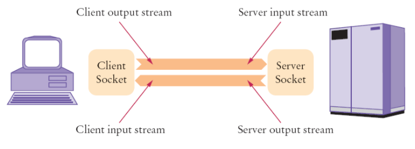
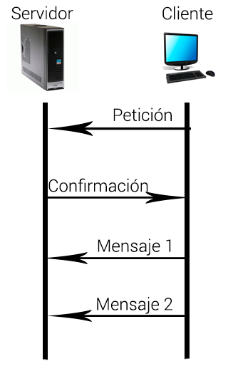

# Tema 8: Flujos (Entrada/Salida, ficheros y redes)

??? abstract "Duración y criterios de evaluación"

    Duración estimada: 12 sesiones

    <hr />

    **Resultados de aprendizaje**

    1. Conocer la necesidad de la persistencia: los datos viven más allá de la ejecución del programa.
    2. Comprender el concepto de *flujo de datos* y los dos grandes tipos (caracteres y bytes).
    3. Leer y escribir ficheros de texto con el paquete `java.io`.
    4. Serializar objetos para almacenarlos en disco.
    5. Guardar preferencias con el archivo `Properties`.
    6. Pasar argumentos por línea de comandos a los programas.
    7. Establecer comunicación entre programas mediante *sockets*.

    **Criterios de evaluación**

    1. Se elige el flujo de datos adecuado (caracteres vs. bytes) para cada necesidad.
    2. Se realizan lecturas y escrituras de ficheros capturando `FileNotFoundException` e `IOException`.
    3. Se gestionan correctamente los recursos con `try-with-resources`.
    4. Se serializan y recuperan objetos propios con `ObjectOutputStream`/`ObjectInputStream`.
    5. Se guardan y leen preferencias con `java.util.Properties`.
    6. Se reciben y procesan los argumentos del método `main`.
    7. Se implementa una comunicación cliente/servidor con `Socket` y `ServerSocket`.

## 8.1 Introducción

Hasta ahora, todos los datos que manejábamos **se perdían al cerrar el programa**. Con los ficheros conseguimos **dar persistencia** a las aplicaciones: los datos se mantienen aunque cerremos el programa.

A las operaciones que constituyen el **flujo de información con el exterior** del programa se les llama operaciones de **Entrada/Salida** (E/S o I/O). Hay de dos tipos:

- **Usuario ↔ Programa**: por ejemplo, pedir datos por `Scanner`.
- **Programa ↔ Software exterior**: por ejemplo, lectura y escritura en disco.

### Excepciones más comunes

Al trabajar con ficheros, las excepciones más típicas son:

| Excepción | Cuándo aparece |
|-----------|----------------|
| `java.io.FileNotFoundException` | No se encuentra el fichero (al leer, o al escribir en un directorio inexistente). |
| `java.io.IOException` | Error de permisos, fichero corrupto, dispositivo lleno... |

### ¿Qué es un flujo de datos?

Un **flujo de datos** (o *stream*) es una **abstracción** de aquello que produzca o consuma información. Es una **entidad lógica**: representa un archivo, un dispositivo de E/S, una conexión TCP/IP...

<figure>
  
  <figcaption>Un flujo es una abstracción de cualquier fuente o destino de información</figcaption>
</figure>

La **vinculación del flujo al dispositivo físico** es tarea del sistema de E/S de Java: nosotros solo tratamos con el flujo y es él quien se "entiende" con el sistema operativo concreto. De esta forma la aplicación es **independiente del SO** y del dispositivo de almacenamiento.

### Tipos de flujos

Existen dos grandes tipos:

- **Flujos de caracteres**: leen y escriben datos legibles para humanos (ficheros de texto). Clases abstractas base: `java.io.Reader` y `java.io.Writer`, con los métodos `read()` y `write()`.
- **Flujos de bytes**: leen y escriben datos binarios legibles por máquinas (conexiones TCP/IP, imágenes...). Clases abstractas base: `java.io.InputStream` y `java.io.OutputStream`, con los métodos `read()` y `write()`.

<figure>
  
  <figcaption>Jerarquía de las clases del paquete java.io</figcaption>
</figure>

<figure>
  
  <figcaption>Excepciones del paquete java.io</figcaption>
</figure>

!!! tip "Novedad: `java.nio.file`"
    Además del clásico `java.io`, desde Java 7 existe el paquete `java.nio.file` (clases `Path`, `Files`, `Paths`), más moderno y con métodos que hacen **todo el trabajo en una línea**: `Files.readString(path)`, `Files.writeString(path, texto)`... Lo veremos como alternativa recomendada dentro de cada apartado.

## 8.2 Lectura de ficheros de texto

Para **leer** un fichero de texto:

- Creamos un **manejador de ficheros** (objeto que hace referencia al fichero con el que trabajar).
- Las operaciones van en bloques `try-catch` para capturar excepciones.
- **No olvidar cerrarlo** al terminar.

```java
// La ruta del archivo es relativa a la raíz del proyecto
BufferedReader bf = new BufferedReader(new FileReader("archivo.txt"));
String linea = bf.readLine();
bf.close();
```

### 8.2.1 Leer un fichero mostrando su contenido

```java
String linea = "";

try {
    // Crear manejador de ficheros (stream)
    BufferedReader bf = new BufferedReader(new FileReader("archivo.txt"));

    // Leer línea a línea
    while (linea != null) {
        System.out.println(linea);
        linea = bf.readLine();
    }

    // Cerrar el stream
    bf.close();
} catch (FileNotFoundException e) {
    System.out.println("No se encuentra el fichero");
} catch (IOException e) {
    System.out.println("No se puede leer el fichero");
}
```

### 8.2.2 Leer notas de un fichero y calcular la media

```java
int notas = 0;
int contadorLineas = 0;

try {
    BufferedReader bf = new BufferedReader(new FileReader("notas.txt"));

    // Leer línea a línea
    String linea = bf.readLine();
    while (linea != null) {
        contadorLineas++;
        // Convertir línea a int eliminando antes espacios
        notas += Integer.parseInt(linea.trim());
        linea = bf.readLine();
    }

    bf.close();
} catch (FileNotFoundException e) {
    System.out.println("No se encuentra el fichero");
} catch (IOException e) {
    System.out.println("No se puede leer el fichero");
}

System.out.println("La nota media es: " + (notas / contadorLineas));
```

!!! example "Forma moderna (Java 11+): `Files.readAllLines()`"
    ```java
    import java.nio.file.*;

    int suma = 0;
    for (String linea : Files.readAllLines(Path.of("notas.txt"))) {
        suma += Integer.parseInt(linea.trim());
    }
    System.out.println("La nota media es: " + (suma / Files.readAllLines(Path.of("notas.txt")).size()));
    ```
    `Files.readAllLines()` devuelve directamente un `List<String>` y **cerrar el fichero ya no es responsabilidad del programador**.

## 8.3 Escritura en ficheros de texto

Para **escribir** usamos `BufferedWriter` y `FileWriter`, con el método `write("texto")` en el que podemos meter saltos de línea, tabulaciones...

```java
try {
    BufferedWriter bw = new BufferedWriter(new FileWriter("archivo.txt"));
    bw.write("Línea 1\n");
    bw.write("Línea 2\n");
    bw.write("Línea 3\n");
    bw.close();
    System.out.println("Escritura en el archivo finalizada");
} catch (IOException e) {
    e.printStackTrace();
}
```

### 8.3.1 Añadir información al final

Para añadir en lugar de sobrescribir, pasamos el segundo parámetro `append = true` en el constructor de `FileWriter`:

```java
BufferedWriter bw = new BufferedWriter(new FileWriter("archivo.txt", true));
bw.write("Línea 1\n");
bw.close();
```

### 8.3.2 Lectura y escritura sobre el mismo archivo

El stream de salida se crea **después** de cerrar el de entrada:

```java
String texto = "";
int contador = 0;

try {
    BufferedReader bf = new BufferedReader(new FileReader("archivo.txt"));
    String linea = bf.readLine();
    while (linea != null) {
        texto = texto + (++contador) + linea + "\n";
        linea = bf.readLine();
    }
    bf.close();

    // Se crea el stream de salida cuando el de entrada está cerrado
    BufferedWriter bw = new BufferedWriter(new FileWriter("archivo.txt"));
    bw.write(texto);
    bw.close();
} catch (FileNotFoundException e) {
    System.out.println("No se encuentra el fichero");
} catch (IOException e) {
    System.out.println("No se puede escribir en el fichero");
}
```

### 8.3.3 Mezclar dos ficheros en uno

```java
try {
    BufferedReader bf1 = new BufferedReader(new FileReader("fichero1.txt"));
    BufferedReader bf2 = new BufferedReader(new FileReader("fichero2.txt"));
    BufferedWriter bw = new BufferedWriter(new FileWriter("mezcla.txt"));

    String linea1 = bf1.readLine();
    String linea2 = bf2.readLine();
    while (linea1 != null || linea2 != null) {
        if (linea1 != null) bw.write(linea1 + "\n");
        if (linea2 != null) bw.write(linea2 + "\n");
        linea1 = bf1.readLine();
        linea2 = bf2.readLine();
    }

    bf1.close();
    bf2.close();
    bw.close();
} catch (FileNotFoundException e) {
    System.out.println("No se encuentra el fichero");
} catch (IOException e) {
    System.out.println("No se puede escribir en el fichero");
}
```

!!! warning "Gestiona bien los recursos: `try-with-resources` (Java 7+)"
    El manual anterior funciona, pero si una excepción salta a mitad, los ficheros quedan abiertos. Desde Java 7 se recomienda **`try-with-resources`**: la cláusula `try` cierra **solo** los recursos declarados entre paréntesis, incluso si hay error:

    ```java
    try (BufferedReader bf = new BufferedReader(new FileReader("notas.txt"))) {
        String linea = bf.readLine();
        while (linea != null) {
            System.out.println(linea);
            linea = bf.readLine();
        }
    } catch (FileNotFoundException e) {
        System.out.println("No se encuentra el fichero");
    } catch (IOException e) {
        System.out.println("No se puede leer el fichero");
    }
    // No hace falta bf.close() → se cierra automáticamente
    ```

### 8.3.4 Trabajar con la clase `File`

La clase `java.io.File` permite operaciones con el propio fichero o directorio:

```java
// Mostrar la lista de archivos del directorio actual
File directorio = new File(".");
String[] listaArchivos = directorio.list();
for (String f : listaArchivos) {
    System.out.println(f);
}
```

```java
// Eliminar el fichero pedido por teclado
Scanner s = new Scanner(System.in);
System.out.println("Introduce nombre de archivo a borrar: ");
String nombreFichero = s.nextLine();

File fichero = new File(nombreFichero);
if (fichero.exists()) {
    fichero.delete();
    System.out.println("Fichero eliminado");
} else {
    System.out.println("El fichero no existe");
}
```

!!! example "Novedad Java 11+: `Files.writeString`"
    Para escribir un contenido sencillo completo en una línea:

    ```java
    import java.nio.file.*;

    Files.writeString(Path.of("archivo.txt"), "Línea 1\nLínea 2\n");
    // Con opciones: Files.writeString(path, texto, StandardOpenOption.APPEND)
    ```

## 8.4 Serialización

La **serialización** consiste en **transformar objetos en bytes** para poder almacenarlos en disco (y luego recuperarlos).

- Para serializar un objeto, **su clase y la de todos los objetos que contiene** deben implementar la interfaz **marcador** `java.io.Serializable` (no tiene métodos: solo "marca" que la clase es serializable).

```java
public class Cliente implements Serializable {
    ...
}

public class Cuenta implements Serializable {
    Cliente titular;    // Cliente también debe ser Serializable
    ...
}
```

### 8.4.1 Escribir un objeto en disco

```java
String cadena = "Eso es una cadena";

try {
    ObjectOutputStream oos = new ObjectOutputStream(new FileOutputStream("cadena.out"));
    oos.writeObject(cadena);
    oos.close();
} catch (FileNotFoundException e) {
    e.printStackTrace();
} catch (IOException e) {
    e.printStackTrace();
}
```

### 8.4.2 Leer un objeto de disco

```java
try {
    ObjectInputStream ois = new ObjectInputStream(new FileInputStream("cadena.out"));
    String cadena = (String) ois.readObject();
    ois.close();
    System.out.println(cadena);
} catch (FileNotFoundException e) {
    e.printStackTrace();
} catch (IOException e) {
    e.printStackTrace();
} catch (ClassNotFoundException e) {
    e.printStackTrace();
}
```

### 8.4.3 Serializar objetos propios

```java
// Método guardar, dentro de Persona
public void guardar() throws IOException {
    ObjectOutputStream oos = new ObjectOutputStream(new FileOutputStream("persona.dat"));
    oos.writeObject(this);
    oos.close();
}

// Método recuperar, dentro de Persona
public static Persona recuperar() throws IOException, ClassNotFoundException {
    ObjectInputStream ois = new ObjectInputStream(new FileInputStream("persona.dat"));
    Persona p = (Persona) ois.readObject();
    ois.close();
    return p;
}
```

!!! warning "La serialización de Java es código legado"
    Poderoso, pero con problemas de seguridad y de compatibilidad. **Hoy en día se prefiere serializar a JSON o XML** (vimos Gson en el tema 7). Este apartado se estudia porque aparece en aplicaciones antiguas y porque es la base de otros mecanismos, pero en tus proyectos usa **JSON**.

    Si usas serialización, ten en cuenta:
    - El atributo `serialVersionUID` identifica la versión de la clase y evita errores al evolucionar.
    - `static` y `transient` no son serializados.

## 8.5 Archivo Properties

La clase `java.util.Properties` permite guardar **parámetros o preferencias** de la aplicación de forma sencilla.

- Almacena **pares clave-valor de tipo `String`** (como un `HashMap`, pero con ambos valores `String`).
- Se pueden definir **valores por defecto**.
- La tabla puede **grabarse y recuperarse de un stream** en una única operación.

Ejemplo de contenido de un archivo `.properties`:

```
# Ejemplo Properties
# Mon Mar 24 20:50:56 2022
lastAccess=2026-09-11
language=ES
```

### Métodos principales

| Método | Descripción |
|--------|-------------|
| `getProperty(String key)` | Devuelve un `String` con el valor asociado a la clave. |
| `setProperty(String key, String valor)` | Guarda un `String` asociado a la clave dada. |
| `load(Reader/InputStream)` | Carga las propiedades desde el archivo. |
| `store(Writer/OutputStream, String comentarios)` | Guarda las propiedades en el archivo. |

### Escritura de properties

```java
import java.io.*;
import java.util.*;
import java.time.LocalDate;

public class EscribirProperties {
    public static void main(String[] args) {
        // Crear objeto Properties
        Properties properties = new Properties();

        // Modificar/crear propiedades
        properties.setProperty("lastAccess", LocalDate.now().toString());
        properties.setProperty("language", "ES");

        // Escribir el objeto properties a fichero
        try {
            FileWriter fichero = new FileWriter("archivo.properties");
            properties.store(fichero, "Fichero de configuración");
            fichero.close();
        } catch (IOException e) {
            e.printStackTrace();
        }
    }
}
```

### Lectura de properties

```java
import java.io.*;
import java.util.*;

public class LeerProperties {
    public static void main(String[] args) {
        // Crear objeto Properties
        Properties properties = new Properties();

        try {
            // Cargar las propiedades desde el fichero
            FileReader fichero = new FileReader("archivo.properties");
            properties.load(fichero);
            fichero.close();
        } catch (IOException e) {
            e.printStackTrace();
        }

        // Leer propiedades (con valor por defecto en el segundo caso)
        String lastAccess = properties.getProperty("lastAccess");
        String language = properties.getProperty("language", "ES");
    }
}
```

!!! tip "Uso típico"
    Guardar las **preferencias del usuario** (color de texto, idioma, última conexión...) y leerlas al arrancar el programa para mostrar la interfaz en el idioma y color correspondiente.

## 8.6 Argumentos por línea de comandos

Muchos programas de consola se controlan con argumentos. Por ejemplo, en Linux:

```bash
# Devuelve las 5 primeras líneas del archivo de cuentas de usuario
$ head -5 /etc/passwd
```

En Java, los argumentos se reciben en el método `main` como un **array de `String`**:

```bash
$ java Argumentos hola que tal 24 1.2 fin
```

```java
public class Argumentos {
    public static void main(String[] args) {
        System.out.println("Argumentos introducidos:");
        for (String arg : args) {
            System.out.println(arg);
        }
    }
}
```

!!! info "Establecer los argumentos desde IntelliJ IDEA"
    En IntelliJ IDEA se configuran en **Run → Edit Configurations**: dentro del apartado *Program arguments* de la clase principal se escriben los argumentos separados por espacios.

<figure>
  
  <figcaption>Configuración de argumentos en IntelliJ IDEA (1)</figcaption>
</figure>

<figure>
  
  <figcaption>Configuración de argumentos en IntelliJ IDEA (2)</figcaption>
</figure>

<figure>
  
  <figcaption>Configuración de argumentos en IntelliJ IDEA (3)</figcaption>
</figure>

!!! example "Ejemplo: operaciones con argumentos numéricos"
    Programa que calcule la **suma, media, máximo y mínimo** de una serie de números pasados como argumentos:

    ```java
    public class Calculadora {
        public static void main(String[] args) {
            int suma = 0;
            int max = Integer.parseInt(args[0]);
            int min = Integer.parseInt(args[0]);

            for (String arg : args) {
                int n = Integer.parseInt(arg);
                suma += n;
                if (n > max) max = n;
                if (n < min) min = n;
            }

            System.out.println("Suma: " + suma);
            System.out.println("Media: " + (suma / (double) args.length));
            System.out.println("Máximo: " + max);
            System.out.println("Mínimo: " + min);
        }
    }
    ```

## 8.7 Sockets

Un **socket** es un mecanismo que permite **establecer un enlace entre dos programas** que se ejecutan independientemente (normalmente un **cliente** y un **servidor**), mediante la librería `java.net`, que nos provee dos clases:

- `java.net.Socket`: implementa la conexión desde el **lado del cliente**.
- `java.net.ServerSocket`: permite manipular la conexión desde el **lado del servidor**.

```
Cliente ──► petición ──► Servidor
Cliente ◄──── respuesta ◄── Servidor
```

<figure>
  
  <figcaption>El cliente y el servidor se comunican mediante su IP y un puerto</figcaption>
</figure>

<figure>
  
  <figcaption>El servidor espera la petición del cliente y responde afirmativamente</figcaption>
</figure>

- El **cliente** y el **servidor** no necesariamente deben estar implementados en Java: solo deben conocer sus **direcciones IP** y el **puerto** por el que se comunicarán.
- El **servidor** está a la espera de una conexión; el **cliente** envía una petición y el servidor le responde para que empiecen a intercambiar mensajes.

### 8.7.1 Ejemplo: chat por consola

El **servidor** escucha en el puerto `9999`:

```java
import java.io.*;
import java.net.*;

public class Server {
    public static void main(String[] args) {
        try {
            // ServerSocket escucha en el puerto 9999
            ServerSocket serverSocket = new ServerSocket(9999);
            System.out.println("Esperando conexión del cliente...");

            // Acepta la conexión entrante del cliente
            Socket socket = serverSocket.accept();
            System.out.println("Cliente conectado");

            // Flujo de entrada para recibir mensajes
            BufferedReader in = new BufferedReader(
                    new InputStreamReader(socket.getInputStream()));
            String mensaje = in.readLine();
            System.out.println("Mensaje del cliente: " + mensaje);

            // Cerrar todo
            in.close();
            socket.close();
            serverSocket.close();
        } catch (IOException e) {
            e.printStackTrace();
        }
    }
}
```

El **cliente** se conecta a `localhost:9999`:

```java
import java.io.*;
import java.net.*;

public class Client {
    public static void main(String[] args) {
        try {
            // Conectar al servidor en localhost puerto 9999
            Socket socket = new Socket("localhost", 9999);

            // Flujo de salida para enviar un mensaje
            PrintWriter out = new PrintWriter(socket.getOutputStream(), true);
            out.println("Hola, servidor");

            socket.close();
        } catch (IOException e) {
            e.printStackTrace();
        }
    }
}
```

!!! example "Ejercicio propuesto (chat múltiple)"
    Amplía el ejemplo anterior para que el servidor **responda a las peticiones del cliente** y quede a la espera de nuevas conexiones, y para que el cliente lea la configuración (IP y puerto) desde un fichero `properties`. Como reto final, haz que el servidor **guarde todos los mensajes recibidos** junto a su remitente y la fecha/hora en un archivo.

## 8.8 Buenas prácticas

- **Cierra siempre los recursos**. Mejor: usa `try-with-resources` y olvídate.
- Usa el tipo de flujo adecuado: **caracteres** para texto legible, **bytes** para binario (imágenes, sockets, ficheros serializados).
- Para ficheros de texto sencillos, **`java.nio.file.Files`** es mucho más cómodo: `Files.readString`, `Files.writeString`, `Files.readAllLines`.
- Las fechas se guardan como texto con `LocalDate.now().toString()` (java.time), no con el antiguo `System.currentTimeMillis()`.
- Para persistir objetos en tus proyectos, usa **JSON con Gson** antes que la serialización nativa de Java.
- En `Properties`, usa `getProperty(clave, valorPorDefecto)` para que el programa no falle si falta una clave.
- Los sockets exigen controlar bien el cierre de flujos y la concurrencia entre cliente y servidor.

## 8.9 Referencias

- [w3schools - Java Files](https://www.w3schools.com/java/java_files.asp)
- [Oracle - Mostrar archivos: caminos y sistemas de archivos](https://docs.oracle.com/javase/tutorial/essential/io/fileio.html)
- [JavaPoint - Java.io package](https://www.javatpoint.com/java-io)
- [Oracle - try-with-resources](https://docs.oracle.com/javase/tutorial/essential/exceptions/tryResourceClose.html)
- [GeeksforGeeks - Socket Programming in Java](https://www.geeksforgeeks.org/socket-programming-in-java/)

## 8.10 Actividades

801. Escribe un fichero con tres líneas de texto y otro programa que lo lea mostrando su contenido numerado (1, 2, 3...).

802. Crea un fichero `notas.txt` con una nota por línea y calcula la **media** de las notas (reutiliza el código del tema).

803. Mezcla dos ficheros `fichero1.txt` y `fichero2.txt` en `mezcla.txt` intercalando sus líneas (si uno es más corto, el otro continúa).

804. Pide por teclado el nombre de un fichero y el texto a añadir, y **añádelo al final** con `FileWriter(..., true)`.

805. Implementa en la **App Banco** la persistencia de cuentas con serialización: constructor que lee de disco el `ArrayList`, método que lo escribe, y las clases `Cuenta`, `Cliente` y `Movimiento` implementando `Serializable`.

806. Crea un programa que guarde y recupere en un `properties` las preferencias: color de texto e idioma. Ofrece un menú para cambiarlas y lee el archivo para mostrar la interfaz en el idioma y color correspondiente.

807. Programa que calcule la **suma, media, máximo y mínimo** de los números pasados como argumentos.

808. Modifica el programa anterior para que reciba como **argumento el nombre del fichero** donde están los números en vez de los números directamente.

809. Implementa el **chat gráfico** (cliente y servidor en Java que se comunican por el puerto 9999; el servidor espera la conexión y muestra los mensajes recibidos).

810. Amplía el chat para que sea **múltiple**: el servidor responde a las peticiones del cliente, y el cliente lee la configuración de IP/puerto de un fichero `properties`.

811. Reto: modifica el chat para que el servidor **almacene todos los mensajes** recibidos junto a su remitente y fecha/hora en un archivo (`mensajes.txt`).

812. Repasa en w3schools el apartado *Files* y haz una práctica de E/S: crear, escribir, leer y borrar un fichero con `File` y `Files`.