# Tema 9: Conexión a Bases de Datos

??? abstract "Duración y criterios de evaluación"

    Duración estimada: 14 sesiones

    <hr />

    **Resultados de aprendizaje**

    1. Conocer cómo se relacionan los lenguajes de programación con las bases de datos mediante APIs.
    2. Comprender el **desfase objeto-relacional** y el papel de los ORM.
    3. Instalar y configurar el **driver JDBC** para MySQL.
    4. Conectar una aplicación Java a una base de datos MySQL con la **API JDBC**.
    5. Ejecutar sentencias SQL (INSERT, UPDATE, DELETE, SELECT) desde Java.
    6. Desplegar una base de datos MySQL (y phpMyAdmin) con **Docker**.
    7. Aplicar el **patrón DAO** para independizar la lógica de negocio del acceso a datos.

    **Criterios de evaluación**

    1. Se explica la utilidad de una API y del driver/conector para acceder a la BDD.
    2. Se establece una conexión correcta con `DriverManager.getConnection()` (sin `Class.forName`).
    3. Se realizan operaciones con `Statement` y, preferentemente, con `PreparedStatement`.
    4. Se procesan los resultados de una consulta con `ResultSet`.
    5. Se gestionan los recursos con `try-with-resources`.
    6. Se levantan MySQL y phpMyAdmin como contenedores Docker.
    7. Se estructura el acceso a datos con el patrón DAO: `DAOManager`, interfaces y DAOs.

## 9.1 Introducción y desfase objeto-relacional

Los lenguajes de programación y las bases de datos se relacionan **mediante APIs**. Nosotros vamos a trabajar con la **API JDBC** (*Java DataBase Connectivity*) para acceder desde Java a **MySQL**. Nos va a permitir ejecutar sentencias SQL desde Java de forma sencilla.

### El desfase objeto-relacional

Consiste en las **diferencias entre la POO y las bases de datos relacionales**:

- El lenguaje de programación (Java) es distinto del lenguaje de acceso a datos (SQL).
- En POO hay **tipos de datos complejos** (objetos con sus relaciones) y en la BDD relacional, **datos sencillos**.
- En la fase de diseño intervienen **diagramas de clases** (clases y objetos) y **diagramas ER** (tablas y relaciones).
- El modelo relacional trata con **relaciones y conjuntos** (base matemática); el de POO, con **objetos y asociaciones**.

La principal dificultad es **manejar nuestras clases y pasarlas a SQL**: un objeto *EquipoFutbol* que tiene una colección de *Jugadores* y cada jugador su número de teléfono se modela "fácil" en POO, pero pasarlo a SQL no es trivial y necesita mucho código.

### La solución: ORM

Un **ORM** (*Object Relational Mapping*) **mapea de forma automática nuestros objetos a tablas SQL y viceversa**.

<figure>
  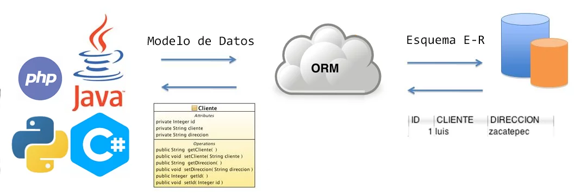
  <figcaption>Un ORM convierte objetos Java en filas de tablas y viceversa</figcaption>
</figure>

Algunos ORMs: **Hibernate**, ObjectDB, TopLink, CocoBase, OpenJPA...

!!! tip "¿Por qué empezar entonces con JDBC?"
    JDBC es el API "de bajo nivel" sobre el que se construyen los ORM. Entenderlo te ayuda a saber qué hace Hibernate "bajo el capó" y te permite trabajar sin él en proyectos pequeños.

## 9.2 Drivers (conectores)

Un **conector o driver** es un **conjunto de clases encargadas de implementar las interfaces del API** utilizado para acceder a la base de datos. En nuestro caso, es un fichero **`.jar`** que contiene una implementación de todas las interfaces del API JDBC que conectará con MySQL.

<figure>
  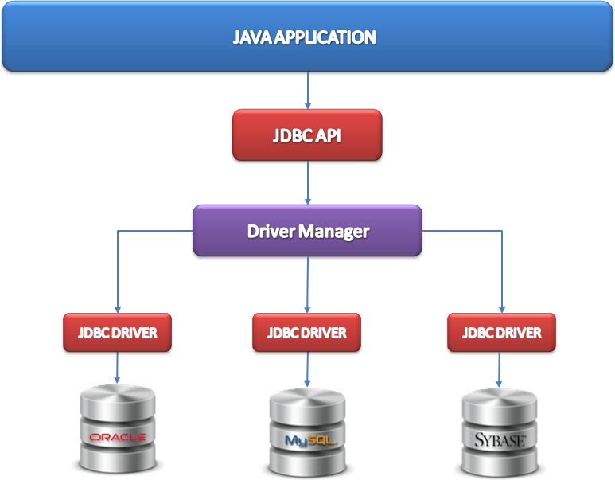
  <figcaption>El driver JDBC actúa de puente entre la aplicación Java y el SGBD</figcaption>
</figure>

### Cómo instalarlo: opción manual

1. Descargar el **MySQL Connector/J** (elige la opción *Independiente de la plataforma* y descarga el ZIP).

<figure>
  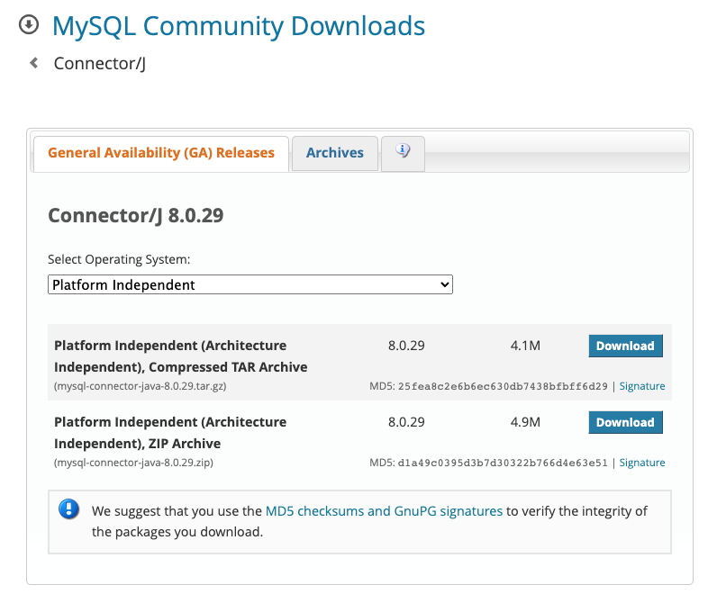
  <figcaption>Descarga del conector JDBC para MySQL</figcaption>
</figure>

2. Descomprimir el ZIP y añadir el `.jar` al proyecto en **Project structure → Modules → Dependencies → + → JAR or directories**.

<figure>
  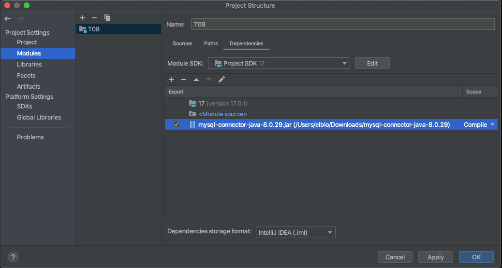
  <figcaption>Añadir el JAR del driver al proyecto en IntelliJ IDEA</figcaption>
</figure>

### Cómo instalarlo: opción Maven (recomendada)

En lugar de descargar el JAR a mano, añade la dependencia en el `pom.xml` para que Maven la gestione automáticamente. El grupo/artefacto actual es `com.mysql:mysql-connector-j` (versión actual: **26.7.0**):

```xml
<dependency>
    <groupId>com.mysql</groupId>
    <artifactId>mysql-connector-j</artifactId>
    <version>26.7.0</version>
</dependency>
```

!!! info "Ya no hace falta `Class.forName` (JDBC 4.0+)"
    Los tutoriales antiguos cargaban el driver con `Class.forName("com.mysql.cj.jdbc.Driver")`. Desde **JDBC 4.0** (Java 6) eso es innecesario: el JAR del driver **se registra solo** mediante el mecanismo de *ServiceLoader* al llamar a `getConnection()`. Basta con que el JAR esté en el classpath (o la dependencia en Maven). Si tú lo tienes escrito, puedes eliminarlo.

## 9.3 API JDBC

**JDBC** es el API de Java para ejecutar sentencias SQL. Se basa en:

- La **simplicidad** y la **abstracción**.
- Ocultar al usuario toda la información posible sobre el acceso a la **capa de datos**.
- Programar las operaciones de lectura/escritura trabajando con **clases de Java**.

JDBC proporciona las clases e interfaces para:

1. **Establecer una conexión** a una base de datos.
2. **Ejecutar** una sentencia o consulta SQL.
3. **Procesar los resultados**.

### 9.3.1 Establecer una conexión

```java
// URL con el servidor, puerto, SGBD y nombre de la BDD
String url = "jdbc:mysql://localhost:3306/pruebabdd";
String user = "root";
String password = "";

// Establecer la conexión a la base de datos
Connection conn = DriverManager.getConnection(url, user, password);
```

!!! warning "Ejemplo clásico (código antiguo)"
    Antiguamente se precedía de `Class.forName("com.mysql.cj.jdbc.Driver");`. Hoy no es necesario (ver el aviso anterior). Este apunte lo omite por considerarlo obsoleto.

### 9.3.2 Ejecutar sentencias: `executeUpdate`

Mediante `executeUpdate` se ejecutan sentencias **INSERT, UPDATE y DELETE**, devolviendo el **número de filas afectadas**.

```java
// Crear y ejecutar la sentencia
Statement stmt = conn.createStatement();
String sql = "INSERT INTO usuarios (nombre, edad) VALUES ('Juan López', 25)";
int rows = stmt.executeUpdate(sql);
System.out.println("Filas insertadas: " + rows);
```

### 9.3.3 Ejecutar consultas: `executeQuery`

Mediante `executeQuery` se ejecutan consultas, devolviendo los datos en un **`ResultSet`**.

```java
// Crear y ejecutar la consulta
Statement stmt = conn.createStatement();
String sql = "SELECT * FROM usuarios";
ResultSet rs = stmt.executeQuery(sql);

// Procesar los resultados de la consulta (avanza fila a fila con next())
while (rs.next()) {
    int id = rs.getInt("id");
    String nombre = rs.getString("nombre");
    int edad = rs.getInt("edad");
    System.out.println(id + " | " + nombre + " | " + edad);
}
```

<figure>
  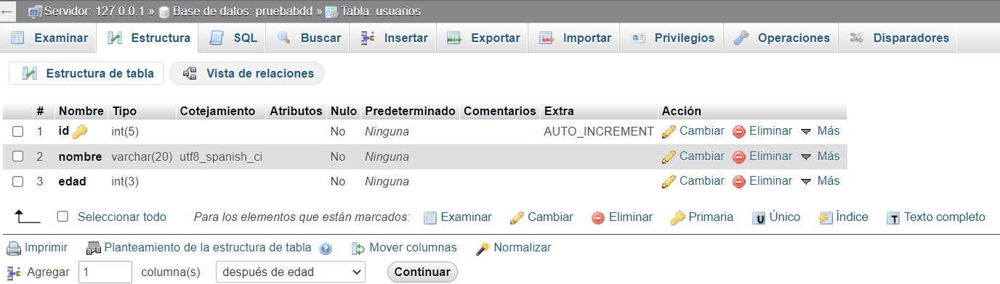
  <figcaption>Base de datos `pruebabdd` con la tabla `usuarios` (id, nombre, edad)</figcaption>
</figure>

### 9.3.4 Ejemplo completo: Insert, Update y Delete

```java
import java.sql.*;

public class EjemploInsertUpdateDelete {
    public static void main(String[] args) {
        String url = "jdbc:mysql://localhost:3306/pruebabdd";
        String user = "root";
        String password = "";

        try (Connection conn = DriverManager.getConnection(url, user, password)) {

            // INSERT
            Statement stmt = conn.createStatement();
            String insertSql = "INSERT INTO usuarios (nombre, edad) VALUES ('Ana Pérez', 30)";
            int filasInsertadas = stmt.executeUpdate(insertSql);
            System.out.println("Filas insertadas: " + filasInsertadas);

            // UPDATE
            String updateSql = "UPDATE usuarios SET edad = 31 WHERE nombre = 'Ana Pérez'";
            int filasActualizadas = stmt.executeUpdate(updateSql);
            System.out.println("Filas actualizadas: " + filasActualizadas);

            // DELETE
            String deleteSql = "DELETE FROM usuarios WHERE id = 1";
            int filasBorradas = stmt.executeUpdate(deleteSql);
            System.out.println("Filas borradas: " + filasBorradas);

        } catch (SQLException e) {
            e.printStackTrace();
        }
    }
}
```

### 9.3.5 Ejemplo completo: SELECT

```java
import java.sql.*;

public class EjemploSelect {
    public static void main(String[] args) {
        String url = "jdbc:mysql://localhost:3306/pruebabdd";
        String user = "root";
        String password = "";

        try (Connection conn = DriverManager.getConnection(url, user, password)) {

            Statement stmt = conn.createStatement();
            String sql = "SELECT id, nombre, edad FROM usuarios";
            ResultSet rs = stmt.executeQuery(sql);

            System.out.println("USUARIOS:");
            while (rs.next()) {
                int id = rs.getInt("id");
                String nombre = rs.getString("nombre");
                int edad = rs.getInt("edad");
                System.out.println(id + " | " + nombre + " | " + edad);
            }

        } catch (SQLException e) {
            e.printStackTrace();
        }
    }
}
```

!!! danger "Usa `PreparedStatement` (evita la inyección SQL)"
    Cuando la sentencia lleve **datos variables** (del usuario), NO concatene cadenas. Usa `PreparedStatement`, que además es más cómodo y más rápido si se repite:

    ```java
    String sql = "INSERT INTO usuarios (nombre, edad) VALUES (?, ?)";
    try (PreparedStatement ps = conn.prepareStatement(sql)) {
        ps.setString(1, nombreDelUsuario);   // El "?" 1
        ps.setInt(2, edadDelUsuario);        // El "?" 2
        int filas = ps.executeUpdate();
    }
    ```

    Con concatener en el `Statement` un nombre como `Ana'; DROP TABLE usuarios;--` tu tabla... desaparece. Inyección SQL, de verdad.

## 9.4 Base de datos con Docker

**Docker** es una solución de **virtualización ligera** para correr **contenedores Linux** de manera muy eficiente. Se puede usar en equipos de escritorio y también desplegar en nubes como Azure, AWS... A partir de un anfitrión Linux es capaz de desplegar máquinas que **comparten procesos e hilos** de la máquina anfitriona.

<figure>
  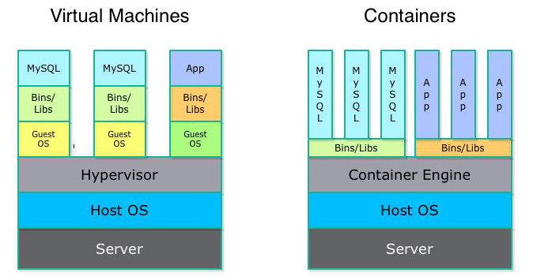
  <figcaption>Contenedores Docker: máquinas ligeras que comparten el kernel del anfitrión</figcaption>
</figure>

!!! info "Docker en Windows"
    En Windows, a diferencia de Linux y Mac, la instalación y ejecución **no es trivial** porque no hay un kernel Linux funcionando en el sistema.

<figure>
  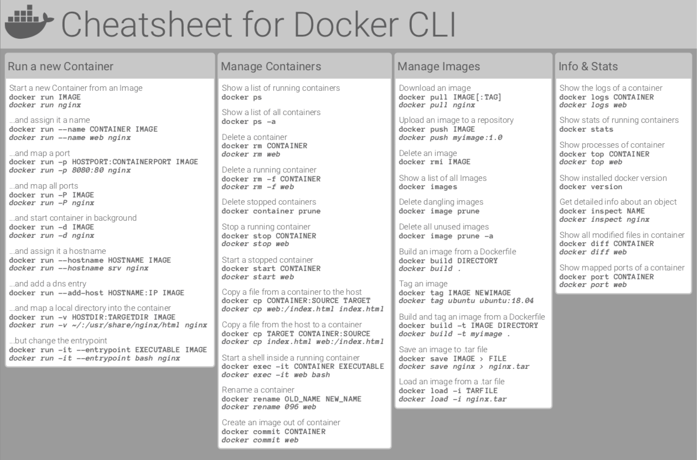
  <figcaption>Docker Desktop: gestión de contenedores con interfaz gráfica</figcaption>
</figure>

Vamos a desplegar y asociar **2 contenedores**: uno con el SGBD **MySQL** y otro con **phpmyadmin**, para facilitar la interacción y visualización de los datos. Trabajaremos desde la terminal.

Paso a paso:

1. **Descargar las imágenes** de MySQL y phpMyAdmin.

<figure>
  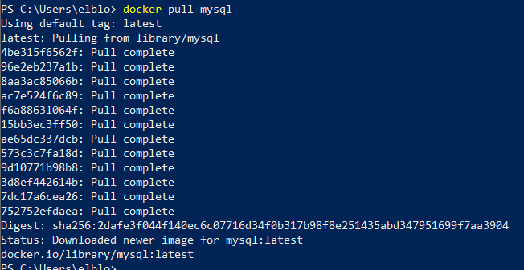
  <figcaption>Paso 1: descargar las imágenes de MySQL y phpMyAdmin</figcaption>
</figure>

```bash
# Descargar las imágenes
$ docker pull mysql:8.4
$ docker pull phpmyadmin:latest

# Comprobar las imágenes descargadas
$ docker images
```

<figure>
  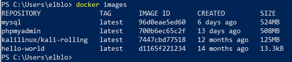
  <figcaption>Comprobar las imágenes descargadas</figcaption>
</figure>

2. **Crear los contenedores**. Opciones importantes:
   - `-d` / `--detach`: ejecutar el contenedor en **background** (normalmente porque tenga un servicio).
   - `-p` / `--publish`: conectar puertos del contenedor con los del host.
   - `--name`: dar un nombre al contenedor.
   - `-e` / `--env`: establecer **variables de entorno** (usuario root, contraseña, BDD inicial...).

<figure>
  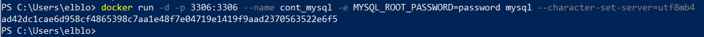
  <figcaption>Paso 2: crear los contenedores MySQL y phpMyAdmin</figcaption>
</figure>

```bash
# Contenedor MySQL (root con contraseña "pass", crea la BDD pruebabdd)
$ docker run --name mysql-daw -p 3306:3306 -e MYSQL_ROOT_PASSWORD=pass \
    -e MYSQL_DATABASE=pruebabdd -d mysql:8.4

# Contenedor phpMyAdmin enlazado al MySQL
$ docker run --name phpmyadmin-daw -p 8080:80 --link mysql-daw:db \
    -e PMA_HOST=mysql-daw -d phpmyadmin:latest
```

3. **Comprobar el estado** de los contenedores y acceder a phpMyAdmin (`http://localhost:8080`, usuario `root` | contraseña `pass`).

<figure>
  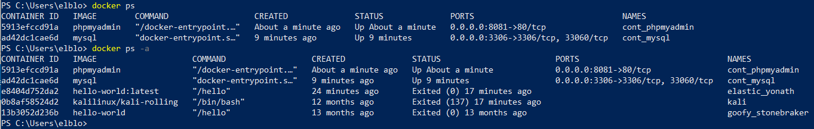
  <figcaption>Comprobar el estado de los contenedores creados</figcaption>
</figure>

<figure>
  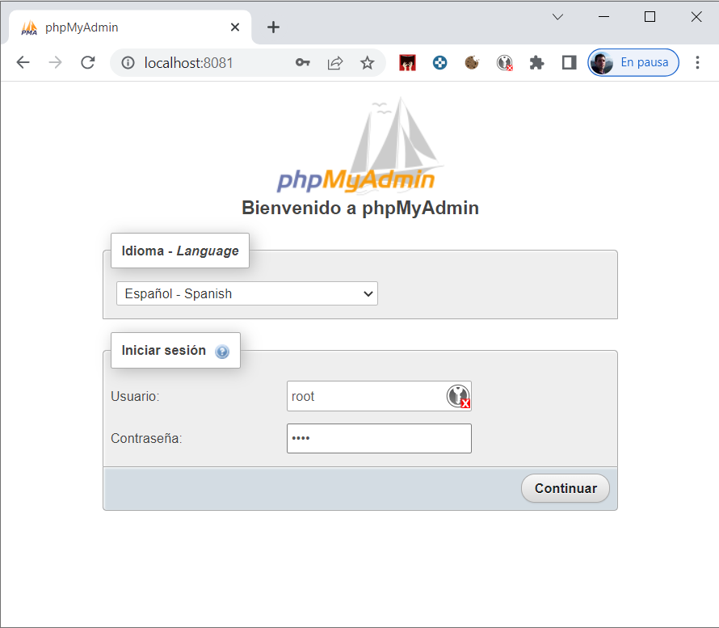
  <figcaption>Acceder a phpMyAdmin desde el navegador</figcaption>
</figure>

4. **Gestión básica** de los contenedores:

```bash
# Ejecutar comandos dentro de un contenedor
$ docker exec -it mysql-daw mysql -u root -p

# Parar la ejecución de un contenedor
$ docker stop mysql-daw

# Volver a ejecutar un contenedor ya creado
$ docker start mysql-daw
```

<figure>
  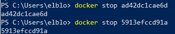
  <figcaption>Parar la ejecución de los contenedores</figcaption>
</figure>

<figure>
  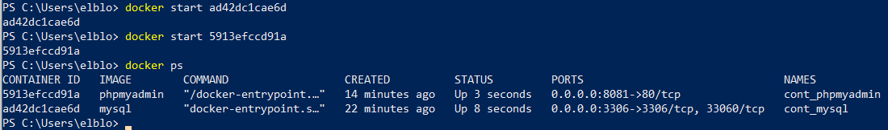
  <figcaption>Volver a ejecutar los contenedores previamente creados</figcaption>
</figure>

!!! tip "ddl y consultas a mano"
    Crearemos la BDD y las tablas desde **phpMyAdmin** (o con la pestaña *SQL*). Te vendrá bien esta chuleta:

<figure>
  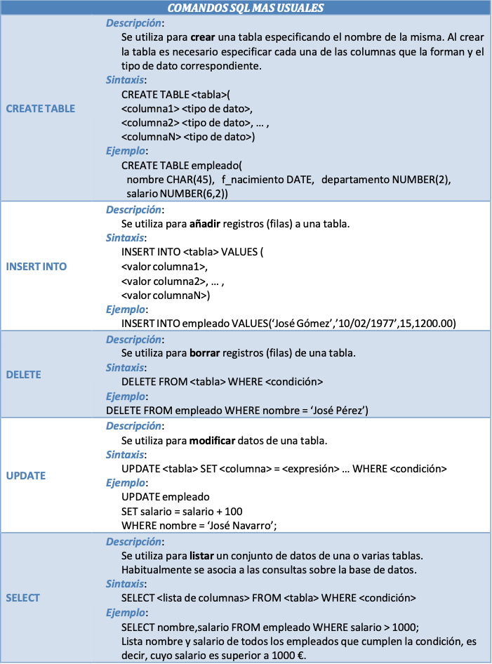
  <figcaption>Chuleta SQL: DDL y consultas</figcaption>
</figure>

## 9.5 Resumen SQL rápido

| Sentencia | Ejemplo |
|-----------|---------|
| Crear BDD | `CREATE DATABASE pruebabdd;` |
| Usar BDD | `USE pruebabdd;` |
| Crear tabla | `CREATE TABLE usuarios (id INT AUTO_INCREMENT PRIMARY KEY, nombre VARCHAR(50), edad INT);` |
| Insertar | `INSERT INTO usuarios (nombre, edad) VALUES ('Ana', 30);` |
| Actualizar | `UPDATE usuarios SET edad = 31 WHERE nombre = 'Ana';` |
| Borrar | `DELETE FROM usuarios WHERE id = 2;` |
| Consultar | `SELECT * FROM usuarios WHERE edad > 18 ORDER BY nombre;` |

## 9.6 Patrón DAO

El patrón **Data Access Object (DAO)** pretende **independizar la aplicación de la forma de acceder a la base de datos**: fuera de las clases DAO **no debe haber código que acceda al repositorio de datos**.

Ventajas:

- Separar el **modelo de negocio** del **acceso a datos**.
- Tener un código limpio en la aplicación, **sin mezclar con SQL**.
- Posibilidad de **cambiar de BDD** con la misma lógica de negocio.

<figure>
  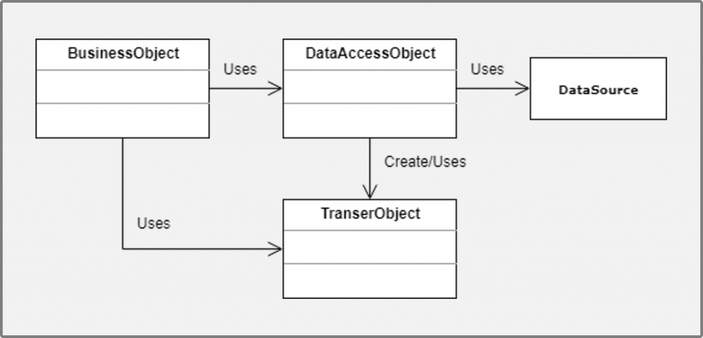
  <figcaption>Estructura del patrón DAO</figcaption>
</figure>

Clases que utilizaremos:

1. **DAO Manager**: gestión de la conexión.
2. **Interfaces** con las operaciones CRUD.
3. **DAOs** de nuestras clases con la implementación de su correspondiente interfaz.

### 9.6.1 DAO Manager (patrón singleton)

Clase **singleton** (solo puede instanciarse 1 objeto) que gestiona la conexión (abrirla y cerrarla) con la BDD y a la que enviaremos las sentencias SQL.

<figure>
  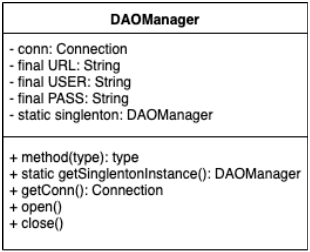
  <figcaption>Esquema del DAO Manager</figcaption>
</figure>

```java
import java.sql.*;

public class DAOManager {

    // Atributos
    private Connection conn;
    private final String URL;
    private final String USER;
    private final String PASS;
    private static DAOManager singleton; // Atributo estático con la única instancia

    // Constructor PRIVADO para que no se pueda utilizar desde el exterior
    private DAOManager() {
        this.URL = "jdbc:mysql://localhost:3306/pruebabdd";
        this.USER = "root";
        this.PASS = "pass";
    }

    // Método estático que devuelve la única instancia (la crea si no existe)
    public static DAOManager getSingletonInstance() {
        if (singleton == null) singleton = new DAOManager();
        return singleton;
    }

    // Conectar
    public Connection open() throws SQLException {
        conn = DriverManager.getConnection(URL, USER, PASS);
        return conn;
    }

    // Desconectar
    public void close() throws SQLException {
        conn.close();
    }
}
```

Uso desde el `main`:

```java
DAOManager dao = DAOManager.getSingletonInstance();
DAOManager dao2 = DAOManager.getSingletonInstance(); // Misma instancia

try {
    dao.open();
    System.out.println("Conexión establecida");
} catch (SQLException e) {
    System.out.println("Error de conexión: " + e.getMessage());
}
```

### 9.6.2 Interfaces de operaciones

No es obligatorio, aunque sí **buena práctica**. Se desarrollan interfaces sobre nuestras clases con las operaciones CRUD y otras que pudiéramos necesitar. Así, si se cambia de SGBD, solo habría que **implementar la interfaz sobre el DAO del nuevo SGBD**, sin que se olvide ninguno de los métodos.

```java
package ejemploBDMySQL.DAO;

import ejemploBDMySQL.modelo.Alumno;

public interface DaoAlumno {
    public boolean insert(Alumno alumno, DAOManager dao);
    public boolean update(Alumno alumno, DAOManager dao);
    public boolean delete(Alumno alumno, DAOManager dao);
    public Alumno read(String dni, DAOManager dao);
    public ArrayList<Alumno> readAll(DAOManager dao);
    public ArrayList<Alumno> readAlumnosByApellidos(String apellidos, DAOManager dao);
}
```

### 9.6.3 DAOs de nuestras clases

```java
package ejemploBDMySQL.DAO;

import ejemploBDMySQL.modelo.Alumno;

public class DaoAlumnoSQL implements DaoAlumno {

    @Override
    public boolean insert(Alumno alumno, DAOManager dao) {
        Statement s = null;
        try {
            s = dao.open().createStatement();
            String sentencia = "INSERT INTO alumnos VALUES ('" + alumno.getDni() + "','"
                    + alumno.getNombre() + "','" + alumno.getApellidos() + "','"
                    + alumno.getFechaNacim().format(DateTimeFormatter.ofPattern("yyyy-MM-dd")) + "')";
            s.executeUpdate(sentencia);
            return true;
        } catch (SQLException e) {
            e.printStackTrace();
            return false;
        } finally {
            try {
                dao.close();
            } catch (SQLException e) {
                e.printStackTrace();
            }
        }
    }

    // update, delete, read, readAll, readAlumnosByApellidos...
}
```

!!! danger "El SQL de los DAOs: usa `PreparedStatement`"
    El ejemplo didáctico anterior **concatena valores** en el SQL. En un proyecto real hazlo siempre con `PreparedStatement` (con `?`), para evitar la inyección SQL y manejos de comillas (fechas, apóstrofes...):

    ```java
    String sentencia = "INSERT INTO alumnos (dni, nombre, apellidos) VALUES (?, ?, ?)";
    PreparedStatement ps = dao.open().prepareStatement(sentencia);
    ps.setString(1, alumno.getDni());
    ps.setString(2, alumno.getNombre());
    ps.setString(3, alumno.getApellidos());
    ps.executeUpdate();
    ```

### 9.6.4 Preparación previa

- **No olvidar añadir el driver** JDBC al proyecto (manual o Maven).

<figure>
  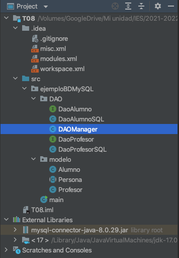
  <figcaption>Añadir el conector JDBC al proyecto</figcaption>
</figure>

- Antes de comenzar, crear en phpMyAdmin las tablas `alumnos` y `profesores`, relacionándolas con las clases `Alumno` y `Profesor` del tema anterior.

<figure>
  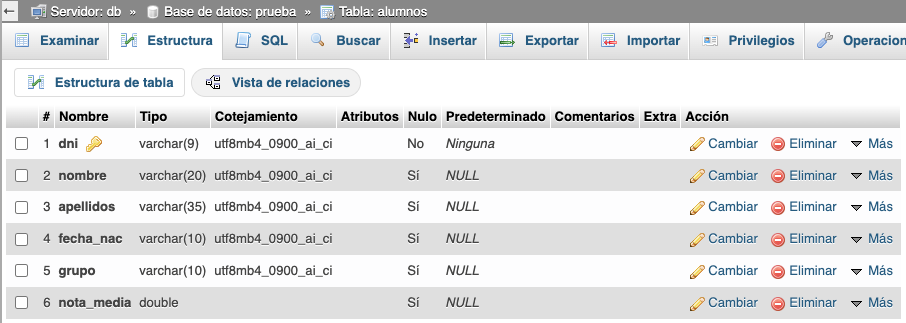
  <figcaption>Crear las tablas en phpMyAdmin</figcaption>
</figure>

<figure>
  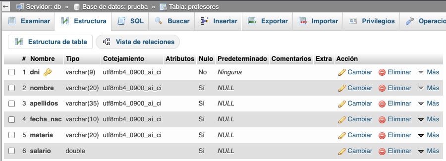
  <figcaption>Tablas alumnos y profesores creadas</figcaption>
</figure>

## 9.7 Buenas prácticas

- **Conecta una sola vez** y reutiliza la conexión (patrón singleton en el `DAOManager`).
- **Cierra siempre** conexiones, statements y resultsets. Con `try-with-resources` es automático.
- Usa **`PreparedStatement`** para cualquier sentencia con valores variables.
- Separa las **capas**: modelo, acceso a datos (DAO) y presentación.
- La **configuración** (URL, usuario, contraseña) idealmente en un fichero `properties` externo, no "horneado" en el código.
- Para proyectos grandes, plantéate un **ORM** (Hibernate/JPA) sobre el patrón DAO.
- Trabaja con **MySQL/phpMyAdmin en Docker** para tener tu entorno de BDD reproducible en cualquier equipo.

## 9.8 Referencias

- [JavaTpoint: JDBC API](https://www.javatpoint.com/java-jdbc)
- [w3schools: SQL](https://www.w3schools.com/sql/)
- [arquitecturajava: PreparedStatement](https://www.arquitecturajava.com/jdbc-preparedstatement-ejemplo/)
- [Oracle: try-with-resources](https://docs.oracle.com/javase/tutorial/essential/exceptions/tryResourceClose.html)
- [MySQL Connector/J developer guide](https://dev.mysql.com/doc/connector-j/en/)

## 9.9 Actividades

901. Levanta con Docker los contenedores **MySQL** y **phpMyAdmin**, crea la base de datos `pruebabdd` y la tabla `usuarios` (id, nombre, edad). Verifica el acceso desde phpMyAdmin.

902. Escribe un programa que se conecte a `pruebabdd` y **inserte** tres usuarios nuevos. Comprueba el número de filas afectadas.

903. Amplía el programa anterior para **actualizar** la edad de un usuario y **borrar** otro, mostrando las filas afectadas en cada operación.

904. Crea un programa que lea la tabla `usuarios` con `SELECT *` y la muestre por consola con `while (rs.next())`.

905. Reescribe el programa de inserción usando **`PreparedStatement`** con parámetros leídos por teclado (pide datos hasta escribir "fin"). Prueba a introducir el valor `Ana'; DROP TABLE usuarios;--` y comprueba que el `PreparedStatement` no deja "rota" la tabla.

906. Implementa el **DAO Manager** como singleton (constructor privado, `getSingletonInstance`, `open` y `close`). Comprueba en el `main` que si obtienes dos veces la instancia es la misma.

907. Crea las tablas `alumnos` y `profesores` en phpMyAdmin y las clases `Alumno` y `Profesor` del tema anterior (ambas con DNI, nombre, apellidos y fecha de nacimiento).

908. Implementa el **DAO de Alumno** (`DaoAlumnoSQL`) con los métodos `insert`, `delete`, `read` y `update` (este último lo implementas tú a partir del ejemplo). Usa `PreparedStatement`.

909. Implementa los siguientes métodos en los DAOs de Profesor y Alumno: `readAll()` y `readAlumnosByApellidos(String apellidos)`, y añade su correspondiente `DaoProfesorSQL`.

910. Crea un menú en consola que, usando los DAOs, permita: insertar un alumno, listar todos, buscar por apellidos, actualizar y borrar. Toda la lógica de acceso a datos debe vivir dentro de los DAOs (ningún SQL fuera de ellos).

911. Reto: cambia la configuración de conexión (URL, usuario y contraseña) a un fichero `properties` externo que lea el `DAOManager`.

912. Investiga un ORM (Hibernate o JPA) y explica públicamente cómo resolvería el *desfase objeto-relacional* puesto en contexto en este tema.