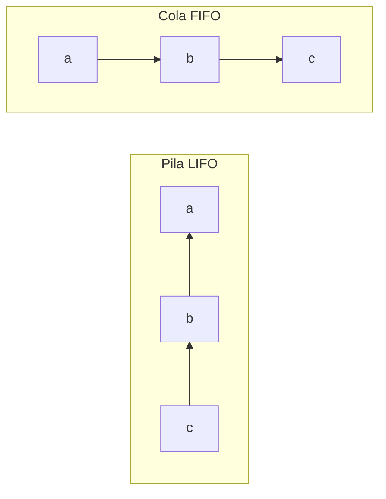

# Tema 11: Estructuras de datos

??? abstract "Duración y criterios de evaluación"

    Duración estimada: 8 sesiones

    <hr />

    **Resultados de aprendizaje**

    1. Conocer las estructuras de datos fundamentales: pilas, colas, dobles colas, listas circulares, tablas hash y montículos.
    2. Implementar las estructuras básicas (pila, cola, doble cola) con arrays.
    3. Crear estructuras de datos **genéricas** reutilizables para cualquier tipo de dato.
    4. Reconocer las implementaciones propias en la librería estándar de Java.

    **Criterios de evaluación**

    1. Se explica el comportamiento LIFO de la pila y FIFO de la cola.
    2. Se distingue entre cola y doble cola (deque).
    3. Se implementa manualmente una pila y una cola con arrays (incluida la cola circular).
    4. Se implementan estructuras con **tipos genéricos**.
    5. Se asocia cada estructura de datos con su contrapartida del JDK (`Deque`, `Queue`, `PriorityQueue`, `HashMap`...).

## 11.1 Introducción

Las **estructuras de datos** son fundamentales en la programación: permiten **organizar y gestionar la información de manera eficiente**. Entre las más utilizadas están las **pilas, colas, listas** y estructuras más avanzadas como **montículos y tablas hash**.

En este tema aprenderemos **qué son** y **cómo se implementan** por debajo (con arrays), para después saber **cuándo usar** cada una y qué clase del JDK te la da ya hecha.

## 11.2 Tipos de estructuras

| Estructura | Principio | Se usa en... |
|------------|-----------|--------------|
| **Pila (Stack)** | LIFO (*Last In, First Out*) | Gestión de llamadas recursivas, evaluación de expresiones, botón "deshacer" |
| **Cola (Queue)** | FIFO (*First In, First Out*) | Sistemas de gestión de procesos, colas de impresión, transmisión de datos |
| **Doble cola (Deque)** | Inserción/borrado por **ambos** extremos | Algoritmos de búsqueda, gestión de *buffers* de datos |
| **Lista circular** | El último elemento apunta al primero | Reproducción en bucle de música, planificación de tareas en SO |
| **Tabla hash** | Dispersión por función `hash` + sondeo en colisiones | Búsquedas rápidas en BBDD, cache, diccionarios |
| **Montículo (Heap)** | Árbol binario con jerarquía | Colas de prioridad, algoritmos de Dijkstra y HeapSort |



### 11.2.1 Pila (Stack)

Estructura de tipo **LIFO** (*Last In, First Out*): **el último elemento en entrar es el primero en salir**. Las operaciones son:

- **Apilar** (`push`): añade un elemento encima.
- **Desapilar** (`pop`): extrae el elemento de la cima.
- **Cima** (`peek`/`top`): observa el de la cima sin sacarlo.

### 11.2.2 Cola (Queue)

Estructura que sigue el principio **FIFO** (*First In, First Out*): **el primero en entrar es el primero en salir**. Operaciones:

- **Encolar** (`enqueue`): añade por el **final**.
- **Desencolar** (`dequeue`): extrae por el **frente**.
- **Frente** (`peek`): observa el primero sin sacarlo.

### 11.2.3 Doble cola (Deque)

Permite **inserción y eliminación tanto por el frente como por el final**.

### 11.2.4 Lista circular

Variante de la lista en la que **el último elemento está conectado al primero**, formando un ciclo.

### 11.2.5 Tabla hash

Almacena datos de forma eficiente mediante una **función de dispersión (hash)**. Ante **colisiones** las gestiona mediante **sondeo lineal** (o encadenamiento). Ofrece **búsquedas rápidas**.

### 11.2.6 Montículo (Heap)

Estructura basada en un **árbol binario** que mantiene una **jerarquía** entre sus elementos (el mayor —o menor— siempre arriba). Base de las **colas de prioridad** y de algoritmos como **Dijkstra** y **HeapSort**.

## 11.3 Ejemplos de implementación con arrays

### 11.3.1 Pila

```java
public class Pila {
    private int[] elementos;
    private int tope;

    public Pila(int capacidad) {
        elementos = new int[capacidad];
        tope = -1; // -1 significa pila vacía
    }

    public void apilar(int valor) {
        if (tope < elementos.length - 1) {
            tope++;
            elementos[tope] = valor;
        } else {
            System.out.println("Pila llena, no se puede apilar");
        }
    }

    public int desapilar() {
        if (tope >= 0) {
            return elementos[tope--];
        }
        return -1; // Indicar error: pila vacía
    }

    public int cima() {
        if (tope >= 0) {
            return elementos[tope];
        }
        return -1; // Pila vacía
    }

    public boolean estaVacia() {
        return tope == -1;
    }
}
```

### 11.3.2 Cola (circular)

```java
public class Cola {
    private int[] elementos;
    private int frente, fin, tamano;

    public Cola(int capacidad) {
        elementos = new int[capacidad];
        frente = 0;
        fin = -1;
        tamano = 0;
    }

    public void encolar(int valor) {
        if (tamano < elementos.length) {
            fin = (fin + 1) % elementos.length; // índice circular
            elementos[fin] = valor;
            tamano++;
        } else {
            System.out.println("Cola llena");
        }
    }

    public int desencolar() {
        if (tamano > 0) {
            int valor = elementos[frente];
            frente = (frente + 1) % elementos.length;
            tamano--;
            return valor;
        }
        return -1; // Cola vacía
    }

    public int frente() {
        if (tamano > 0) {
            return elementos[frente];
        }
        return -1;
    }

    public boolean estaVacia() {
        return tamano == 0;
    }
}
```

!!! tip "El truco del índice `%` (módulo)"
    La cola reutiliza el espacio del array: cuando `fin` llega al final, `(fin + 1) % capacidad` lo devuelve al principio. Por eso se llama **cola circular**.

### 11.3.3 Doble cola (Deque)

```java
public class Deque {
    private int[] elementos;
    private int frente, fin, tamano;

    public Deque(int capacidad) {
        elementos = new int[capacidad];
        frente = 0;
        fin = -1;
        tamano = 0;
    }

    public void insertarFrente(int valor) {
        if (tamano < elementos.length) {
            frente = (frente - 1 + elementos.length) % elementos.length;
            elementos[frente] = valor;
            tamano++;
        }
    }

    public void insertarFinal(int valor) {
        if (tamano < elementos.length) {
            fin = (fin + 1) % elementos.length;
            elementos[fin] = valor;
            tamano++;
        }
    }

    public int eliminarFrente() {
        if (tamano > 0) {
            int valor = elementos[frente];
            frente = (frente + 1) % elementos.length;
            tamano--;
            return valor;
        }
        return -1;
    }

    public int eliminarFinal() {
        if (tamano > 0) {
            int valor = elementos[fin];
            fin = (fin - 1 + elementos.length) % elementos.length;
            tamano--;
            return valor;
        }
        return -1;
    }
}
```

## 11.4 Las estructuras ya hechas en el JDK

Puedes **implementarlas tú** (como hicimos arriba) para entenderlas a fondo, pero en tus proyectos usa la **librería estándar**:

| Estructura | Clases/Interfaces del JDK | Notas |
|------------|---------------------------|-------|
| Pila | `java.util.ArrayDeque` (interfaz `Deque`) | Mejor que la vieja `java.util.Stack` (heredada, lenta) |
| Cola | `java.util.LinkedList` (interfaz `Queue`) | `add/poll/peek` |
| Doble cola | `java.util.ArrayDeque` (`Deque`) | `addFirst/addLast/pollFirst/pollLast` |
| Cola de prioridad (montículo) | `java.util.PriorityQueue` | El elemento con más prioridad (menor/mayor) sale primero |
| Tabla hash | `java.util.HashMap` / `HashSet` | Búsqueda O(1) media (ya visto en el tema 7) |
| Lista circular | `java.util.LinkedList` (aplicando el algoritmo) | No hay clase específica: es un uso de la lista |

```java
import java.util.*;

// PILA con ArrayDeque (recomendada: ¡no uses Stack!)
Deque<String> pila = new ArrayDeque<>();
pila.push("hola");
pila.push("mundo");
pila.pop();        // "mundo" (el último en entrar sale primero)

// COLA con LinkedList
Queue<String> cola = new LinkedList<>();
cola.add("doc1");
cola.add("doc2");
cola.poll();       // "doc1" (el primero en entrar sale primero)

// MONTÍCULO: cola de prioridad (sale primero el más pequeño por defecto)
PriorityQueue<Integer> pq = new PriorityQueue<>();
pq.add(30);
pq.add(10);
pq.add(20);
pq.poll();         // 10 (el de MENOR prioridad numérica, primero)
```

!!! info "«Lista circular» en el JDK"
    No existe una clase `CircularList`. Una `LinkedList` normal se recorre "en bucle" volviendo al principio al llegar al final; el patrón circular suele implementarse por encima de una lista normal.

## 11.5 Tipos genéricos

Y si pudiéramos crear estas estructuras **para cualquier tipo de dato**, en lugar de hacer cada vez "una pila de enteros", "otra de Strings", "otra de Tareas"... **Gracias a los tipos genéricos** en Java podemos crear estructuras de datos que funcionen con cualquier tipo, proporcionando **flexibilidad y reutilización de código**.

### Pila genérica

```java
// Puedes sustituir de momento los throw por sout
// Anotación para suprimir warnings de castings a (T) en tiempo de compilación
@SuppressWarnings("unchecked")
public class Pila<T> {

    private Object[] elementos; // Guardamos Object
    private int cima;

    public Pila(int tamanio) {
        this.elementos = new Object[tamanio];
        this.cima = -1;
    }

    public T pop() {
        if (estaVacia()) {
            throw new RuntimeException("Pila vacía");
        }
        return (T) elementos[cima--]; // Casteo a T
    }

    public void push(T elemento) {
        if (cima < elementos.length - 1) {
            cima++;
            elementos[cima] = elemento;
        } else {
            throw new RuntimeException("Pila llena");
        }
    }

    public boolean estaVacia() {
        return cima == -1;
    }
}
```

### Usar la pila genérica con cualquier clase

```java
public class Main {
    public static void main(String[] args) {
        // Pila de Alumno
        Pila<Alumno> pila1 = new Pila<>(5);
        pila1.push(new Alumno("Ana", 18));
        pila1.push(new Alumno("Luis", 19));
        pila1.push(new Alumno("María", 20));

        System.out.println(pila1.pop().getNombre()); // María (la última en entrar)

        // Pila de String
        Pila<String> pila2 = new Pila<>(3);
        pila2.push("hola");

        // Pila de enteros
        Pila<Integer> pila3 = new Pila<>(3);
        pila3.push(42);
    }
}
```

!!! example "Ejercicio 1101 (tipo genérico): Cola genérica"
    Implementa una **Cola genérica circular** similar a la clase `Cola` anterior, con métodos `encolar(T valor)`, `desencolar()` (devuelve `T`), `estaVacia()` y `frente()`. Recuerda manejar correctamente los índices `frente`/`fin` y el tamaño con el `%` de la cola circular.

## 11.6 Buenas prácticas

- **Primero piensa la estructura, después el código**: ¿necesitas LIFO, FIFO, prioridad o búsqueda rápida?
- **No reinventes la rueda**: en producción usa `ArrayDeque`, `LinkedList`, `PriorityQueue`, `HashMap`...
- Si implementas estructuras para aprender, hazlas **genéricas** (`<T>`) para que sirvan para cualquier dato.
- En colas circulares recuerda: **siempre devolver el elemento, no solo "verlo"**, para no perder datos; y distingue entre "pila/cola *llena*" y "*vacía*".
- `java.util.Stack` y `java.util.Vector` están desaconsejados: usan sincronización antigua y son heredadas. Prefiere `ArrayDeque`.

## 11.7 Referencias

- [GeeksforGeeks: Data Structures](https://www.geeksforgeeks.org/data-structures/)
- [JavaProgramTo: Estructura de datos pila (con clases)](https://www.javaprogramto.com/)
- [JavaPoint: Data Structure](https://www.javatpoint.com/data-structure-tutorial)
- [Oracle: Generic Types](https://docs.oracle.com/javase/tutorial/java/generics/types.html)

## 11.8 Actividades

1101. Implementa la **Cola genérica circular** del ejercicio del bloque anterior (con `T`).

1102. **Simulador de navegación web (pila)**: crea una clase `HistorialNavegacion` que simule la navegación con una pila: visitar una página (se apila la URL), retroceder (se desapila la última URL visitada), e ir a la vista actual (cima) sin sacarla.

1103. **Cola de impresión (cola)**: diseña `ColaImpresion` para gestionar documentos (nombre y número de páginas): añadir documento a la cola, procesar el siguiente (se retira de la cola) y mostrar los pendientes.

1104. **Lista de tareas (lista)**: crea `ListaTareas` (descripción y prioridad): añadir tarea, eliminar tarea por su posición, y mostrar todas las tareas.

1105. Implementa un **`Deque<Integer>`** con `ArrayDeque` y demuestra con ejemplos `addFirst`, `addLast`, `pollFirst`, `pollLast`.

1106. **Cola de prioridad**: con `PriorityQueue`, gestiona urgencias de un hospital: cada paciente tiene una prioridad numérica y atiende primero al de mayor urgencia. Pista: usa `Comparator.reverseOrder()`.

1107. Reto: implementa una **tabla hash propia** sencilla con array de listas (encadenamiento) y métodos `put`, `get` y `remove`.

1108. Compara (con `Instant` + `Duration`, del tema anterior) el `push/pop` de `ArrayDeque` frente a `java.util.Stack` con 100.000 operaciones y comenta el resultado.