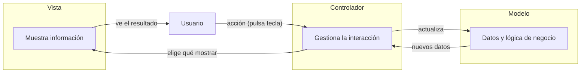

# Tema 12: Patrón Modelo-Vista-Controlador (MVC)

??? abstract "Duración y criterios de evaluación"

    Duración estimada: 6 sesiones

    <hr />

    **Resultados de aprendizaje**

    1. Conocer el patrón de arquitectura de software MVC.
    2. Saber cuál es la responsabilidad de cada componente (modelo, vista, controlador).
    3. Aplicar MVC a una aplicación Java de consola con una o varias clases de modelo.

    **Criterios de evaluación**

    1. Se explica el patrón MVC y sus tres componentes.
    2. Se identifican las ventajas de separar la lógica de negocio de la presentación.
    3. Se estructura una aplicación sencilla en modelo, vista y controlador.
    4. Se conectan los componentes en un programa principal con menú interactivo.
    5. Se reconoce cuándo el patrón conviene o es excesivo en pequeñas aplicaciones.

## 12.1 Introducción

El patrón **Modelo-Vista-Controlador (MVC)** es una **arquitectura de software** que separa la lógica de la aplicación en tres componentes principales:

- **Modelo (Model)**: representa los **datos y la lógica de negocio**.
- **Vista (View)**: **muestra la información** al usuario (en consola, en una interfaz gráfica, en una web...).
- **Controlador (Controller)**: **gestiona la interacción**, recibe las peticiones del usuario, actualiza el modelo y decide qué vista mostrar.



## 12.2 Ventajas

- **Separación de responsabilidades**: cada componente tiene una función específica, facilitando la organización del código.
- **Facilidad de mantenimiento**: separar la lógica de negocio, la presentación y la gestión de la interacción permite modificar o mejorar una parte sin tocar las otras.
- **Escalabilidad**: al estar bien estructurado, es más fácil añadir nuevas funcionalidades sin afectar al sistema en su conjunto.
- **Facilita la colaboración**: diferentes desarrolladores pueden trabajar simultáneamente en distintas partes del código sin interferir entre ellos.

## 12.3 Ejemplo básico: una clase base

### 12.3.1 Modelo

Define los datos y la lógica de negocio:

```java
class Estudiante {
    private String nombre;
    private int edad;

    public Estudiante(String nombre, int edad) {
        this.nombre = nombre;
        this.edad = edad;
    }

    public String getNombre() {
        return nombre;
    }

    public void setNombre(String nombre) {
        this.nombre = nombre;
    }

    public int getEdad() {
        return edad;
    }

    public void setEdad(int edad) {
        this.edad = edad;
    }
}
```

### 12.3.2 Vista

Muestra la información al usuario:

```java
class EstudianteVista {
    public void mostrarEstudiante(String nombre, int edad) {
        System.out.println("Estudiante: ");
        System.out.println("Nombre: " + nombre);
        System.out.println("Edad: " + edad);
    }
}
```

### 12.3.3 Controlador

Gestiona la relación entre el modelo y la vista:

```java
class EstudianteControlador {
    private Estudiante modelo;
    private EstudianteVista vista;

    public EstudianteControlador(Estudiante modelo, EstudianteVista vista) {
        this.modelo = modelo;
        this.vista = vista;
    }

    public void setNombre(String nombre) {
        modelo.setNombre(nombre);
    }

    public String getNombre() {
        return modelo.getNombre();
    }

    public void setEdad(int edad) {
        modelo.setEdad(edad);
    }

    public int getEdad() {
        return modelo.getEdad();
    }

    public void actualizarVista() {
        vista.mostrarEstudiante(modelo.getNombre(), modelo.getEdad());
    }
}
```

### 12.3.4 Programa principal

Conectamos los componentes y probamos el patrón:

```java
public class EstudianteApp {
    public static void main(String[] args) {
        // Crear modelo
        Estudiante modelo = new Estudiante("Juan Perez", 20);

        // Crear vista
        EstudianteVista vista = new EstudianteVista();

        // Crear controlador
        EstudianteControlador controlador = new EstudianteControlador(modelo, vista);

        // Mostrar el estado inicial
        controlador.actualizarVista();

        // Modificar el modelo a través del controlador
        controlador.setNombre("Juan López");

        // Mostrar el estado actualizado
        controlador.actualizarVista();
    }
}
```

Si necesitamos un **menú** para interactuar con el usuario (pidiéndole datos), también iría en esta clase:

```java
public class EstudianteApp {
    public static void main(String[] args) {
        Estudiante modelo = new Estudiante("", 0);
        EstudianteVista vista = new EstudianteVista();
        EstudianteControlador controlador = new EstudianteControlador(modelo, vista);

        Scanner scanner = new Scanner(System.in);
        System.out.println("Introduce el nombre: ");
        controlador.setNombre(scanner.nextLine());
        System.out.println("Introduce la edad: ");
        controlador.setEdad(scanner.nextInt());

        controlador.actualizarVista();
    }
}
```

## 12.4 Ejemplo completo: varias clases base

Vamos a gestionar un estudiante que puede cursar **muchas asignaturas**.

### 12.4.1 Modelo

```java
// Archivo Asignatura.java
class Asignatura {
    private String nombre;
    private int creditos;

    public Asignatura(String nombre, int creditos) {
        this.nombre = nombre;
        this.creditos = creditos;
    }

    public String getNombre() { return nombre; }
    public int getCreditos() { return creditos; }
}

// Archivo Estudiante.java
class Estudiante {
    private String nombre;
    private int edad;
    private Asignatura[] asignaturas;

    public Estudiante(String nombre, int edad, Asignatura[] asignaturas) {
        this.nombre = nombre;
        this.edad = edad;
        this.asignaturas = asignaturas;
    }

    public String getNombre() { return nombre; }
    public int getEdad() { return edad; }
    public Asignatura[] getAsignaturas() { return asignaturas; }
}
```

### 12.4.2 Vista

```java
class EstudianteVista {
    public void mostrarEstudiante(String nombre, int edad, Asignatura[] asignaturas) {
        System.out.println("Estudiante: ");
        System.out.println("Nombre: " + nombre);
        System.out.println("Edad: " + edad);
        System.out.println("Asignaturas: ");
        for (Asignatura a : asignaturas) {
            System.out.println(" - " + a.getNombre() + " (" + a.getCreditos() + " créditos)");
        }
    }
}
```

### 12.4.3 Controlador

```java
class EstudianteControlador {
    private Estudiante modelo;
    private EstudianteVista vista;

    public EstudianteControlador(Estudiante modelo, EstudianteVista vista) {
        this.modelo = modelo;
        this.vista = vista;
    }

    public void actualizarVista() {
        vista.mostrarEstudiante(
                modelo.getNombre(), modelo.getEdad(), modelo.getAsignaturas());
    }
}
```

### 12.4.4 Programa principal

```java
public class EstudianteApp {
    public static void main(String[] args) {
        // Crear modelo (simulando su recuperación de BD)
        Asignatura prog = new Asignatura("Programación", 6);
        Asignatura bd = new Asignatura("Bases de datos", 4);

        Estudiante modelo = new Estudiante("Juan Pérez", 20, new Asignatura[]{prog, bd});

        // Crear vista y controlador
        EstudianteVista vista = new EstudianteVista();
        EstudianteControlador controlador = new EstudianteControlador(modelo, vista);

        // Mostrar los datos
        controlador.actualizarVista();
    }
}
```

### 12.4.5 Resumen del ejemplo

- Se define `Asignatura` para representar cada materia con **nombre** y **créditos**.
- Se crea un objeto **`Estudiante`** con un **array de asignaturas**.
- La clase **`EstudianteVista`** muestra los datos en la consola, incluyendo las asignaturas del estudiante.
- El **`EstudianteControlador`** ofrece un método para mostrar la información del estudiante a través de la vista.

!!! example "Ejercicio (ampliación)"
    Modifica `EstudianteApp` para que interactúe con el usuario mediante un **menú** (mira el ejemplo del caso con una sola clase base): permitir cambiar el nombre, cambiar la edad, añadir asignaturas y mostrar los datos (usando siempre el controlador).

## 12.5 Consideraciones finales

**¿Realmente es práctico este patrón?** Los ejemplos son muy sencillos, con el objetivo de ilustrar el patrón MVC, pero **no son prácticos**. En el mundo real:

- Para el **modelo** es más común tener una o varias clases que **se inician sin datos** (o que se rellenan desde una base de datos, como vimos con el patrón DAO en el tema 9).
- **¿Podrían crearse modelo y vista directamente en el controlador?** Sí, en aplicaciones pequeñas podrían instanciarse directamente dentro del controlador, **siempre que no vayan a cambiar** y usemos el patrón por motivos de organización. Pero si prevés que el modelo o la vista crecerán (p. ej. pasar de consola a interfaz gráfica), es mejor mantenerlos separados.

El MVC encaja casi siempre en aplicaciones con **interfaz de usuario** (escritorio, web, móvil). En programas de consola pequeños puede ser *overkill*, pero es un magnífico ejercicio para aprender a **estructurar** aplicaciones con varias clases.

## 12.6 Buenas prácticas

- **El modelo no sabe nada de la vista ni del controlador**: solo datos y lógica de negocio.
- **La vista no llama al modelo directamente** cuando hay menú/interacción: pásale siempre por el controlador.
- Toda la **entrada del usuario** (también el `Scanner`) vive en la clase principal / controlador, nunca en el modelo.
- Mantén los nombres claros: `Xxx`, `XxxVista`, `XxxControlador` y `XxxApp`.
- Si la aplicación crece, combina MVC con el **patrón DAO** (tema 9): el modelo usa los DAOs, el controlador usa el modelo, la vista solo muestra.

## 12.7 Referencias

- [GeeksforGeeks: MVC Design Pattern](https://www.geeksforgeeks.org/mvc-design-pattern/)
- [w3resource: MVC Pattern](https://www.w3resource.com/design-pattern/design-pattern-mvc.php)
- [Baeldung: MVC in Java](https://www.baeldung.com/mvc-in-jswing)
- [Oracle: Concurrency and MVC](https://docs.oracle.com/javase/tutorial/uiswing/concurrency/index.html)

## 12.8 Actividades

1201. **Gestor de tareas**: implementa un gestor donde el usuario pueda añadir, listar y marcar tareas como completadas:
    - **Modelo** `Tarea`: atributos `id`, `descripcion`, `completada` (booleano); getters/setters y `marcarComoCompletada()`.
    - **Modelo** `GestorTareas`: array de tareas; métodos para agregar, buscar, marcar como completada y listar.
    - **Vista** `GestorTareasVista`: muestra las tareas con ✓/✗.
    - **Controlador** `GestorTareasControlador`: conecta modelo y vista.

    ```java
    // Ejemplo de uso:
    public class Main {
        public static void main(String[] args) {
            GestorTareas modelo = new GestorTareas();
            GestorTareasVista vista = new GestorTareasVista("✅", "❌");
            GestorTareasControlador controlador = new GestorTareasControlador(modelo, vista);
            controlador.mostrarTareas();
        }
    }
    ```

1202. **Carrito de tienda online**: implementa un carrito al que se pueda añadir, quitar y listar productos:
    - **Modelo** `Producto`: atributos `id`, `descripcion`, `cantidad`, `precio`; getters/setters y **coste** (`cantidad * precio`).
    - **Modelo** `Carrito`: array de productos; métodos para añadir/quitar productos y calcular el **total** del carrito.
    - **Vista** y **Controlador**: muestra el carrito y conecta el modelo con las acciones del usuario.
    - Menú final en `Main` para interactuar.

1203. Añade al gestor de tareas (1201) un **menú** con las opciones: añadir tarea, listar, marcar completada, y salir. Toda la interacción debe pasar por el controlador.

1204. Refactoriza el ejemplo del tema anterior (App Banco o el que tengas) para separar **modelo** (cuentas y operaciones), **vista** (menús y salidas) y **controlador** (la lógica que une ambos). Explica en pocas líneas qué ha ganado la aplicación con el cambio.