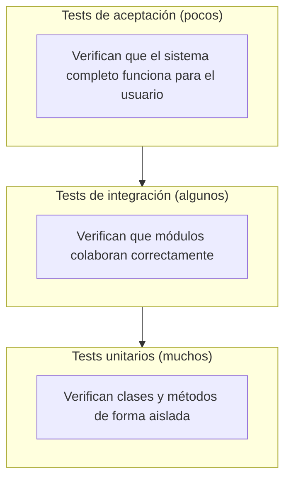
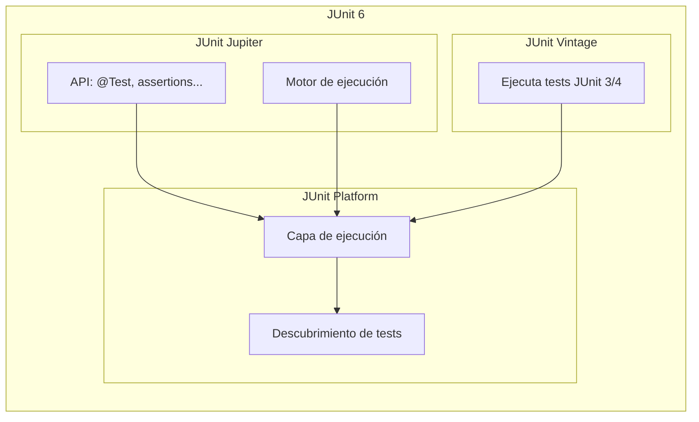
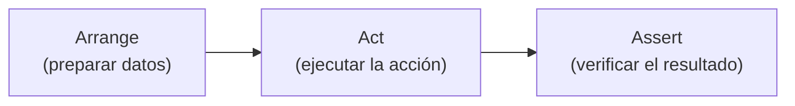
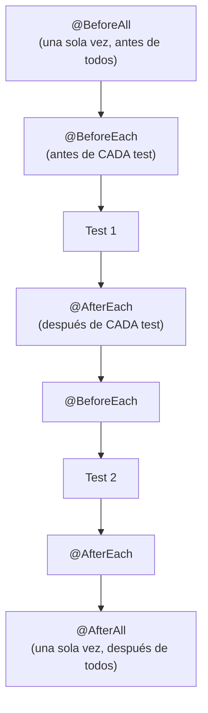
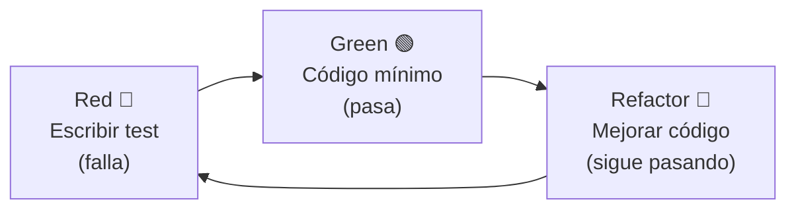

# Tema 13: Testing: pruebas unitarias con JUnit

??? abstract "Duración y criterios de evaluación"

    Duración estimada: 6 sesiones

    <hr />

    **Resultados de aprendizaje**

    1. Comprender por qué las pruebas unitarias son fundamentales en el desarrollo de software.
    2. Conocer el framework JUnit 6 (Jupiter) y su arquitectura (Platform / Jupiter / Vintage).
    3. Saber configurar un proyecto Maven con JUnit en IntelliJ IDEA.
    4. Escribir pruebas unitarias aplicando el patrón AAA (Arrange-Act-Assert).
    5. Utilizar aserciones, anotaciones de ciclo de vida y tests parametrizados.
    6. Aplicar la metodología TDD (Red-Green-Refactor) en el desarrollo de código.

    **Criterios de evaluación**

    1. Se explica la importancia de las pruebas unitarias y su papel en el desarrollo de software.
    2. Se configura correctamente un proyecto Maven con JUnit 6 en IntelliJ IDEA.
    3. Se estructuran pruebas aplicando el patrón AAA y se ejecutan desde el IDE.
    4. Se utilizan las aserciones y anotaciones de ciclo de vida de JUnit.
    5. Se escriben tests para la clase `Cuenta` y para excepciones.
    6. Se aplican tests parametrizados con `@ParameterizedTest`.
    7. Se describe y aplica el ciclo TDD Red-Green-Refactor con un ejemplo paso a paso.

## 13.1 Introducción: por qué testear

El **testing** (pruebas de software) es el proceso de verificar que una pieza de código funciona como se espera. Las **pruebas unitarias** comprueban unidades individuales de código (una clase, un método) de forma aislada.

### 13.1.1 El coste de los errores

Un error (*bug*) detectado en producción puede costar entre **10 y 100 veces más** que uno detectado durante el desarrollo. Ejemplos reales:

- **Ariane 5 (1996)**: un desbordamiento de entero causó la destrucción de un cohete valorado en 370 millones de dólares.
- **Knight Capital (2012)**: un bug en un algoritmo de trading causó pérdidas de 440 millones de dólares en 45 minutos.
- **CrowdStrike (2024)**: una actualización defectuosa dejó a millones de ordenadores fuera de servicio en todo el mundo.

Las pruebas unitarias ayudan a **detectar errores temprano**, antes de que lleguen a producción.

### 13.1.2 Testing manual vs automático

| Aspecto | Testing manual | Testing automático |
|---------|---------------|-------------------|
| Velocidad | Lento, humano | Rápido, ejecutable en segundos |
| Repetibilidad | Difícil de repetir exactamente | Siempre el mismo resultado |
| Coste a largo plazo | Alto | Bajo (inversión inicial) |
| Fiabilidad | Propenso a errores humanos | Consistente |

### 13.1.3 Pirámide de testing

La pirámide de testing indica la proporción ideal de cada tipo de prueba en un proyecto:



!!! tip "Regla práctica"
    La mayoría del código de tests en tu proyecto debe ser **unitario** (~70%). Son rápidos, baratos y dan feedback inmediato. Los tests de integración (~20%) verifican la colaboración entre componentes, y los de aceptación (~10%) validan requisitos del usuario.

## 13.2 ¿Qué es JUnit?

**JUnit** es el framework de pruebas unitarias más utilizado en Java. Su historia:

- **JUnit 4** (2006): introdujo anotaciones (`@Test`, `@Before`, `@After`).
- **JUnit 5 / Jupiter** (2017): arquitectura modular (Platform / Jupiter / Vintage), anotaciones de ciclo de vida, tests parametrizados, extensiones.
- **JUnit 6 / Jupiter** (2025): evolución estable, mismas anotaciones que JUnit 5, requiere Java 17+, versión única para Platform / Jupiter / Vintage.

### 13.2.1 Arquitectura de JUnit 6



!!! info "¿JUnit 5 o JUnit 6?"
    JUnit 6 es la evolución estable de JUnit 5. El API es **idéntico** para lo que aprenderemos aquí (mismas anotaciones, mismas aserciones). JUnit 6 requiere **Java 17+** como mínimo. En este tema documentaremos **JUnit 6.1.3** (la última estable).

## 13.3 Preparar el proyecto en IntelliJ IDEA

### 13.3.1 Crear un proyecto Maven

1. **File → New → Project → Maven**.
2. Selecciona la versión de Java (21 o superior; JDK 26 si está disponible).
3. Añade la dependencia de JUnit en el `pom.xml`:

```xml
<dependencies>
    <dependency>
        <groupId>org.junit.jupiter</groupId>
        <artifactId>junit-jupiter</artifactId>
        <version>6.1.3</version>
        <scope>test</scope>
    </dependency>
</dependencies>
```

!!! info "¿Por qué `<scope>test</scope>`?"
    Indica que JUnit **solo se usa durante las pruebas**, no en el código de producción. IntelliJ lo tiene en cuenta al compilar y ejecutar.

### 13.3.2 Estructura de directorios

Maven sigue una convención de carpetas:

```
proyecto/
├── src/
│   ├── main/
│   │   └── java/
│   │       └── com/ejemplo/
│   │           └── Cuenta.java
│   └── test/
│       └── java/
│           └── com/ejemplo/
│               └── CuentaTest.java
├── pom.xml
```

- **`src/main/java`**: código de producción (tu aplicación).
- **`src/test/java`**: código de pruebas (los tests).

### 13.3.3 Crear el primer test con IntelliJ

IntelliJ puede generar la estructura de un test automáticamente:

1. Abre la clase que quieres testear (p. ej. `Cuenta.java`).
2. **Code → Generate → Test...** (o `Ctrl+Shift+T` / `Cmd+Shift+T`).
3. Selecciona los métodos a testear y pulsa **OK**.

IntelliJ creará un archivo `CuentaTest.java` en `src/test/java` con los métodos vacíos listos para implementar.

## 13.4 Estructura de un test

### 13.4.1 Anotaciones básicas

- **`@Test`**: marca un método como prueba. Debe ser `public void`, sin parámetros.
- **`@DisplayName("descripción")`**: nombre descriptivo que aparece en el informe de resultados.

```java
import org.junit.jupiter.api.Test;
import org.junit.jupiter.api.DisplayName;
import static org.junit.jupiter.api.Assertions.*;

class CuentaTest {

    @Test
    @DisplayName("El saldo inicial debe ser cero")
    void deberiaTenerSaldoInicialCero() {
        // Arrange (preparar)
        Cuenta cuenta = new Cuenta();

        // Act (ejecutar)
        double saldo = cuenta.getSaldo();

        // Assert (verificar)
        assertEquals(0, saldo, "El saldo inicial debe ser 0");
    }
}
```

### 13.4.2 Patrón AAA (Arrange-Act-Assert)

Todo test sigue tres fases:



| Fase | Qué hace | Ejemplo |
|------|---------|---------|
| **Arrange** | Prepara los datos y objetos necesarios | `Cuenta c = new Cuenta();` |
| **Act** | Ejecuta la operación a testear | `c.ingresar(100);` |
| **Assert** | Comprueba que el resultado es el esperado | `assertEquals(100, c.getSaldo());` |

### 13.4.3 Aserciones principales

JUnit 6 ofrece varias aserciones en `org.junit.jupiter.api.Assertions`:

| Aserción | Qué comprueba | Ejemplo |
|----------|--------------|---------|
| `assertEquals(esperado, real)` | Igualdad | `assertEquals(100, c.getSaldo())` |
| `assertTrue(condición)` | Verdadero | `assertTrue(c.getSaldo() > 0)` |
| `assertFalse(condición)` | Falso | `assertFalse(c.estaVaciada())` |
| `assertNull(valor)` | Es `null` | `assertNull(c.getTitular())` |
| `assertNotNull(valor)` | No es `null` | `assertNotNull(c)` |
| `assertThrows(TipoExcepción, código)` | Lanza excepción | `assertThrows(IllegalArgumentException.class, ...)` |
| `assertArrayEquals(esperado, real)` | Arrays iguales | `assertArrayEquals(new int[]{1,2}, a)` |

!!! tip "Mensaje de error opcional"
    La mayoría de aserciones admiten un último parámetro `String mensaje` que se muestra si la aserción falla: `assertEquals(0, saldo, "El saldo debe ser 0");`

## 13.5 Ciclo de vida de un test

JUnit ejecuta cada test dentro de un **ciclo de vida** que permite preparar y limpiar el estado:



| Anotación | Cuándo se ejecuta | Notas |
|-----------|-------------------|-------|
| `@BeforeAll` | Una vez, **antes** de todos los tests de la clase | Debe ser `static` |
| `@AfterAll` | Una vez, **después** de todos los tests de la clase | Debe ser `static` |
| `@BeforeEach` | **Antes** de cada método `@Test` | Útil para inicializar objetos |
| `@AfterEach` | **Después** de cada método `@Test` | Útil para liberar recursos |

### Ejemplo con ciclo de vida

```java
import org.junit.jupiter.api.*;
import static org.junit.jupiter.api.Assertions.*;

class CuentaCicloVidaTest {

    private Cuenta cuenta;

    @BeforeAll
    static void initAll() {
        System.out.println("=== Inicio de la suite de tests ===");
    }

    @BeforeEach
    void setUp() {
        cuenta = new Cuenta("12345", 1000);
        System.out.println("  Cuenta creada con saldo 1000");
    }

    @AfterEach
    void tearDown() {
        System.out.println("  Test completado, saldo final: " + cuenta.getSaldo());
    }

    @AfterAll
    static void tearDownAll() {
        System.out.println("=== Fin de la suite de tests ===");
    }

    @Test
    @DisplayName("Ingresar dinero aumenta el saldo")
    void deberiaAumentarSaldoAlIngresar() {
        cuenta.ingresar(500);
        assertEquals(1500, cuenta.getSaldo());
    }

    @Test
    @DisplayName("Reintegro válido disminuye el saldo")
    void deberiaDisminuirSaldoAlReintegro() {
        cuenta.reintegro(300);
        assertEquals(700, cuenta.getSaldo());
    }
}
```

### Otras anotaciones útiles

- **`@Disabled("motivo")`**: desactiva un test (se muestra como omitido en el informe).
- **`@DisplayName("nombre descriptivo")`**: cambia el nombre que aparece en el reporte de ejecución.

## 13.6 Ejemplo práctico: clase `Cuenta`

Vamos a testear la clase `Cuenta` del [tema 5](05poo.md):

```java
// Archivo: src/main/java/com/ejemplo/Cuenta.java
public class Cuenta {
    private String numero;
    private double saldo;
    private String titular;

    public Cuenta(String numero, double saldoInicial) {
        this.numero = numero;
        this.saldo = saldoInicial;
        this.titular = "Desconocido";
    }

    public String getNumero() { return numero; }
    public double getSaldo() { return saldo; }
    public String getTitular() { return titular; }
    public void setTitular(String titular) { this.titular = titular; }

    public void ingresar(double cantidad) {
        if (cantidad <= 0) throw new IllegalArgumentException("La cantidad debe ser positiva");
        saldo += cantidad;
    }

    public void reintegro(double cantidad) {
        if (cantidad <= 0) throw new IllegalArgumentException("La cantidad debe ser positiva");
        if (cantidad > saldo) throw new IllegalArgumentException("Saldo insuficiente");
        saldo -= cantidad;
    }

    public boolean estaVaciada() {
        return saldo == 0;
    }
}
```

### Suite de tests completa

```java
import org.junit.jupiter.api.*;
import org.junit.jupiter.params.ParameterizedTest;
import org.junit.jupiter.params.provider.ValueSource;
import static org.junit.jupiter.api.Assertions.*;

class CuentaTest {

    private Cuenta cuenta;

    @BeforeEach
    void setUp() {
        cuenta = new Cuenta("001", 500);
    }

    // --- Constructores y getters ---

    @Test
    @DisplayName("Constructor establece saldo y número correctamente")
    void deberiaCrearCuentaConSaldoInicial() {
        assertEquals("001", cuenta.getNumero());
        assertEquals(500, cuenta.getSaldo());
        assertEquals("Desconocido", cuenta.getTitular());
    }

    @Test
    @DisplayName("setTitular cambia el nombre del titular")
    void deberiaCambiarElTitular() {
        cuenta.setTitular("Juan Pérez");
        assertEquals("Juan Pérez", cuenta.getTitular());
    }

    // --- Ingresar ---

    @Test
    @DisplayName("Ingresar una cantidad positiva aumenta el saldo")
    void deberiaAumentarSaldoAlIngresar() {
        cuenta.ingresar(200);
        assertEquals(700, cuenta.getSaldo());
    }

    @Test
    @DisplayName("Ingresar cantidad negativa lanza excepción")
    void deberiaLanzarExcepcionAlIngresarNegativo() {
        assertThrows(IllegalArgumentException.class, () -> cuenta.ingresar(-100));
    }

    @Test
    @DisplayName("Ingresar cero lanza excepción")
    void deberiaLanzarExcepcionAlIngresarCero() {
        assertThrows(IllegalArgumentException.class, () -> cuenta.ingresar(0));
    }

    // --- Reintegro ---

    @Test
    @DisplayName("Reintegro válido disminuye el saldo")
    void deberiaDisminuirSaldoAlReintegro() {
        cuenta.reintegro(200);
        assertEquals(300, cuenta.getSaldo());
    }

    @Test
    @DisplayName("Reintegro que excede el saldo lanza excepción")
    void deberiaLanzarExcepcionAlReintegroInsuficiente() {
        assertThrows(IllegalArgumentException.class, () -> cuenta.reintegro(600));
    }

    // --- estaVaciada ---

    @Test
    @DisplayName("Cuenta con saldo > 0 no está vaciada")
    void noDeberiaEstarVaciada() {
        assertFalse(cuenta.estaVaciada());
    }

    @Test
    @DisplayName("Cuenta con saldo 0 sí está vaciada")
    void deberiaEstarVaciadaTrasReintegroTotal() {
        cuenta.reintegro(500);
        assertTrue(cuenta.estaVaciada());
    }
}
```

!!! example "Ejecutar los tests"
    Botón derecho sobre la clase `CuentaTest` → **Run 'CuentaTest'** (o `Ctrl+Shift+F10` / `Cmd+Shift+F10`). IntelliJ muestra en verde los tests que pasan y en rojo los que fallan.

## 13.7 Tests de excepciones

JUnit permite verificar que tu código lanza las excepciones esperadas usando `assertThrows`:

```java
@Test
@DisplayName("Dividir por cero lanza ArithmeticException")
void deberiaLanzarExcepcionAlDividirPorCero() {
    assertThrows(ArithmeticException.class, () -> {
        int resultado = 10 / 0;
    });
}

@Test
@DisplayName("Parsear un string no numérico lanza NumberFormatException")
void deberiaLanzarExcepcionAlParsear() {
    assertThrows(NumberFormatException.class, () -> {
        Integer.parseInt("abc");
    });
}
```

!!! info "Capturar la excepción (opcional)"
    Si necesitas comprobar el mensaje de la excepción, puedes asignar el resultado de `assertThrows`:

    ```java
    @Test
    void mensajeDeExcepcion() {
        IllegalArgumentException ex = assertThrows(
            IllegalArgumentException.class,
            () -> cuenta.ingresar(-50)
        );
        assertEquals("La cantidad debe ser positiva", ex.getMessage());
    }
    ```

## 13.8 Tests parametrizados (intro)

Los **tests parametrizados** ejecutan el mismo test con diferentes datos, evitando duplicar código.

### 13.8.1 `@ValueSource`

Proporciona una lista de valores simples:

```java
import org.junit.jupiter.params.ParameterizedTest;
import org.junit.jupiter.params.provider.ValueSource;

class ParametrizadosTest {

    @ParameterizedTest
    @DisplayName("Valores positivos no deben lanzar excepción al ingresar")
    @ValueSource(doubles = {1, 10, 100, 1000, 9999})
    void ingresarValoresPositivos(double cantidad) {
        Cuenta cuenta = new Cuenta("001", 0);
        assertDoesNotThrow(() -> cuenta.ingresar(cantidad));
        assertEquals(cantidad, cuenta.getSaldo());
    }
}
```

### 13.8.2 `@CsvSource`

Proporciona pares de valores (entrada → esperado):

```java
import org.junit.jupiter.params.ParameterizedTest;
import org.junit.jupiter.params.provider.CsvSource;

class CalculoSaldoTest {

    @ParameterizedTest
    @DisplayName("Reintegros correctos disminuyen el saldo adecuadamente")
    @CsvSource({
        "500, 100, 400",   // saldo, reintegro, saldo esperado
        "500, 250, 250",
        "500, 500, 0",
        "1000, 100, 900"
    })
    void reintegroCorrecto(double saldoInicial, double reintegro, double saldoEsperado) {
        Cuenta cuenta = new Cuenta("001", saldoInicial);
        cuenta.reintegro(reintegro);
        assertEquals(saldoEsperado, cuenta.getSaldo());
    }
}
```

!!! tip "¿Cuándo usar tests parametrizados?"
    Cuando el **mismo test** se ejecuta con **múltiples datos de entrada**. Si la lógica varía mucho entre casos, es mejor tests independientes.

## 13.9 TDD: Red-Green-Refactor

**TDD** (Test-Driven Development, desarrollo guiado por pruebas) es una metodología donde **primero escribes el test** (que fallará), luego escribes el código mínimo para que pase, y finalmente refactorizas.

### 13.9.1 El ciclo TDD



### 13.9.2 Ejemplo paso a paso: función `aplicarIRPF`

**Objetivo**: crear una función `aplicarIRPF(double salario, int porcentaje)` que calcula el salario tras retener el IRPF.

---

**Paso 1: Red 🔴 — Escribir el test (falla)**

```java
import org.junit.jupiter.api.Test;
import static org.junit.jupiter.api.Assertions.*;

class CalculadoraIRPFTest {

    @Test
    void aplicarIRPF20PorCiento() {
        double resultado = CalculadoraIRPF.aplicarIRPF(1000, 20);
        assertEquals(800, resultado);
    }
}
```

¡**Falla**! La clase `CalculadoraIRPF` no existe todavía.

---

**Paso 2: Green 🟢 — Código mínimo para que pase**

```java
public class CalculadoraIRPF {
    public static double aplicarIRPF(double salario, int porcentaje) {
        return salario - (salario * porcentaje / 100.0);
    }
}
```

El test **pasa** (verde). Pero el código es mínimo: no valida nada.

---

**Paso 3: Red 🔴 — Añadir test de validación**

```java
@Test
void porcentajeNegativoLanzaExcepcion() {
    assertThrows(IllegalArgumentException.class,
        () -> CalculadoraIRPF.aplicarIRPF(1000, -5));
}
```

¡**Falla**! No hay validación todavía.

---

**Paso 4: Green 🟢 — Añadir la validación**

```java
public class CalculadoraIRPF {
    public static double aplicarIRPF(double salario, int porcentaje) {
        if (porcentaje < 0 || porcentaje > 100) {
            throw new IllegalArgumentException("El porcentaje debe estar entre 0 y 100");
        }
        return salario - (salario * porcentaje / 100.0);
    }
}
```

Ambos tests **pasan**.

---

**Paso 5: Refactor 🔵 — Mejorar el código**

El código es pequeño y claro, pero podríamos añadir más cobertura:

```java
@Test
void salarioCeroDaCero() {
    assertEquals(0, CalculadoraIRPF.aplicarIRPF(0, 20));
}

@Test
void porcentajeCeroDaElMismoSalario() {
    assertEquals(1000, CalculadoraIRPF.aplicarIRPF(1000, 0));
}

@Test
void porcentaje100DaCero() {
    assertEquals(0, CalculadoraIRPF.aplicarIRPF(1000, 100));
}
```

Todos los tests siguen **pasando** tras el refactor. El código está validado y preparado para futuros cambios.

!!! info "Ventajas de TDD"
    - **Diseño**: fuerza a pensar en la interfaz antes de la implementación.
    - **Confianza**: cada cambio puede verificarse instantáneamente.
    - **Documentación viviente**: los tests describen qué hace el código y cómo se espera que se use.
    - **Refactor seguro**: puedes reorganizar el código sabiendo que los tests te dirán si algo se rompe.

## 13.10 Buenas prácticas

- **Cada test verifica una única cosa**. Si un test falla, debes saber exactamente qué está mal.
- **Nombres descriptivos** (`deberiaLanzarExcepcionAlIngresarNegativo`, no `test1`).
- **Tests aislados**: no dependen de otros tests ni comparten estado mutable entre sí (por eso `@BeforeEach` crea una cuenta nueva en cada test).
- **No testees código trivial** (getters/setters puros sin lógica). Enfócate en la lógica de negocio y los casos límite.
- **Ejecuta los tests a menudo** (shortcut: `Ctrl+Shift+F10` / `Cmd+Shift+F10` sobre el archivo).
- **No dejes tests rotos**: si un test falla, repáralo o desactívalo temporalmente con `@Disabled("motivo")`.
- **TDD cuando aporte valor**: no siempre es necesario, pero para lógica compleja o algorítmica es muy útil.

## 13.11 Referencias

- [JUnit 6 User Guide (docs.junit.org)](https://docs.junit.org/)
- [Baeldung: JUnit 5/6 Quick Start](https://www.baeldung.com/junit-5-start)
- [Baeldung: Parameterized Tests in JUnit](https://www.baeldung.com/parameterized-tests-junit)
- [Oracle: Java Testing Best Practices](https://docs.oracle.com/javase/tutorial/)
- [Martin Fowler: Test Driven Development](https://martinfowler.com/articles/tdd.html)

## 13.12 Actividades

1301. **Tests de una clase `Calculadora`**: crea una clase `Calculadora` con métodos `sumar`, `restar`, `multiplicar` y `dividir`. Escribe tests para:
    - Operaciones normales (2 + 3 = 5, 10 / 2 = 5).
    - División por cero (debe lanzar `ArithmeticException`).
    - Multiplicación por cero (debe dar 0).

    ??? info "Solución"

        ```java
        // --- Calculadora.java ---
        public class Calculadora {
            public double sumar(double a, double b) { return a + b; }
            public double restar(double a, double b) { return a - b; }
            public double multiplicar(double a, double b) { return a * b; }
            public double dividir(double a, double b) {
                if (b == 0) throw new ArithmeticException("División por cero");
                return a / b;
            }
        }

        // --- CalculadoraTest.java ---
        import org.junit.jupiter.api.Test;
        import static org.junit.jupiter.api.Assertions.*;

        class CalculadoraTest {
            private final Calculadora calc = new Calculadora();

            @Test void sumar() { assertEquals(5, calc.sumar(2, 3)); }
            @Test void restar() { assertEquals(7, calc.restar(10, 3)); }
            @Test void multiplicar() { assertEquals(0, calc.multiplicar(5, 0)); }
            @Test void dividir() { assertEquals(5, calc.dividir(10, 2)); }
            @Test void dividirPorCero() {
                assertThrows(ArithmeticException.class, () -> calc.dividir(10, 0));
            }
        }
        ```

1302. **Tests de una clase `Persona`**: crea una clase `Persona` con atributos `nombre`, `edad` y método `esMayorDeEdad()` (devuelve `true` si `edad >= 18`). Tests a incluir:
    - Persona de 20 años → `esMayorDeEdad()` true.
    - Persona de 15 años → `esMayorDeEdad()` false.
    - Establecer edad negativa → lanza `IllegalArgumentException`.

    ??? info "Solución"

        ```java
        // --- Persona.java ---
        public class Persona {
            private String nombre;
            private int edad;

            public Persona(String nombre, int edad) {
                if (edad < 0) throw new IllegalArgumentException("Edad no válida");
                this.nombre = nombre;
                this.edad = edad;
            }

            public String getNombre() { return nombre; }
            public int getEdad() { return edad; }
            public boolean esMayorDeEdad() { return edad >= 18; }
        }

        // --- PersonaTest.java ---
        import org.junit.jupiter.api.Test;
        import static org.junit.jupiter.api.Assertions.*;

        class PersonaTest {
            @Test void mayorDeEdad() {
                assertTrue(new Persona("Ana", 20).esMayorDeEdad());
            }
            @Test void menorDeEdad() {
                assertFalse(new Persona("Luis", 15).esMayorDeEdad());
            }
            @Test void edadNegativaLanzaExcepcion() {
                assertThrows(IllegalArgumentException.class, () -> new Persona("X", -1));
            }
        }
        ```

1303. **Tests parametrizados**: para la `Calculadora` del ejercicio 1301, escribe un test parametrizado con `@CsvSource` que verifique 4 casos de división válida (ej. `10,2,5.0`, `9,3,3.0`, `7,1,7.0`, `100,10,10.0`).

    ??? info "Solución"

        ```java
        import org.junit.jupiter.params.ParameterizedTest;
        import org.junit.jupiter.params.provider.CsvSource;
        import static org.junit.jupiter.api.Assertions.*;

        class CalculadoraParametrizadosTest {
            private final Calculadora calc = new Calculadora();

            @ParameterizedTest
            @CsvSource({
                "10, 2, 5.0",
                "9, 3, 3.0",
                "7, 1, 7.0",
                "100, 10, 10.0"
            })
            void dividir(double a, double b, double esperado) {
                assertEquals(esperado, calc.dividir(a, b));
            }
        }
        ```

1304. **TDD completo**: aplica el ciclo Red-Green-Refactor para crear una función `esPalindromo(String texto)` que devuelva `true` si el texto es un palíndromo (ignorando mayúsculas/espacios). Sigue estos pasos:

    1. **Red**: escribe el test para `"reconocer"` → `true`.
    2. **Green**: implementa la función mínima.
    3. **Red**: añade test para `"Java"` → `false` y `"Anita lava la tina"` → `true`.
    4. **Green**: completa la implementación.
    5. **Refactor**: mejora el código y añade tests para casos límite (cadena vacía, un solo carácter).

    ??? info "Solución"

        ```java
        // --- TextoUtil.java ---
        public class TextoUtil {
            public static boolean esPalindromo(String texto) {
                if (texto == null) return false;
                String limpio = texto.toLowerCase().replaceAll("\\s+", "");
                return limpio.equals(new StringBuilder(limpio).reverse().toString());
            }
        }

        // --- TextoUtilTest.java ---
        import org.junit.jupiter.api.Test;
        import static org.junit.jupiter.api.Assertions.*;

        class TextoUtilTest {
            @Test void reconocerEsPalindromo() {
                assertTrue(TextoUtil.esPalindromo("reconocer"));
            }
            @Test void javaNoEsPalindromo() {
                assertFalse(TextoUtil.esPalindromo("Java"));
            }
            @Test void frasePalindromo() {
                assertTrue(TextoUtil.esPalindromo("Anita lava la tina"));
            }
            @Test void cadenaVaciaEsPalindromo() {
                assertTrue(TextoUtil.esPalindromo(""));
            }
            @Test void unSoloCaracter() {
                assertTrue(TextoUtil.esPalindromo("a"));
            }
            @Test void nullDevuelveFalse() {
                assertFalse(TextoUtil.esPalindromo(null));
            }
        }
        ```

1305. **Ciclo de vida**: crea una clase de test que imprima mensajes en `@BeforeAll`, `@BeforeEach`, `@AfterEach` y `@AfterAll` para que observes el orden de ejecución en la consola de IntelliJ.

    ??? info "Solución"

        ```java
        import org.junit.jupiter.api.*;

        class CicloVidaTest {

            @BeforeAll
            static void initAll() { System.out.println(">>> BeforeAll: una vez al inicio"); }

            @BeforeEach
            void setUp() { System.out.println("  > BeforeEach: antes de cada test"); }

            @AfterEach
            void tearDown() { System.out.println("  < AfterEach: después de cada test"); }

            @AfterAll
            static void tearDownAll() { System.out.println("<<< AfterAll: una vez al final"); }

            @Test void testUno() { System.out.println("    Test 1 ejecutado"); }

            @Test void testDos() { System.out.println("    Test 2 ejecutado"); }
        }
        ```

        Salida esperada en consola:

        ```
        >>> BeforeAll: una vez al inicio
          > BeforeEach: antes de cada test
            Test 1 ejecutado
          < AfterEach: después de cada test
          > BeforeEach: antes de cada test
            Test 2 ejecutado
          < AfterEach: después de cada test
        <<< AfterAll: una vez al final
        ```

1306. **Suite completa para `Cuenta`**: amplía los tests de la sección 13.6 añadiendo:
    - Test parametrizado que ingrese 5 cantidades positivas distintas y verifique el saldo final.
    - Test que realice un ingreso y luego un reintegro que deje la cuenta a cero (comprueba `estaVaciada()`).
    - Test con `@Disabled` para una funcionalidad pendiente de implementar (p. ej. transferencia entre cuentas).

    ??? info "Solución"

        ```java
        import org.junit.jupiter.api.*;
        import org.junit.jupiter.params.ParameterizedTest;
        import org.junit.jupiter.params.provider.ValueSource;
        import static org.junit.jupiter.api.Assertions.*;

        class CuentaAmpliadaTest {

            private Cuenta cuenta;

            @BeforeEach
            void setUp() { cuenta = new Cuenta("001", 0); }

            @ParameterizedTest
            @ValueSource(doubles = {100, 200, 50, 1000, 250})
            void ingresosPositivosAcumulan(double cantidad) {
                cuenta.ingresar(cantidad);
                assertEquals(cantidad, cuenta.getSaldo());
            }

            @Test
            void ingresoYReintegroDejanSaldoCero() {
                cuenta.ingresar(300);
                cuenta.reintegro(300);
                assertTrue(cuenta.estaVaciada());
            }

            @Disabled("Transferencia entre cuentas aún no implementada")
            @Test
            void transferenciaEntreCuentas() {
                // Pendiente de implementar
            }
        }
        ```
